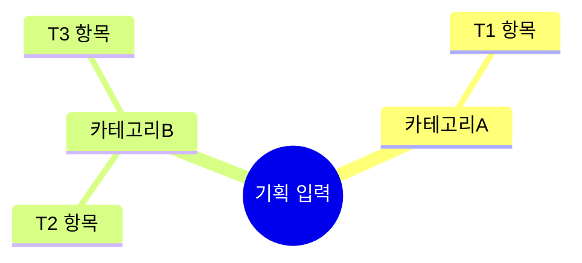

# 01 · target — 기획 내용 정리

> **이 문서는?** 입력 기획 문서를 한 줄씩 빠짐없이 풀어 정리한 목록입니다(무엇). 뒤 단계가 전부
> 여기서 출발하므로(왜) "원문에 뭐라 적혔나"와 "개발 관점 해석"을 분리해 표로 적고 분류 트리로
> 한눈에 보이게 하며(어떻게), 사이클 시작 직후 Claude 가 작성하고 사람은 G1 에서 해석을 확인합니다(언제·누가).
> 입력: `00_input/`. 모호도 "높음"은 [G1](decisions.md#G1) 에서 확인. 새 용어는 `[[용어]]` 사전 링크(_conventions §8).

## 한눈에 — 기획 내용 분류 트리

## target 매트릭스
> ID 셀의 `<a id>` 앵커로 ②goal 등이 점프해 온다(_conventions §7-A). 원문근거는 입력 문서로 링크.

| T-ID | 항목 | 분류 | 원문근거 | 해석 | 모호도 |
|---|---|---|---|---|---|
| T1 |  |  | [§…](00_input/<문서>) |  | 낮음/보통/높음 |

## 모호·누락 항목 (G1 질문 대상)
- 

## as-is 스냅샷
- `snapshots/<ts>_before.txt` 참조 (Editor 가 직접 기록 — 쿡북 §7)

---
## 🔗 관련 문서 (Foam)
- 파이프라인: **① target**(현재) → [[<cycle-id>/02_goal|② goal]] → [[<cycle-id>/03_scope|③ scope]] → [[<cycle-id>/04_assets|④ assets]] → [[<cycle-id>/06_test_env|⑥ test_env]] → [[<cycle-id>/07_plan|⑦ plan]] → [[<cycle-id>/08_result|⑧ result]] → [[<cycle-id>/09_next|⑨ next]]
- 게이트 결정: [[<cycle-id>/decisions|decisions]] (G1)
- 용어: <!-- 이 문서에 등장한 사전 용어 나열: [[용어1]] · [[용어2]] --> [[_glossary|용어 사전]]
