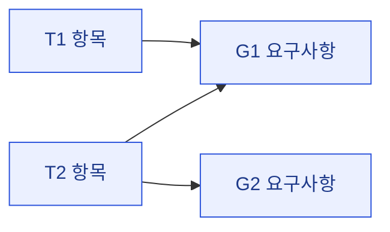

# 02 · goal — 개발 요구사항 도출

> **이 문서는?** ①의 기획 항목(무엇을 원하나)을 "개발팀이 실제로 만들 일"(G-ID)로 바꾼 목록입니다(무엇).
> 기획과 구현 사이의 다리라서(왜) 각 target→goal 을 매핑 표와 흐름도로 잇고 빠짐없는지 점검하며(어떻게),
> G1 통과 직후 Claude 가 작성합니다(언제·누가). 모든 T-ID 가 최소 1 goal 에 연결되는지 확인.
> 새 용어는 `[[용어]]` 사전 링크.

## 한눈에 — target → goal 매핑

## goal 매트릭스
> "연결 target" 열은 ①의 ID 로 점프 — `[T1](01_target.md#T1)` (_conventions §7-A).

| G-ID | 연결 target | 개발 요구사항 | 필요 시스템 | 에셋 범주 | 우선순위 |
|---|---|---|---|---|---|
| G1 | [T1](01_target.md#T1) |  |  |  | P0/P1/P2 |

## 매핑 점검
- 미연결 target: 없음

---
## 🔗 관련 문서 (Foam)
- 이전 [[<cycle-id>/01_target|① target]] · **② goal**(현재) · 다음 [[<cycle-id>/03_scope|③ scope]]
- 게이트 결정: [[<cycle-id>/decisions|decisions]]
- 용어: [[_glossary|용어 사전]]
