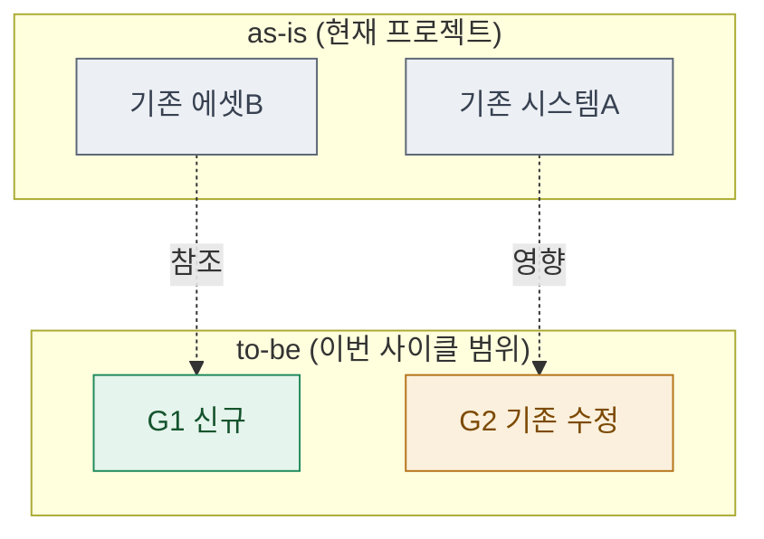

# 03 · scope — 변경 범위·영향도

> **이 문서는?** 만들 것 중 "이미 있는 것 / 새로 만들 것 / 고칠 것"을 가려낸 판정표입니다(무엇).
> 중복 개발을 막고 이번 사이클이 **건드릴 범위**를 미리 못박기 위해(왜) 프로젝트를 실제 스캔해
> 상태별 색으로 시각화하며(어떻게), ②goal 직후 Claude(asset-auditor 위임)가 만들고 사람은 G2 에서
> 범위·리스크를 승인합니다(언제·누가). 기존 변경·고리스크는 [G2](decisions.md#G2) 승인 대상.

## 한눈에 — 이번 사이클 변경 범위 (as-is → to-be)
> 이번 사이클에서 **접근·수정하는 범위만** 그린다. 색: 기구현=회색·신규=초록·수정=골드(_conventions §13-B).

## scope 매트릭스
> "연결 goal" 열은 ②로 점프 — `[G1](02_goal.md#G1)`.

| 연결 goal | 상태 | 대상 에셋·타입 | 존재 근거 | 영향 범위 | 리스크 |
|---|---|---|---|---|---|
| [G1](02_goal.md#G1) | 신규/기구현/변경 |  | exec=… / 사이클 X |  | 낮음/보통/높음 |

## 이전 사이클 재사용
- 참조한 사이클: 
- 재사용/중복 회피 항목: 

## G2 확인 대상
- 기존 에셋 변경: 
- 고영향 항목:

---
## 🔗 관련 문서 (Foam)
- 이전 [[<cycle-id>/02_goal|② goal]] · **③ scope**(현재) · 다음 [[<cycle-id>/04_assets|④ assets]]
- 게이트 결정: [[<cycle-id>/decisions|decisions]] (G2)
- 용어: [[_glossary|용어 사전]]
