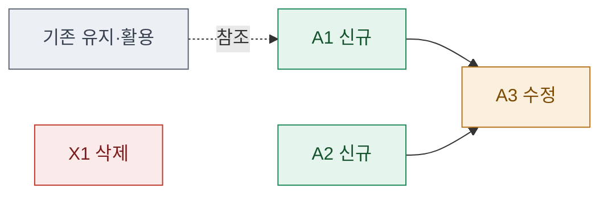

# 04 · assets — 에셋 작업 목록 확정

> **이 문서는?** 이번 사이클에서 만들거나 고칠 파일들의 확정 목록(계약)입니다(무엇). 여기서 정한
> 파일명·경로가 이후 단계의 계약이 되므로(왜) 실제 경로를 클릭 링크로 적고 **추가/수정/삭제/유지**를
> 색으로 시각화하며(어떻게), ③scope 직후 Claude 가 만들고 사람은 [G3](decisions.md#G3) 에서 네이밍을
> 확정합니다(언제·누가). 경로 링크 규칙·범주는 _conventions §9·§2.

## 한눈에 — 변경·활용 맵 (추가/수정/삭제/유지)
> 이번 사이클이 **추가·수정·삭제하는 에셋**과, 손대지 않지만 **활용(참조)하는 기존 에셋**을 함께. 색: _conventions §13-B.

## assets 매트릭스
> 경로는 클릭=열기 링크(_conventions §9). "연결 goal" 은 ②로 점프.

| A-ID | 경로 (클릭=열기) | 범주 | 신규/변경/삭제 | 연결 goal | 의존 |
|---|---|---|---|---|---|
| A1 | [`Assets/…`](../../../Assets/…) |  | new/modify/delete | [G1](02_goal.md#G1) | — |

## 각 에셋 작업 요지 (상세는 ⑤ spec)
- **A1** — 한 줄 요지. 스펙: [[<cycle-id>/05_spec/A1_<에셋명>|A1 명세]]

## Hierarchy 배치 (`_conventions.md` §15)
> 각 오브젝트가 씬 계층 어디에 어떻게 들어가나. **자동생성이면 "씬 배치 없음 — 런타임 자동생성"** 으로 명시.
| A-ID | 배치 유형 | 경로 / 방식 |
|---|---|---|
| A1 | 씬배치 / DDOL승격 / **런타임 자동생성** / 프리팹 | 예: `━━━━ X Layer ━━━━/─── 그룹 ───/<GO>` · 또는 "런타임 자동생성(부트스트랩)" |

## 의존 순서 (⑦ plan 근거)
- A1 → A2 → …

## G3 확인 대상 (네이밍·경로 확정)
- 

---
## 🔗 관련 문서 (Foam)
- 이전 [[<cycle-id>/03_scope|③ scope]] · **④ assets**(현재) · 다음 [[<cycle-id>/06_test_env|⑥ test_env]] / [[<cycle-id>/07_plan|⑦ plan]]
- 에셋 명세: [[<cycle-id>/05_spec/A1_<에셋명>|A1]] · …
- 게이트 결정: [[<cycle-id>/decisions|decisions]] (G3)
- 용어: [[_glossary|용어 사전]] — 신규 script/asset 은 사전에도 등록(분류 `script/`·`asset/`)
