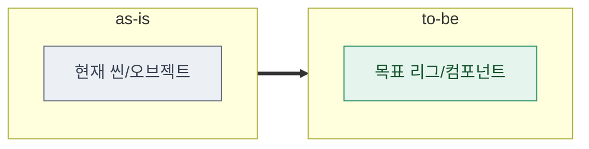

# 06 · test_env — 테스트 환경 정의

> **이 문서는?** 만든 것을 시험할 "실험실 환경"(씬·오브젝트·설정)을 현재(as-is)와 목표(to-be)로
> 적고 적용법을 정한 문서입니다(무엇). 실제 프로젝트가 바뀌는 단계라(왜) unity-cli 재현 가능한
> 수준으로 기술하고 변화를 흐름도로 보이며(어떻게), ⑤spec 직후 Claude 가 만들고 사람은
> [G5](decisions.md#G5) 에서 적용을 승인합니다(언제·누가).
> `.prefab/.unity/.asset/.mat` 편집의 reserialize·compile·console 은 PostToolUse 훅이 자동 수행.

## 한눈에 — 환경 변화 (as-is → to-be)


## test_env 매트릭스
| 대상 | as-is | to-be | 적용 방법 |
|---|---|---|---|
| Test.unity | 없음 |  | Write→훅 / exec |

## to-be Hierarchy 배치 (`_conventions.md` §15)
> 오브젝트가 씬 계층 어디에 들어가는지 트리로. **런타임 자동생성이면 그 사실을 명시**(에디트 모드 씬엔 없음).
```text
<활성 씬 또는 DontDestroyOnLoad>
└─ ━━━━ X Layer ━━━━
   └─ ─── 그룹 ───
      └─ <배치되는 GameObject> (배치 유형: 씬배치/DDOL/프리팹)
# 또는: [자동생성GO]  ← 런타임 자동생성(RuntimeInitializeOnLoadMethod) — 씬 배치 없음
```

## 적용 스니펫 (쿡북 §4 참조)
```bash
# 예: unity-cli exec "var go=new UnityEngine.GameObject(\"TestRig\"); ..."
```

## G5 확인
- 적용 대상 씬/프리팹: 
- 영향 범위:

---
## 🔗 관련 문서 (Foam)
- 이전 [[<cycle-id>/04_assets|④ assets]] · **⑥ test_env**(현재) · 다음 [[<cycle-id>/07_plan|⑦ plan]]
- 게이트 결정: [[<cycle-id>/decisions|decisions]] (G5)
- 용어: [[_glossary|용어 사전]]
