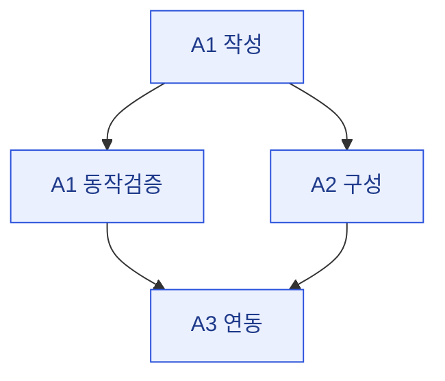

# 07 · plan — 체크리스트·진행관리

> **이 문서는?** 구현 작업을 잘게 쪼갠 살아있는 할 일 목록입니다(무엇). 구현 루프의 작업 큐이자
> 완료 판정 근거라(왜) 각 task 에 연결 A-ID·검증법을 달고 의존 순서를 흐름도로 보이며(어떻게),
> ⑥ 직후 Claude 가 만들어 task 통과마다 갱신합니다(언제·누가).
> 미완료 `- [ ]` / 완료 `- [x]`. 전부 체크되기 전에는 Stop 훅이 사이클 종료를 막는다.

## 한눈에 — task 의존 순서

## 구현 체크리스트
- [ ] A1 <task> — 검증: compile
- [ ] A1 <task 동작> — 검증: play+console
- [ ] A2 <task> — 검증: reserialize(훅)+console

## 마감 정리 (하네스 규약 — 삭제 금지)
- [ ] 용어 사전 갱신 — 이 사이클 신규/재등장 용어를 `glossary/`에 등록·갱신하고 `_glossary.md` 인덱스에 반영 (_conventions §8)
- [ ] 검증 증빙 수집 — 콘솔 덤프·스크린샷·status 출력을 `evidence/`에 저장하고 `08_result.md` 증빙 섹션 작성 (_conventions §10)
- [ ] **최종 재검증 스모크(사인오프 직전)** — `test-runner` 위임: compile 0 + play 진입 + console error 0(무관 제외) + 증빙 저장. 구현 완료~사인오프 사이의 회귀를 차단한다
- [ ] 이점·이관 정리 — `08_result.md` 다측면 이점 섹션 + `09_next.md` 작성(이관 없으면 "이관 없음" 명시) (_conventions §14)
- [ ] 링크·시각화 정합 검사 — `bash .harness/hooks/check-links.sh`(링크 0 broken) + `bash .harness/hooks/check-mermaid.sh`(mermaid 0 bad)

## 진행 메모
- 

---
## 🔗 관련 문서 (Foam)
- 이전 [[<cycle-id>/04_assets|④ assets]] / [[<cycle-id>/06_test_env|⑥ test_env]] · **⑦ plan**(현재) · 다음 [[<cycle-id>/08_result|⑧ result]]
- 게이트 결정: [[<cycle-id>/decisions|decisions]]
- 용어: [[_glossary|용어 사전]]
