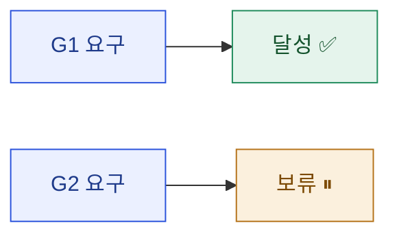

# 08 · result — 결과 보고서

> **이 문서는?** 이번 사이클에서 무엇을 만들었고 제대로 동작하는지를 **언제·어떻게 확인했는지(증빙)**
> 정리한 최종 보고서입니다(무엇). 사이클의 가치를 결산하고 사인오프 근거가 되므로(왜) 달성 대비표·
> diff·검증 증빙·다측면 이점을 함께 싣고(어떻게), ⑦ 완료 후 Claude 가 쓰고 사람은
> [G7](decisions.md#G7) 에서 사인오프합니다(언제·누가). 경로 클릭=실파일, `[[ ]]`=용어 풀이.

## 한눈에 — 달성 요약


## 요약
- 

## 달성 대비표
| target/goal | 완료 | 비고 |
|---|---|---|
| [T1](01_target.md#T1) / [G1](02_goal.md#G1) | ✅/⛔/보류 |  |

## as-is → to-be diff
- 추가 에셋(new): [`Assets/…`](../../../Assets/…) ← 실제 파일 링크(§9)
- 변경 에셋(modify): 
- (스냅샷: `snapshots/<ts>_before.txt` → `snapshots/<ts>_after.txt` diff / 권위 diff 는 git)

## 검증 증빙 (Evidence)
> "검증 완료"의 근거. 원본은 `evidence/` 폴더, 여기엔 발췌+링크. (_conventions §10, 수집은 쿡북 §8, 보통 test-runner 위임)

### 검증 환경·시각
| 항목 | 값 |
|---|---|
| 검증 일시 | YYYY-MM-DD HH:MM ~ HH:MM |
| Unity / Connector | `unity-cli status` 출력 기입 |
| 검증 방법 | compile / play smoke / console / 수동(절차서) |

### task별 검증 기록
| task (A-ID) | 시각 | 방법 | 판정 | 근거 |
|---|---|---|---|---|
| [A1](04_assets.md#A1) … | HH:MM | compile+play | ✅ | [콘솔 덤프](evidence/console_xxx.txt) |

### 콘솔 로그 발췌
```log
(판정 근거가 된 핵심 콘솔 출력 — 전문은 evidence/ 링크)
```

### 스크린샷·산출물
- 
- 결과물: [`Assets/…`](../../../Assets/…)

## 산출물 인수인계 (어떻게 적용·사용하나 — `_conventions.md` §16)
> 이번 사이클 산출물을 한눈에. 상세 사용법은 각 ⑤ spec "산출물 사용 가이드" 참조.
| 산출물 | 무엇 | 적용(자동/수동) | 사용법 한 줄 | 주의 |
|---|---|---|---|---|
| [`…`](../../../Assets/…) | <한 줄> | 자동생성 / 씬배치 / 프리팹 | <켜고 쓰는 법> | <함정·전제> |

## 다측면 이점 (이번 사이클이 가져온 가치)
> 측면별로 적는다. 해당 없으면 "해당 없음"으로 남겨 누락과 구분(_conventions §14).
| 측면 | 이점 |
|---|---|
| 게임(플레이어 체감) |  |
| 개발(생산성·안정성) |  |
| 기획(검증·의사결정) |  |
| 아트(작업 기반) |  |
| 운영(측정·이력) |  |

## 잔여 이슈 / 후속 제안
- (실행 가능한 이관 후보는 [[<cycle-id>/09_next|⑨ next]] 로 구조화)

## 게이트 결정 요약
- [[<cycle-id>/decisions|decisions]] 참조: G1 …, G2 …, G5 …, G7 …

## 용어 사전 갱신
- 이번 사이클 등록/갱신 용어: <!-- [[용어1]] · [[용어2]] -->

---
## 🔗 관련 문서 (Foam)
- 이전 [[<cycle-id>/07_plan|⑦ plan]] · **⑧ result**(현재) · 다음 [[<cycle-id>/09_next|⑨ next]]
- 전체 파이프라인: [[<cycle-id>/01_target|①]] · [[<cycle-id>/02_goal|②]] · [[<cycle-id>/03_scope|③]] · [[<cycle-id>/04_assets|④]] · [[<cycle-id>/06_test_env|⑥]]
- 게이트 결정: [[<cycle-id>/decisions|decisions]]
- 용어: [[_glossary|용어 사전]]
