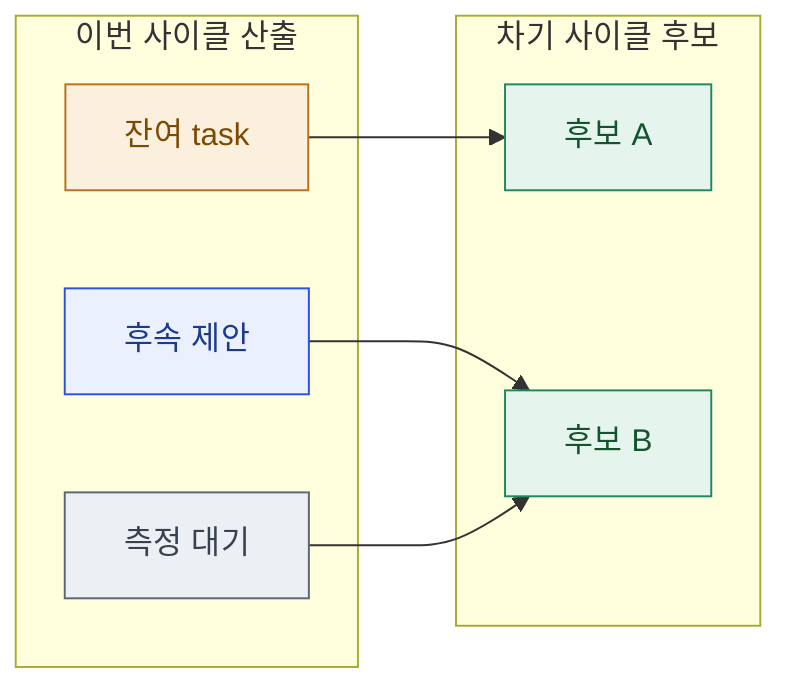

# 09 · next — 다음 사이클 이관

> **이 문서는?** 이번 사이클에서 다 못 했거나 새로 발견해 **다음 사이클로 넘길 것**을, 바로 다음
> `/cycle-start` 의 입력이 되도록 구조화한 인계장입니다(무엇). 작업이 사이클 단위로 끊기되 맥락은
> 이어지게 하려고(왜) 잔여·후속·측정 대기를 차기 후보로 승격하고 이관 흐름을 그리며(어떻게),
> ⑧ result 사인오프 후 Claude 가 작성하고 **마지막에 사람에게 "바로 진행?"을 질의**합니다(언제·누가).
> 이관할 게 없으면 "이관 없음"을 명시하고 사이클을 종결한다(_conventions §14).

## 한눈에 — 이관 흐름

## 차기 후보 매트릭스
> "출처" 열은 이번 사이클의 산출 지점으로 점프(`[08_result#잔여](08_result.md#잔여-이슈--후속-제안)` 등).

| 차기후보 | 유형 | 출처 | 우선순위 | 비고 |
|---|---|---|---|---|
| N1 | 이월/신규/측정 | [⑧ 잔여](08_result.md) | P0/P1/P2 |  |

## 권장 다음 사이클
- **slug 제안**: `<도메인>-<주제>` 
- **입력 문서 제안**: `09_next.md`(본 문서) 또는 `Reports/<도메인>/…`
- **선행 조건**: (있으면 — 예: 2인 측정 선행, 특정 게이트 결정 등)

## ▶ 다음 사이클 진행 질의 (G8)
> Claude 는 여기까지 작성한 뒤 **자동 진행을 멈추고** 사용자에게 묻는다:
> "이번 사이클을 종료합니다. `09_next` 의 **N1(…)** 를 다음 사이클로 **바로 시작할까요?**
> [예 → `/cycle-start` 실행 / 아니오 → 여기서 종료 / 다른 후보·범위로 조정]"
> - 예 → 권장 입력으로 `/cycle-start <문서> <slug>` 안내·실행.
> - 아니오 → 본 문서를 인계장으로 보관하고 종료(다음 세션이 재개 가능).

---
## 🔗 관련 문서 (Foam)
- 이전 [[<cycle-id>/08_result|⑧ result]] · **⑨ next**(현재, 사이클 종단)
- 게이트 결정: [[<cycle-id>/decisions|decisions]] (G8)
- 용어: [[_glossary|용어 사전]]
