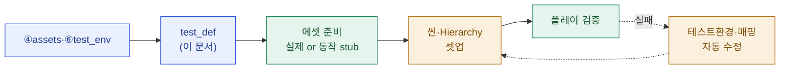

# test_run · 테스트 정의 — <cycle-id>

> **이 문서는?** 사이클 `<cycle-id>` 의 ④ assets·⑥ test_env 에 적힌 씬/프리팹/Hierarchy/월드 셋팅을, 실제
> Unity 에 재현하기 위한 **구체 실행 사양**으로 다시 정리한 문서입니다(무엇). 문서만으로는 빠지는 디테일
> (부모 경로·컴포넌트 필드값·에셋 슬롯·로딩 검증 지점)을 unity-cli 가 그대로 셋업할 수준으로 못박으려고(왜)
> `/test-run` 시점의 사이클 문서를 근거로 작성하며(어떻게), 셋업·플레이 직전에 Claude 가 만들고 사람은
> 셋팅이 의도와 맞는지 확인합니다(언제·누가).
> 경로·규약: [[_conventions#17. `/test-run <cycle>` — 테스트 씬 자동 셋업·플레이 검증|_conventions §17]].

## 근거 (이 시점 사이클 문서)
- 출처: [[<cycle-id>/04_assets|④ assets]] · [[<cycle-id>/06_test_env|⑥ test_env]] (작성 시점 스냅샷)
- as-is 스냅샷: `../snapshots/…` / 셋팅 명시 부족 시 G-질문으로 보강한 내용:

## 테스트 씬
- 경로: [`Assets/_TestRuns/<cycle-id>/<cycle-id>_TestScene.unity`](../../../../Assets/_TestRuns/<cycle-id>/<cycle-id>_TestScene.unity) (빌드 미포함)
- 렌더/월드 셋팅: <카메라·라이트·스카이박스·URP volume 등 — 사이클 명시값. 없으면 기본>

## to-be Hierarchy (셋업 목표)
> 레이어 `━━━━` → 그룹 `───` → GO. 각 GO 의 컴포넌트·핵심 필드값까지(§15).
```text
<cycle-id>_TestScene
└─ ━━━━ Test Layer ━━━━
   └─ ─── <그룹> ───
      └─ <GameObject>  [컴포넌트: …  필드: …]  ← 에셋 슬롯 S1
```

## 에셋 슬롯 (→ asset_map.md 와 1:1)
| 슬롯 | 무엇 | 범주 | 기대 경로 (Assets/_TestRuns/<cycle-id>/assets/…) |
|---|---|---|---|
| S1 |  | Prefab/Material/Scene/Data |  |

## 월드/런타임 셋팅
- <스폰 지점·초기 상태·전역 매니저·NetworkManager 등 플레이에 필요한 셋업>

## 검증 항목 (플레이 테스트 합격 기준)
- [ ] 씬 로드 → console error 0 (무관 기존 에러 제외)
- [ ] 각 에셋 슬롯 로딩 성공(AssetDatabase/Resources load != null)
- [ ] 프리팹 인스턴스의 참조(컴포넌트·머티리얼·메시) 연결 — missing 0
- [ ] play --wait 진입 후 의도 동작(있으면) + console error 0

## 한눈에 — 셋업 흐름


---
## 🔗 관련 문서 (Foam)
- 사이클: [[<cycle-id>/04_assets|④ assets]] · [[<cycle-id>/06_test_env|⑥ test_env]] · [[<cycle-id>/08_result|⑧ result]]
- 테스트: **test_def**(현재) · [[<cycle-id>/test_run/asset_map|에셋 매핑]] · [[<cycle-id>/test_run/result|테스트 결과]]
- 용어: [[_glossary|용어 사전]]
