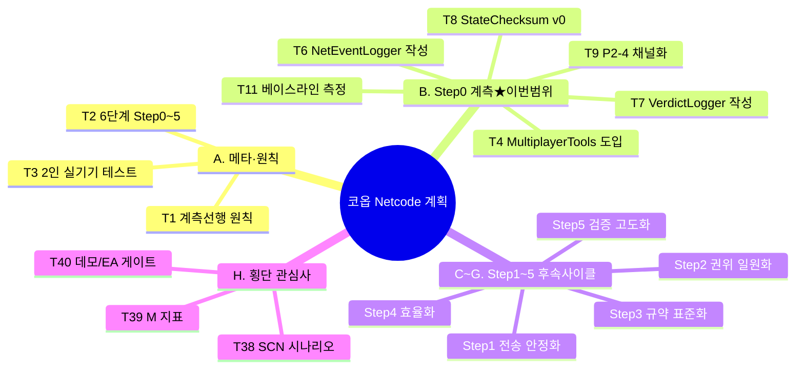

# 01 · target — 기획 내용 정리

> **이 문서는?** `00_input/코옵_Netcode_실행계획_v1.1.md`(계측 선행 재구성판·v1.0 검수 10건 반영)를 SE 관점에서 한 줄씩 풀어, **무엇을** 만들어야 하는지(원문 근거)와 **어떻게** 이해했는지(SE 해석)를 T-ID 단위로 분리 정리한 목록입니다. **왜** 이 작업이 필요한가 — Step 0 계측 기반 없이는 어떤 수정도 효과를 입증할 수 없기 때문이며(§7 "측정 없이는 수정 없다"), **누가** G1 결정을 통해 이 사이클의 범위를 Step 0(T4~T11)로 한정했고, 모호도 "높음" 항목은 **언제** — G1 합의 직후 — 바로잡습니다.
> 원문근거와 SE 해석을 분리. 모호도 "높음"은 G1 에서 확인.
> 이 문서는 **이미 정밀한 실행계획(v1.0 검수 10건 반영판)** 이므로, target 은 계획이 달성하려는
> 작업 단위(Step·이슈·계측 인프라·시나리오·지표·게이트)를 빠짐없이 리스트화하는 데 둔다.

## 한눈에 — 기획 내용 분류 트리

> ★ B(T4~T11)가 이번 사이클 범위 — G1 결정으로 확정.

## A. 메타·원칙

| T-ID | 항목 | 분류 | 원문근거 | 해석 | 모호도 |
|---|---|---|---|---|---|
| T1 | 계측 선행 원칙 "측정 없이는 수정 없다" — 4박자(Baseline→Fix→Re-measure→Gate) | 제약 | [§1](00_input/코옵_Netcode_실행계획_v1.1.md) "v1.1의 단계 진행은 모든 Step에서 동일한 4박자를 따른다" | 모든 수정은 동일 SCN·동일 PROF에서 Before/After 표로만 효과 입증. `StepN_Evidence.md`가 게이트 판정 유일 근거 | 보통 |
| T2 | 6단계 구조(Step 0~5) + 데모/EA 게이트 | 제약 | [§1](00_input/코옵_Netcode_실행계획_v1.1.md) 표, §7 "데모 게이트=Step0~2, EA 게이트=Step3~5" | 단계별 누적 게이트. 데모는 Step0~2 완료, EA는 Step3~5 완료 | 낮음 |
| T3 | 2인 이상 실기기 테스트 기본 원칙 | 제약 | [§7](00_input/코옵_Netcode_실행계획_v1.1.md) "호스트 단독 테스트는 P0-5/P1-10/P1-12 류를 영원히 드러내지 못하므로 모든 SCN은 2인 이상 실기기를 기본" | **자동화 한계 직결** — unity-cli는 단일 에디터. 2자 P2P 측정은 본 하네스로 자동화 불가 | **높음** |

## B. Step 0 · 계측 기반 구축 (신설·최우선)

| T-ID | 항목 | 분류 | 원문근거 | 해석 | 모호도 |
|---|---|---|---|---|---|
| T4 | Unity [[Multiplayer-Tools|Multiplayer Tools]] 도입 ([[RNSM]] HUD + [[Network-Profiler|Network Profiler]]) | 시스템 | [0.A.1](00_input/코옵_Netcode_실행계획_v1.1.md) "`com.unity.multiplayer.tools` 설치" | RNSM=[[RTT]]/바이트/이벤트 HUD(P2-7 80% 충족), Profiler=M6·M7 측정기. 패키지 도입 작업 | 보통 |
| T5 | 네트워크 프로파일 [[PROF-프리셋|PROF-G/A/B]] 프리셋화 | 시스템 | [0.A.1.2](00_input/코옵_Netcode_실행계획_v1.1.md) "Network Simulator 또는 [[Clumsy]]로 3종 프리셋" | NGO Network Simulator(에디터 내) 또는 Clumsy(외부). 자동화 가능성은 Simulator 쪽 | 보통 |
| T5b | RNSM RTT 0표시 정상 = M1 [[베이스라인]] 증거 | 제약 | [0.A.1.3](00_input/코옵_Netcode_실행계획_v1.1.md), R9 "현행 0 표시가 정상이며 그 0이 곧 M1 베이스라인 증거" | Transport `GetCurrentRtt` 미구현이 원인(P0-4). Step 0에서 0을 증거로 기록 | 낮음 |
| T6 | [[NetEventLogger]] 작성 (M3·M8) | 시스템 | [0.A.2.1](00_input/코옵_Netcode_실행계획_v1.1.md) "Connect/Disconnect/Transport 이벤트 타임스탬프 기록" | **기존 `Assets/Scripts/Utilities/NetDiagnostics/NetEventLogger.cs` 존재** → 신규 작성 아닌 확장/검증 가능성 | **높음** |
| T7 | [[VerdictLogger]] 작성 (M5) | 시스템 | [0.A.2.2](00_input/코옵_Netcode_실행계획_v1.1.md) "전투 판정 이벤트를 양측 머신 CSV 기록 → diff" | 양측 머신 기록 필요 → 2인 테스트 의존. CSV `{serverTime,attacker,victim,verdict}` | 보통 |
| T8 | [[StateChecksumV0|StateChecksum]] v0 ([[M-지표|M11]] 골격, 8B RPC) | 시스템 | [0.A.2.3](00_input/코옵_Netcode_실행계획_v1.1.md) "지형 paramHash + 인벤 해시 30초 주기 서버 비교, 불일치([[desync]]) LogError" | EnvFlagRegistry §5 Step 7 선행. 8B라 P0-1 버퍼 제약 무관 | 보통 |
| T9 | [[P0-P1-P2-이슈코드|P2-4]] 패킷 로그 채널화 (M9) | 기능 | [0.A.2.4](00_input/코옵_Netcode_실행계획_v1.1.md) "패킷당 Debug.Log → `#if` [[NETCODE_DEBUG]] + 카운터" | 게임 로직 무침습 원칙의 유일 예외(계측 도구로 간주). 릴리즈 로그 0 목표 | 낮음 |
| T10 | SCN 절차서 + [[soak-테스트|soak]] 하네스 v0 + 강제 끊김 매크로 | 시스템 | [0.A.3](00_input/코옵_Netcode_실행계획_v1.1.md) "`Reports\SCN_Procedures.md` 고정, 30분 타이머 수집 자동화, 클라 kill 스크립트" | soak 완전 자동화는 Step 5. 여기선 수집 자동화 + 절차 문서화까지 | 보통 |
| T11 | [[베이스라인]] 측정 집행 (M1~M11, `Step0_Baseline.md`) | 제약 | [0.A.4](00_input/코옵_Netcode_실행계획_v1.1.md) "[[SCN-시나리오|SCN-01~07]] × PROF-G/A 1회씩, M1~M11 실측 기록" | **실측이 보고서 예상과 다르면 보고서 재검토**(계측=보고서 검증). P0-1 실패 임계 이등분 탐색 포함 | **높음** |

## C. Step 1 · 전송 안정화 (데모 필수 선행)

| T-ID | 항목 | 분류 | 원문근거 | 해석 | 모호도 |
|---|---|---|---|---|---|
| T12 | P0-1 수신 버퍼 동적화 | 기능 | [1.A.1](00_input/코옵_Netcode_실행계획_v1.1.md) "실제 size만큼 정확 할당, 고정 버퍼 재사용 폐기, 서버 TODO 제거·통일" | 경계값(1023/1024/1025/MTU~1300/4096/64KB) 무손상. (선택)ArrayPool | 보통 |
| T13 | P0-2 Disconnect 오발화 수정 | 기능 | [1.A.2](00_input/코옵_Netcode_실행계획_v1.1.md) "`ServerCallbacks.OnDisconnected`의 `NetworkEvent.Connect`→`Disconnect` (1단어)" | 1단어 수정 + 끊김 정리 체인(ready맵·로비·세션카운트) NetEventLogger 재검증 | 낮음 |
| T14 | P0-4 RTT 보고 구현 | 기능 | [1.A.3](00_input/코옵_Netcode_실행계획_v1.1.md) "Facepunch Connection ping/상태 조회로 연결별 RTT 반환" | **정확한 API명 착수 시 Facepunch 버전 기준 확정** 필요. clientId→Connection 매핑 | **높음** |
| T15 | P1-2 SendType 매핑 교정 | 기능 | [1.A.4](00_input/코옵_Netcode_실행계획_v1.1.md) "NGO `NetworkDelivery` ↔ Steam send flag 매핑 재정의(Sequenced 보존/Reliable 승격)" | 매핑표 단위표 문서화 | 보통 |
| T16 | P1-1 RunCallbacks/Shutdown 단일화 | 기능 | [1.A.5](00_input/코옵_Netcode_실행계획_v1.1.md) "펌핑·수명 SteamClient 단일화, Transport.Shutdown은 소켓만(`SteamClient.Shutdown()` 금지)" | 재호스팅 시 Steam 초기화 1회 유지 | 보통 |
| T17 | P2-8 최소 중복 가드 (R7) | 기능 | [1.A.6](00_input/코옵_Netcode_실행계획_v1.1.md) "DontDestroyOnLoad 싱글톤에 중복 인스턴스 즉시 파괴 가드만 선행" | SCN-02 측정 오염 방지용 최소 가드. 전면 정리는 Step 5(T37) | 낮음 |

## D. Step 2 · 권위 일원화 (데모 필수)

| T-ID | 항목 | 분류 | 원문근거 | 해석 | 모호도 |
|---|---|---|---|---|---|
| T18 | P0-3 + P1-9 데미지 파이프라인 단일 판정점 | 시스템 | [2.A.1](00_input/코옵_Netcode_실행계획_v1.1.md) "후보 보고→서버→피격자 Owner 판정·차감(권위 1곳)→연출 브로드캐스트" | 보고서 Fig 3. VerdictLogger 기록지점 ①③④ 이식. R6: 목표는 일관성(치팅 방지 아님) | 보통 |
| T19 | P0-5 + P1-10 아이템 획득 라우팅 (묶음·단독 금지) | 시스템 | [2.A.2](00_input/코옵_Netcode_실행계획_v1.1.md) "`RequestPickupServerRpc` 라우팅(Door 패턴), 서버 검증+Server Write+Despawn" | **단독 수정 금지 묶음**. 가방 장착 ID 권위 방향 (a)Server-Write vs (b)Owner RPC **택1 미결** | **높음** |
| T20 | P1-3 사망 권위 게이트 | 기능 | [2.A.3](00_input/코옵_Netcode_실행계획_v1.1.md) "권위 행위는 Owner/서버만, 연출은 `isDead` NetworkVariable 구독 분리" | | 낮음 |
| T21 | P1-4 인벤토리 서버 검증 + 인스턴스 ID | 기능 | [2.A.4](00_input/코옵_Netcode_실행계획_v1.1.md) "서버 `IsSpaceAvailable` 재검증 + 거절 시 UI 롤백(Request/Ack), 인스턴스 ID(ulong) 도입" | | 보통 |
| T22 | P1-11 슬라이싱 결정론화 | 기능 | [2.A.5](00_input/코옵_Netcode_실행계획_v1.1.md) "절단 입력(평면·법선·시드) RPC 전파 → 각 클라 결정론 재절단, 파편 이벤트 동반" | 보고서 권장 ①+③ | 보통 |

## E. Step 3 · 규약 표준화 (데모~EA)

| T-ID | 항목 | 분류 | 원문근거 | 해석 | 모호도 |
|---|---|---|---|---|---|
| T23 | P1-7 RPC 단일 문법 + Sender | 기능 | [3.A.1](00_input/코옵_Netcode_실행계획_v1.1.md) "`[Rpc(SendTo.Server,...)]` 통일, clientId 인자 금지→`RpcParams.Receive.SenderClientId`, 전수 변환" | Step 2 권위 확정 후 착수가 충돌 최소. grep 정량 검증 | 보통 |
| T24 | P1-12 코옵 스폰 정책 (SyncedSpawnPosition 부활) | 시스템 | [3.A.2](00_input/코옵_Netcode_실행계획_v1.1.md) "로컬 세이브 좌표=싱글 전용 격리, 코옵=서버 결정 스폰. 규약: 스탯=Owner Write/좌표·씬=호스트 권위" | 싱글 이어하기 회귀 0 동시 보장 | 보통 |
| T25 | P2-5 Door NetworkVariable화 | 기능 | [3.A.3](00_input/코옵_Netcode_실행계획_v1.1.md) "가역 상태→개별 `NetworkVariable<bool>` (EnvFlag 아님), 난입 자동 동기화" | 설계서 §2 경계 정의 준수 | 낮음 |
| T26 | P2-6 ConnectionApproval·재접속·호스트 이탈 | 시스템 | [3.A.4](00_input/코옵_Netcode_실행계획_v1.1.md) "ApprovalCallback(정원·버전), 재접속/난입 스냅샷 NetworkVariable 경유, 호스트 이탈=세션 종료+세이브" | **R2 이관**: "재접속 재합류" 검증 여기서 수행 | 보통 |
| T27 | P2-10 람다 구독 6건 + P1-6 콜백 중복 등록 | 기능 | [3.A.5](00_input/코옵_Netcode_실행계획_v1.1.md) "람다 6건→메서드 참조+OnNetworkDespawn 해제, OnClientConnectedCallback 1회 등록 보장" | 같은 "구독 수명" 작업 묶음 | 낮음 |
| T28 | P1-8 Ready 보고 경로 일원화 | 기능 | [3.A.6](00_input/코옵_Netcode_실행계획_v1.1.md) "TerrainSync 단일 경로 통합, allReady 데드코드 정리" | P1-12 스폰 정책과 난입 Ready 흐름 공유 | 낮음 |

## F. Step 4 · 효율화 (EA)

| T-ID | 항목 | 분류 | 원문근거 | 해석 | 모호도 |
|---|---|---|---|---|---|
| T29 | P2-1 캐릭터/AI 대역폭 (효과 큰 순 ①~④) | 시스템 | [4.A.1](00_input/코옵_Netcode_실행계획_v1.1.md) "①AI 위치 게이팅 ②블렌드 0.05 양자화 ③AI 경량 백본 ④거리 차등(조건부)" | ④는 NetworkVariable 클라별 차등 불가→`CheckObjectVisibility`/커스텀 설계 필요. M6 미달 시만(R5 강등). 소단위별 기여도 분해 입증 | **높음** |
| T30 | P2-3 진행형 값 → {state, startServerTime} | 기능 | [4.A.2](00_input/코옵_Netcode_실행계획_v1.1.md) "요리 4종 NetworkVariable→상태Enum+시작 서버시각, 진행도 로컬 재계산" | EnvFlagRegistry 도입 차수 1과 동일 작업(중복 아님 상호 명기) | 보통 |
| T31 | P2-2 아이템 보간 (R3 교정판) | 기능 | [4.A.3](00_input/코옵_Netcode_실행계획_v1.1.md) "①스폰 스냅 ②OnValueChanged 목표 갱신 ③프레임률 독립 보간(`1-exp(-k·dt)`/MoveTowards) ④거리 텔레포트 ⑤회전 동기" | **R3 내용 오류 교정**: 현행 `Lerp(cur,target,dt*speed)`가 바로 프레임률 의존 문제. 보간식 **택1 미결** | **높음** |
| T32 | P2-9 잡기 시각 상태 | 기능 | [4.A.4](00_input/코옵_Netcode_실행계획_v1.1.md) "손 부착 대상 `NetworkVariable<ulong>` 승격 → 난입 동시 해결" | M10 잡기 항목 | 낮음 |
| T33 | P1-5 WeaponItem SO 누수 | 기능 | [4.A.5](00_input/코옵_Netcode_실행계획_v1.1.md) "DB 원본 참조+런타임 스탯 분리(근본), 임시: 교체 시 이전 인스턴스 Destroy" | R4: 권위·동기화 무관 메모리 이슈라 Step 4 유지 | 보통 |

## G. Step 5 · 검증 고도화·잔여 동기화 (EA + 상시)

| T-ID | 항목 | 분류 | 원문근거 | 해석 | 모호도 |
|---|---|---|---|---|---|
| T34 | P2-7 고도화 (체크섬 확장·soak 자동화·CI) | 시스템 | [5.A.1](00_input/코옵_Netcode_실행계획_v1.1.md) "StateChecksum 대상 확장+HUD 경보+재동기화, soak 완전 자동화(무인 30~60분), 끊김/난입 100회, CI/야간" | Step 0=도구 확보, Step 5=자동화·상시화 | 보통 |
| T35 | P2-11 QTE 동기화 | 기능 | [5.A.2](00_input/코옵_Netcode_실행계획_v1.1.md) "주석만 있던 결과 동기화 실제 구현, Step 2 데미지 패턴 준용" | 미구현 기능 신규 구현 | 보통 |
| T36 | P2-12 NPC 발화 전파 | 기능 | [5.A.3](00_input/코옵_Netcode_실행계획_v1.1.md) "서버 권위 게이트 위 전파 계층(ClientRpc/NetworkVariable 큐, 난입 시 후자 권장)" | | 낮음 |
| T37 | P2-8 전면 생명주기 정리 | 기능 | [5.A.4](00_input/코옵_Netcode_실행계획_v1.1.md) "싱글톤 생명주기 가드 완성(Step 1 최소 가드 확장), 씬 전환·재호스팅 정리 경로" | T17 확장 | 낮음 |

## H. 횡단 관심사 (전 단계 공통)

| T-ID | 항목 | 분류 | 원문근거 | 해석 | 모호도 |
|---|---|---|---|---|---|
| T38 | 표준 시나리오 SCN-01~07 | 제약 | [§2](00_input/코옵_Netcode_실행계획_v1.1.md) 표 "접속/끊김재호스팅/전투50/획득인벤/난입/holdout부하/soak" | 모든 측정 단위. 결과 파일명 `SCN-XX_PROF-X_StepN_before\|after` | 보통 |
| T39 | 핵심 지표 M1~M11 + 베이스라인 | 제약 | [§3](00_input/코옵_Netcode_실행계획_v1.1.md) 표 "M1 RTT ~ M11 체크섬 검출력, 예상 베이스라인·목표·달성 Step" | 효과 입증 비교 기준. 다수 M은 2인 P2P 실측 필요 | 보통 |
| T40 | 데모/EA 게이트 + 증거 문서 체계 | 제약 | [§7](00_input/코옵_Netcode_실행계획_v1.1.md), §1.④ "각 Step `Reports\StepN_Evidence.md`가 게이트 판정 유일 근거" | Before/After 표 + 캡처 첨부 누적 | 낮음 |
| T41 | EnvFlagRegistry 후행 진입 게이트 | 제약 | [§6](00_input/코옵_Netcode_실행계획_v1.1.md) "착수 조건 Step 0 + Step 1 완료" | 본 로드맵 산출물(StateChecksum v0, SCN-05, RPC 문법, 요리 상태)이 레지스트리 입력. 도입 차수 0→1→…→5 | 보통 |

---

## 모호·누락 항목 (G1 질문 대상)

### Q1. 이 사이클의 범위 — 전체 6 Step vs Step 0 단독 [구조적·최우선]
- 본 문서는 수 주 분량의 6단계 전체 계획. unity-pipeline 1 사이클 = 1 기능/보고 단위.
- 계획 자체가 **"Step 0가 모든 것의 선행"·"어떤 수정도 베이스라인 없이 착수 금지"**(§7)를 못박음.
- **SE 권고**: 이 사이클은 **Step 0(계측 기반 구축)** 으로 한정하고, Step 1~5는 각각 후속 사이클로 분리. Step 0 산출물이 이후 모든 사이클의 게이트 근거가 되므로 자연스러운 경계.

### Q2. 하네스 능력 격차 — 2인 실기기 P2P 측정의 자동화 불가 [구조적]
- 계획의 검증 다수(SCN×PROF, M5 양측 diff, 30/60분 soak, RNSM 육안, 재호스팅 ×10)는 **2인 이상 실기기 P2P**를 전제(§7, T3).
- 본 하네스(unity-cli)는 **단일 에디터** — 코드 구현·컴파일·단일 플레이·정적 검증은 자동화 가능하나, **실제 2자 P2P 측정·베이스라인 기록은 자동화 불가**.
- **SE 해석**: 본 사이클에서 unity-cli가 책임지는 것은 ① 계측 코드/도구 구현·컴파일·단일 플레이 스모크, ② 절차 문서·하네스 스크립트 작성까지. **실제 베이스라인 측정 집행(T11)·2인 SCN은 사용자 수동 실행 항목**으로 분리해야 함. 동의 여부 확인.

### Q3. 기존 NetEventLogger 처리 [기구현 확인 — ③ scope에서 정밀 확인]
- `Assets/Scripts/Utilities/NetDiagnostics/NetEventLogger.cs` 가 **이미 존재**(T6). `CaveNetworkDebuggerWindow.cs` 등 진단 도구도 존재.
- Step 0 "NetEventLogger 작성"이 신규인지 / 기존 확장·검증인지에 따라 작업량 상이. → ③ scope에서 read-only 스캔으로 확정 예정. G1에선 "기존 자산 우선 재사용" 방침만 합의.

### Q4. 명시적 미결 설계 분기 (착수 시점 결정 — 대부분 G6성, Step 0 범위 밖)
- (a) 가방 장착 ID 권위 방향: Server-Write vs Owner 단일 RPC (T19, Step 2)
- (b) AI 거리 차등 설계: `CheckObjectVisibility` vs 커스텀 송신 (T29, Step 4 — M6 미달 시만)
- (c) 아이템 보간식: 지수감쇠 보정 vs MoveTowards (T31, Step 4)
- (d) P0-4 Facepunch RTT API명: 현행 Facepunch/Steamworks 버전 기준 확정 (T14, Step 1)
- → 이들은 해당 Step 착수 시 결정. **Step 0 사이클 범위에는 미포함**(Q1이 Step 0로 확정될 경우).

### Q5. 측정 도구 환경 의존 (Step 0 내 확인 필요)
- PROF-G/A/B를 **NGO Network Simulator(에디터 내)** vs **Clumsy(외부 Windows 도구)** — 자동화·재현성은 Simulator 우위. Step 0 0.A.1.2에서 택1.
- RNSM HUD는 패키지 도입 후 씬 배치 필요 — 어느 씬을 기준 씬으로 삼을지.

## as-is 스냅샷
- `snapshots/2026-06-12_netcode_before.json` (AssetDatabase 경로 덤프, Editor ready 상태에서 확보)

---
## 🔗 관련 문서 (Foam)
- 파이프라인: **01_target**(현재) → [[2026-06-12_netcode/02_goal|02_goal]] → [[2026-06-12_netcode/03_scope|03_scope]] → [[2026-06-12_netcode/04_assets|04_assets]] → [[2026-06-12_netcode/06_test_env|06_test_env]] → [[2026-06-12_netcode/07_plan|07_plan]] → [[2026-06-12_netcode/08_result|08_result]]
- 게이트 결정: [[2026-06-12_netcode/decisions|decisions]] (G1)
- 입력 문서: [코옵_Netcode_실행계획_v1.1.md](00_input/코옵_Netcode_실행계획_v1.1.md)
- 용어: [[RNSM]] · [[RTT]] · [[Multiplayer-Tools]] · [[Network-Profiler]] · [[PROF-프리셋]] · [[Clumsy]] · [[베이스라인]] · [[NetEventLogger]] · [[VerdictLogger]] · [[StateChecksumV0]] · [[desync]] · [[NETCODE_DEBUG]] · [[P0-P1-P2-이슈코드]] · [[soak-테스트]] · [[SCN-시나리오]] · [[M-지표]] → 인덱스 [[_glossary|용어 사전]]
