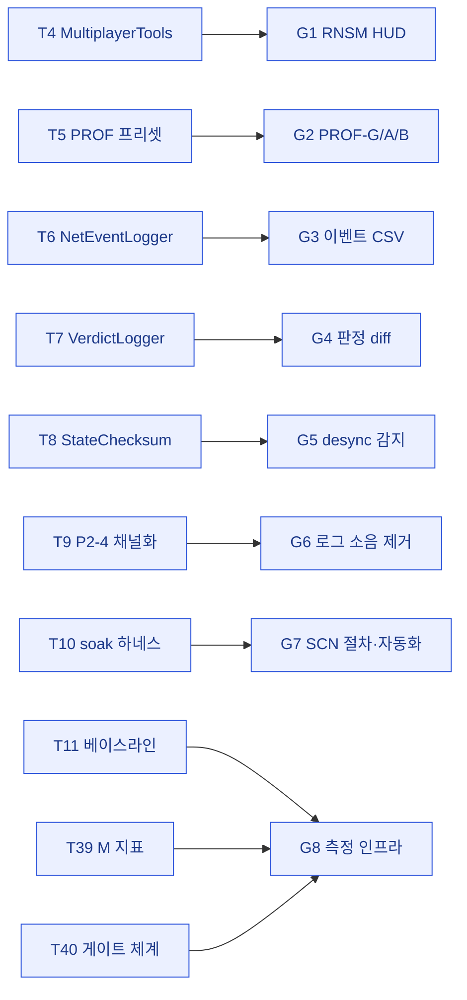

# 02 · goal — 개발 요구사항 도출

> **이 문서는?** `01_target`에서 도출한 Step 0 계획 항목(T4~T11·T38~T40)을 **"개발팀이 실제로 만들어야 할 일"(G1~G8)** 단위로 변환한 요구사항 목록입니다. **왜** — G1 결정(범위=Step 0)에 따라 베이스라인 계측 인프라를 먼저 확보해야 이후 모든 수정의 효과를 입증할 수 있기 때문이며, **누가** 어떤 target을 **어떻게** goal로 매핑했는지는 아래 매트릭스와 흐름도에서, **언제** 각 goal을 처리할지는 우선순위(P0→P1) 순서로 명시합니다. T-ID→G-ID 매핑이 빠진 항목이 없는지 매핑 점검으로 확인합니다.
> **사이클 범위 = Step 0 (계측 기반 구축)** — G1 결정. Step 1~5 target(T12~T37)은 후속 사이클로 이관.
> 본 단계는 Step 0 관련 target(T1·T4~T11·T38~T40)만 개발 요구사항으로 변환한다.
> 자동화 경계(G1-Q2): 코드·도구·프리셋은 단일 에디터로 최대 자동화, 실제 2자 P2P 베이스라인 측정은 오차 명시 하 수동.

## 한눈에 — target → goal 매핑

## goal 매트릭스
| G-ID | 연결 target | 개발 요구사항 | 필요 시스템 | 에셋 범주 | 우선순위 |
|---|---|---|---|---|---|
| G1 | [T4](01_target.md#T4), [T5b](01_target.md#T5b) | Unity Multiplayer Tools 패키지 도입 + RNSM HUD를 기준 씬에 배치(런타임 표시) + Network Profiler 캡처 절차 확인 | Multiplayer Tools(RNSM/Profiler), NGO | Config(manifest)/Script(HUD 부트스트랩)/Scene | P0 |
| G2 | [T5](01_target.md#T5) | NGO Network Simulator로 PROF-G/A/B 3종 프리셋화 + 런타임 토글 수단(에디터에서 프로파일 선택 적용) | NGO Transport, Multiplayer Tools Network Simulator | Script/Config | P0 |
| G3 | [T6](01_target.md#T6), [T1](01_target.md#T1) | 기존 `NetDiagnostics/NetEventLogger` 재사용·확장: Connect/Disconnect/Transport 이벤트 타임스탬프 CSV 기록 → M3·M8 산출 (P0-2 오발화 그대로 포착) | NetDiagnostics, NGO 콜백, SteamP2PRelayTransport | Script | P0 |
| G4 | [T7](01_target.md#T7), [T1](01_target.md#T1) | VerdictLogger 신규: 전투 판정 이벤트(히트·패링·블록·데미지) 양측 머신 `{serverTime,attacker,victim,verdict}` CSV 기록 + diff 스크립트 → M5 | 전투/판정 시스템, NetDiagnostics | Script | P1 |
| G5 | [T8](01_target.md#T8), [T1](01_target.md#T1) | StateChecksum v0: 지형 paramHash + 인벤 목록 해시를 8B RPC로 30초 주기 서버 비교, 불일치 시 LogError → M11 골격 | TerrainSync, Inventory, NGO RPC | Script | P1 |
| G6 | [T9](01_target.md#T9) | P2-4 채널화: SteamP2PRelayTransport의 패킷당 `Debug.Log`를 `#if NETCODE_DEBUG` + 카운터 집계로 전환 → M9 (릴리즈 0, 디버그 카운터) | SteamP2PRelayTransport | Script | P1 |
| G7 | [T10](01_target.md#T10), [T38](01_target.md#T38) | SCN-01~07 절차서(`Reports\SCN_Procedures.md`) + soak 하네스 v0(30분 타이머 + 로거/체크섬 수집 자동화 + 종료 요약 md) + 강제 끊김 매크로(클라 프로세스 kill) | NetDiagnostics, soak 수집기 | Script/Doc/Other(스크립트) | P1 |
| G8 | [T11](01_target.md#T11), [T39](01_target.md#T39), [T40](01_target.md#T40) | 베이스라인 측정 인프라·절차: M1~M11 측정 절차 표준화 + `Step0_Baseline.md` 양식 + `StepN_Evidence.md` 증거 문서 체계. **실측 집행은 수동(2인/근사)**, P0-1 실패 임계 이등분 탐색 절차 포함 | 0.A 도구 전체, 측정 절차 | Doc | P0(절차)·수동(집행) |

## 매핑 점검
- **범위 내 target(Step 0) 전부 연결**: T1→G3·G4·G5, T4→G1, T5→G2, T5b→G1, T6→G3, T7→G4, T8→G5, T9→G6, T10→G7, T11→G8, T38→G7, T39→G8, T40→G8.
- **범위 외(후속 사이클)**: T2(단계구조)·T3(2인 원칙)은 메타 제약으로 전 사이클 공통 적용. T12~T37(Step 1~5)·T41(EnvFlagRegistry)은 본 사이클 미포함 — G1 결정에 따라 후속 `/cycle-start`.

## 우선순위 근거
- **P0(선행 차단)**: G1(RNSM/Profiler — 모든 가시화의 토대), G2(PROF — 모든 측정 조건), G8 절차(측정 표준 없으면 효과 입증 불가), G3(NetEventLogger — P0-2 검증 핵심 도구).
- **P1(P0 후 즉시)**: G4·G5(전투/desync 측정기 — Step 2 입증 도구지만 Step 0에서 골격 확보), G6(로그 소음 제거), G7(반복 측정 자동화).
- G8 실측 집행은 도구(G1~G7) 완성 후 수행하는 **수동 항목**으로 plan에서 분리 표기.

---
## 🔗 관련 문서 (Foam)
- 이전 [[2026-06-12_netcode/01_target|01_target]] · **02_goal**(현재) · 다음 [[2026-06-12_netcode/03_scope|03_scope]]
- 게이트 결정: [[2026-06-12_netcode/decisions|decisions]]
- 용어: [[Multiplayer-Tools]] · [[RNSM]] · [[Network-Profiler]] · [[PROF-프리셋]] · [[NGO]] · [[NetEventLogger]] · [[VerdictLogger]] · [[StateChecksumV0]] · [[SteamP2PRelayTransport]] · [[NETCODE_DEBUG]] · [[SCN-시나리오]] · [[soak-테스트]] · [[베이스라인]] · [[M-지표]] → [[_glossary|용어 사전]]

