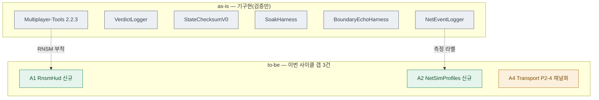

# 03 · scope — 변경 범위·영향도

> **이 문서는?** 만들 것 중 "이미 있는 것 / 새로 만들 것 / 고칠 것"을 가려낸 판정표입니다(무엇).
> 중복 개발을 막고 이번 사이클이 **건드릴 범위**를 못박으려고(왜) 프로젝트를 read-only 스캔해
> 상태별 색으로 시각화하며(어떻게), ②goal 직후 asset-auditor 가 스캔하고 사람은 G2 에서 범위를 승인합니다(언제·누가).
> **핵심 발견: Step 0 산출물 대부분이 선행 작업(2026-06-12)으로 이미 기구현. Step 1 코드까지 완료 상태.**
> 따라서 본 사이클의 실질 작업은 "신규 구현"이 아니라 **① 잔여 갭 마감 + ② 기구현 코드 검증 + ③ 측정 집행(수동)** 으로 재해석된다. → **G2 승인 대상.**

## 한눈에 — 변경 범위 (as-is → to-be)
> 색: 기구현·검증만=회색(keep)·신규=초록(add)·수정=골드(mod). 기구현 7종은 **변경 없이 검증만**, 갭 3건만 실제 손댐.

## scope 매트릭스 (Step 0 범위)

| 연결 goal | 상태 | 대상 에셋·타입 | 존재 근거 | 영향 범위 | 리스크 |
|---|---|---|---|---|---|
| [G1](02_goal.md#G1) (RNSM HUD) | **미흡** | RNSM 컴포넌트 미배치 / 패키지는 존재 | `manifest.json` L15 `com.unity.multiplayer.tools:2.2.3` 존재. 그러나 Bootstrap·씬·프리팹 어디에도 `RuntimeNetStatsMonitor` 배치 없음(scene grep 0건, Bootstrap은 4종만 추가) | 부트스트랩 GO에 RNSM 1줄 추가 or 기준 씬 배치 | 낮음 |
| [G1](02_goal.md#G1) (Profiler 절차) | **미흡** | 캡처 절차 문서 | `SCN_Procedures.md` 존재(절차서). Profiler 캡처 절차 항목 보강 여부 확인 필요 | 문서 | 낮음 |
| [G2](02_goal.md#G2) (PROF 프리셋) | **신규** | NGO Network Simulator `SimulatorConfiguration` 프리셋 3종 | 검색 결과 SimulatorConfiguration .asset 0건. PROF-G/A/B 미구성 | 신규 .asset 3종 or 코드 프리셋 + 토글 | 보통 |
| [G3](02_goal.md#G3) (NetEventLogger) | **기구현** | `NetDiag.NetEventLogger : MonoBehaviour` | `NetDiagnostics/NetEventLogger.cs` 완성 — NGO/Transport 전 이벤트 구독, 재호스팅 추적, events.csv (M3·M8) | 변경 불필요(검증만) | 낮음 |
| [G4](02_goal.md#G4) (VerdictLogger) | **기구현** | `NetDiag.VerdictLogger` (static) + 전투 호출부 | `VerdictLogger.cs` 완성. 호출부 이식 확인: `TakeDamageEffect.cs`·`MeleeWeaponDamageCollider.cs`·`CharacterNetworkManager.cs` 에서 `VerdictLogger.` 호출 존재 | 변경 불필요(검증만) | 낮음 |
| [G5](02_goal.md#G5) (StateChecksum v0) | **기구현** | `NetDiag.StateChecksumV0 : MonoBehaviour` | `StateChecksumV0.cs` 완성 — `TerrainSyncNetworkManager.SyncedWorldSeed` + `CharacterInventoryManager.GetInventoryItems()` FNV-1a 30초 RPC (M11) | 변경 불필요(검증만) | 낮음 |
| [G6](02_goal.md#G6) (P2-4 채널화) | **미흡** | `SteamP2PRelayTransport.cs` Debug.Log | OnMessage 패킷당 로그(L71·L136)는 `#if NETCODE_DEBUG` 완료. **수명주기 로그 9건**(L43·50·60·95·103·121·255·272·389)은 무조건 출력 잔류 | 콘솔 노이즈만(기능 무관) | 낮음 |
| [G7](02_goal.md#G7) (SCN 절차·soak·kill) | **기구현** | `SoakHarness.cs`(F10), `BoundaryEchoHarness.cs`(F9), `SCN_Procedures.md`, kill 매크로 | `SoakHarness.cs` 완성(10초 샘플·soak_summary.md), `BoundaryEchoHarness.cs` 완성(512~64KB 스윕·echo.csv). `Reports/SCN_Procedures.md`(10KB) 존재. kill 매크로 `kill_client.ps1`(Baseline 문서 참조) | 변경 불필요(검증만) | 낮음 |
| [G8](02_goal.md#G8) (베이스라인 집행) | **미집행** | `Step0_Baseline.md`(빈 템플릿) | 양식·M1~M11 표·도구검증표 모두 작성됨. **실측 기입란 전부 공란** — 2인 실기기 측정 미수행 | 측정 = 수동(2인/근사) | 보통(자동화 한계) |
| (보너스) Step 1 코드 | **기구현·범위밖** | `SteamP2PRelayTransport.cs`, `SteamClient.cs`, `SteamLobbyManager.cs`, `WorldItemSpawner.cs` | `Step1_Evidence.md` "코드 완료 2026-06-12, 측정 대기". P0-1/P0-2/P0-4/P1-2/P1-1/P2-8최소 전부 적용됨 | Step 1은 후속 사이클 — 여기선 기록만 | 낮음 |
| asmdef | **신규(선택)** | NetDiagnostics `.asmdef` | 없음. 현재 Assembly-CSharp 단일로 컴파일 가능 | 릴리즈 분리는 Step 5 — 현재 불필요 | 낮음 |

## 이전 사이클 재사용
- 참조한 사이클: 정식 `.harness/cycles/` 이전 사이클 없음(본 폴더가 최초). 단, **`Reports/` 의 선행 산출물**(SCN_Procedures.md, Step0_Baseline.md, Step1_Evidence.md, 코옵_Netcode_Step1-5_진행계획_검증_체크리스트.md, 2026-06-12 16:43)이 사실상 이전 작업 결과물.
- 재사용/중복 회피: **기구현 7종 계측 클래스 + Step 1 코드 일절 재작성 금지**(G1-Q3 결정). 본 사이클은 델타만.

## G2 확인 대상 (승인 필요)
1. **이 사이클의 실질 목적 재정의** — Step 0가 거의 기구현이므로, 본 사이클을 (A)잔여 갭 마감+검증 사이클로 진행할지, (B)다르게 재설정할지.
2. **잔여 갭(미흡/신규) 3건**: RNSM HUD 배치, PROF-G/A/B Network Simulator 프리셋, P2-4 수명주기 로그 9건 채널화 — 기존 코드/씬 변경 동반.
3. **베이스라인 측정 집행(G8)**: 2인 실기기가 정석이나 G1-Q2에 따라 단일 에디터 근사 시도 + 오차 명시. 자동화 가능 범위는 "도구 자체 검증(0.B)"까지.

---
## 🔗 관련 문서 (Foam)
- 이전 [[2026-06-12_netcode/02_goal|02_goal]] · **03_scope**(현재) · 다음 [[2026-06-12_netcode/04_assets|04_assets]]
- 게이트 결정: [[2026-06-12_netcode/decisions|decisions]] (G2)
- 용어: [[RNSM]] · [[PROF-프리셋]] · [[NetEventLogger]] · [[VerdictLogger]] · [[StateChecksumV0]] · [[SteamP2PRelayTransport]] · [[NetDiagnosticsBootstrap]] · [[SoakHarness]] · [[BoundaryEchoHarness]] · [[Multiplayer-Tools]] · [[NETCODE_DEBUG]] · [[베이스라인]] → [[_glossary|용어 사전]]
- 기구현 스크립트 실파일: [`NetEventLogger.cs`](../../../Assets/Scripts/Utilities/NetDiagnostics/NetEventLogger.cs) · [`VerdictLogger.cs`](../../../Assets/Scripts/Utilities/NetDiagnostics/VerdictLogger.cs) · [`StateChecksumV0.cs`](../../../Assets/Scripts/Utilities/NetDiagnostics/StateChecksumV0.cs) · [`SoakHarness.cs`](../../../Assets/Scripts/Utilities/NetDiagnostics/SoakHarness.cs) · [`BoundaryEchoHarness.cs`](../../../Assets/Scripts/Utilities/NetDiagnostics/BoundaryEchoHarness.cs) · [`SCN_Procedures.md`](../../../Reports/netcode/SCN_Procedures.md)
