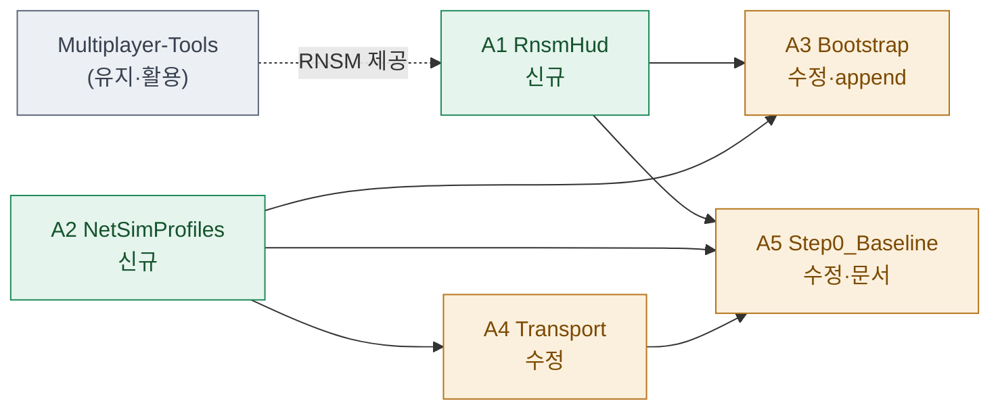

# 04 · assets — 에셋 작업 목록 확정

> **이 문서는?** 이번 사이클에서 만들거나 고칠 파일들의 확정 목록(계약)입니다(무엇). 이후 단계가
> 이 파일명·경로를 계약으로 삼으므로(왜) 실경로를 클릭 링크로 적고 추가/수정/유지를 색으로 보이며(어떻게),
> ③scope 직후 Claude 가 만들고 사람은 [G3](decisions.md#G3) 에서 네이밍을 확정합니다(언제·누가).
> **본 사이클 = Step 0 잔여 갭 마감 + 검증** (G2 결정). 기구현 7종 계측 클래스는 **변경 없음**(검증만).
> 따라서 assets 목록은 미흡/신규 갭 3건(+부착·문서)에 한정된다.

## 한눈에 — 변경·활용 맵
> 추가(초록)/수정(골드)/유지·활용(회색). 화살표=의존(생성 선후·소비). 손대지 않지만 쓰는 기존 자산도 keep 으로.

## assets 매트릭스
| A-ID | 경로 (클릭=열기) | 범주 | 신규/변경 | 연결 goal | 의존 |
|---|---|---|---|---|---|
| A1 | [`Assets/Scripts/Utilities/NetDiagnostics/RnsmHud.cs`](../../../Assets/Scripts/Utilities/NetDiagnostics/RnsmHud.cs) | Script | **new** | [G1](02_goal.md#G1) | [[Multiplayer-Tools]] 2.2.3 (`Unity.Multiplayer.Tools.NetStatsMonitor`) |
| A2 | [`Assets/Scripts/Utilities/NetDiagnostics/NetSimProfiles.cs`](../../../Assets/Scripts/Utilities/NetDiagnostics/NetSimProfiles.cs) | Script | **new** | [G2](02_goal.md#G2) | NetDiagnostics(코어), [[SteamP2PRelayTransport]] |
| A3 | [`Assets/Scripts/Utilities/NetDiagnostics/NetDiagnosticsBootstrap.cs`](../../../Assets/Scripts/Utilities/NetDiagnostics/NetDiagnosticsBootstrap.cs) | Script | **modify** | [G1](02_goal.md#G1), [G2](02_goal.md#G2) | A1, A2 — 부트스트랩 GO에 RnsmHud + NetSimController 컴포넌트 추가 |
| A4 | [`Assets/Scripts/Networking/SteamP2PRelayTransport.cs`](../../../Assets/Scripts/Networking/SteamP2PRelayTransport.cs) | Script | **modify** | [G2](02_goal.md#G2), [G6](02_goal.md#G6) | A2 — (a) 수신 경로 지연/지터 주입 + 펌프 (b) [[P0-P1-P2-이슈코드|P2-4]] 수명주기 Debug.Log 11건 `#if` [[NETCODE_DEBUG]] 채널화 |
| A5 | [`Reports/netcode/Step0_Baseline.md`](../../../Reports/netcode/Step0_Baseline.md) | Doc | **modify** | [G8](02_goal.md#G8) | A1~A4 — §0.B "도구 자체 검증" 표에 단일 에디터 스모크 결과 기입(측정 집행 부분) |

## 각 에셋 작업 요지 (상세는 ⑤ spec)

- **A1 [[RnsmHud]]** — `RuntimeNetStatsMonitor`([[Multiplayer-Tools]])를 런타임 부착·구성하는 MonoBehaviour. 기본 stat([[RTT]]/송수신 bytes/RPC) 표시. 정확한 타입·구성(NetStatsMonitorConfiguration 필요 여부)은 spec에서 패키지 API 확인 후 확정. 게임 로직 무침습(부트스트랩 GO에만 부착).
- **A2 [[NetSimProfiles]]** — [[PROF-프리셋|PROF-G/A/B]] 프리셋 상수 `{rttMs, jitterMs, lossPct}` + `static Active` 홀더 + `NetSimController : MonoBehaviour`(F7 순환 토글, OnGUI 현재 프로파일 라벨). 송신 라벨을 events.csv/카운터에 남겨 측정 파일명 `PROF-X` 표기 지원.
- **A3 `NetDiagnosticsBootstrap.cs`** — 기존 4종(NetEventLogger/StateChecksumV0/BoundaryEchoHarness/SoakHarness) 부착부에 `RnsmHud`·`NetSimController` 2종 추가. `#if !NETDIAG_DISABLED` 가드 유지. **append만**(기존 라인 보존).
- **A4 `SteamP2PRelayTransport.cs`** —
  - (b) **P2-4 채널화(저위험)**: 무조건 `Debug.Log` 11건을 `#if NETCODE_DEBUG`로 래핑. `NetDiag.Event(...)` 계측 호출은 보존. → M9 "릴리즈 0".
  - (a) **PROF 지연/지터 주입(중위험·G6)**: 두 `OnMessage`의 즉시 `InvokeOnTransportEvent(Data...)`를 `EnqueueOrDeliver()` 경유로 전환 — `NetSimProfiles.Active` 활성 시 release-time 큐잉(rtt/2 + 지터), `LateUpdate`에서 만기분 방출. **손실(loss)은 주입하지 않음**(Steam reliable 이후 위치라 영구 유실 위험 → spec G6에서 결론). 비활성(PROF-G/기본)이면 기존 즉시 경로 그대로.
- **A5 `Step0_Baseline.md`** — M1~M11 실측은 2인 측정이라 미집행 유지. 단 §0.B "도구 자체 검증" 표의 단일 에디터로 확인 가능한 항목(RNSM 가동, NetEventLogger CSV 생성, P2-4 릴리즈 0, soak F10, F9 echo.csv, NetSim 토글)을 본 사이클 스모크 결과로 기입.

## Hierarchy 배치 (`_conventions.md` §15)
> 이 사이클 계측은 **전부 런타임 자동생성** — 씬·프리팹을 손대지 않는다(게임 로직 무침습). 사람이 씬에서 찾을 필요 없음.
| A-ID | 배치 유형 | 경로 / 방식 |
|---|---|---|
| A1 RnsmHud | **⑤ 런타임 자동생성** | `[NetDiagnostics]`(자동생성 GO)에 AddComponent — 씬 배치 없음. RnsmHud 가 다시 RuntimeNetStatsMonitor 부착 |
| A2 NetSimController | **⑤ 런타임 자동생성** | `[NetDiagnostics]` 에 AddComponent — 씬 배치 없음 |
| A3 NetDiagnosticsBootstrap | 자동생성 **진입점**(GameObject 아님) | `RuntimeInitializeOnLoadMethod(AfterSceneLoad)` static — `[NetDiagnostics]` GO 를 `new` + DontDestroyOnLoad, `hideFlags=DontSave` |
| A4 SteamP2PRelayTransport | 기존 컴포넌트 **수정** | `World Network Manager`(④ 씬 단독 루트, NGO — DDOLHelper 미사용)의 Transport 컴포넌트. 씬 배치 변경 없음(코드만) |
| A5 Step0_Baseline.md | 해당 없음(문서) | `Reports/netcode/` — Hierarchy 무관 |

## 의존 순서 (⑦ plan 근거)
- A1(RnsmHud) ∥ A2(NetSimProfiles) → A3(Bootstrap 부착) → A4(Transport: 채널화 먼저, 그다음 시뮬 주입) → A5(스모크 검증 기입)
- A4(a)는 A2의 `NetSimProfiles.Active` API 확정 후 착수.

## G3 확인 대상 (네이밍·경로 확정)
1. 신규 파일 2개 경로·클래스명: `NetDiagnostics/RnsmHud.cs`(`NetDiag.RnsmHud`), `NetDiagnostics/NetSimProfiles.cs`(`NetDiag.NetSimProfiles` + `NetDiag.NetSimController`).
2. 기존 변경 2개: `NetDiagnosticsBootstrap.cs`(append), `SteamP2PRelayTransport.cs`(채널화 + 수신 시뮬 주입).
3. 토글 키 **F7**(F9=경계 스윕, F10=soak와 충돌 없음) — 확정 가능?
4. A4(a) 시뮬레이터의 **손실 미주입** 방침(지연/지터만) 동의 — 상세 근거는 ⑤ spec → 필요 시 G6.

---
## 🔗 관련 문서 (Foam)
- 이전 [[2026-06-12_netcode/03_scope|03_scope]] · **04_assets**(현재) · 다음 [[2026-06-12_netcode/06_test_env|06_test_env]] / [[2026-06-12_netcode/07_plan|07_plan]]
- 에셋 명세: [[2026-06-12_netcode/05_spec/A1_RnsmHud|A1_RnsmHud]] · [[2026-06-12_netcode/05_spec/A2_NetSimProfiles|A2_NetSimProfiles]] · [[2026-06-12_netcode/05_spec/A3_A4_Transport_and_Bootstrap_mods|A3_A4_Transport_and_Bootstrap_mods]]
- 게이트 결정: [[2026-06-12_netcode/decisions|decisions]] (G3)
- 용어: [[RnsmHud]] · [[NetSimProfiles]] · [[SteamP2PRelayTransport]] · [[NetDiagnosticsBootstrap]] · [[Multiplayer-Tools]] · [[PROF-프리셋]] · [[NETCODE_DEBUG]] · [[P0-P1-P2-이슈코드]] · [[RTT]] → [[_glossary|용어 사전]]
