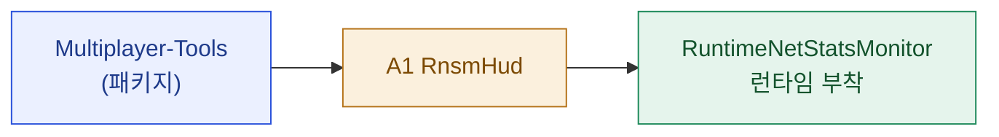

# 05 · spec — A1 RnsmHud

> **이 문서는?** 새로 만들 스크립트 [[RnsmHud]] 의 설계도입니다. 아래 "쉬운 설명"만 읽어도 무엇을 왜 만드는지 알 수 있습니다.

## 메타
- A-ID: A1
- 경로: [`Assets/Scripts/Utilities/NetDiagnostics/RnsmHud.cs`](../../../../Assets/Scripts/Utilities/NetDiagnostics/RnsmHud.cs) ← 클릭=실제 파일
- 범주: Script
- 신규/변경: new

## 쉬운 설명 (비개발자용)
> Unity가 만들어 둔 네트워크 계기판([[RNSM]] — 화면 구석에 [[RTT|RTT(왕복 지연)]]·송수신량을 보여주는 작은 창)을 게임에 "달아주는 거치대" 스크립트입니다. 게임 씬을 전혀 고치지 않고, 게임이 켜질 때 자동으로 계기판을 부착·설정만 합니다. 이 계기판이 있어야 "네트워크가 지금 얼마나 빠른가"를 누구나 눈으로 확인할 수 있습니다.

## 한눈에 — 의존·관계

---
## 스크립트
- **클래스 / 네임스페이스**: `NetDiag.RnsmHud : MonoBehaviour`
- **책임** (1문장): Multiplayer Tools의 `RuntimeNetStatsMonitor`를 런타임에 부착·구성해 RTT(M1)·송수신 바이트(M6 보조)를 화면 HUD로 표시한다(게임 로직 무침습 — 부트스트랩 GO에만).
- **공개 API**:
  - (없음 — 자체 완결형 MonoBehaviour) 단, `public RuntimeNetStatsMonitor Monitor { get; private set; }` 노출(디버그 접근용).
- **인터페이스 / 상속**: `MonoBehaviour`
- **의존성**:
  - 패키지 `com.unity.multiplayer.tools` 2.2.3
  - 네임스페이스: `Unity.Multiplayer.Tools.NetStatsMonitor` (`RuntimeNetStatsMonitor`, `NetStatsMonitorConfiguration`, `DisplayElementConfiguration`, `DisplayElementType`, `CounterConfiguration`), `Unity.Multiplayer.Tools.NetStats` (`MetricId`, `DirectedMetricType`)
- **수명주기**:
  - `Awake()`: 동일 GO에 `RuntimeNetStatsMonitor` 컴포넌트 AddComponent → `BuildConfig()`로 `NetStatsMonitorConfiguration` 인스턴스 생성·할당 → `Monitor.ApplyConfiguration()`.
  - HUD 토글(선택): F6 키로 `Monitor.Visible` on/off (F8=NetSim, F9/F10 충돌 회피). *선택 사항 — 기본 표시.*
- **데이터(직렬화 필드)**: 없음(런타임 구성). 구성은 코드 생성:
  - `ScriptableObject.CreateInstance<NetStatsMonitorConfiguration>()` → `DisplayElements`에 3개 추가:
    1. Counter "RTT(ms)" — `Stats=[MetricId.Create(DirectedMetricType.RttToServer)]`, `CounterConfiguration{ AggregationMethod=Sum, SignificantDigits=0 }` (RttToServer 단위 ms 표시)
    2. Counter "Sent(B/s)" — `Stats=[MetricId.Create(DirectedMetricType.TotalBytesSent)]`
    3. Counter "Recv(B/s)" — `Stats=[MetricId.Create(DirectedMetricType.TotalBytesReceived)]`
  - 생성된 config는 `hideFlags = DontSave`.

## 비고 / 검증 포인트
- RNSM의 RTT는 NGO가 transport `GetCurrentRtt`(P0-4 기구현)로부터 채운다 → **단일 에디터(loopback)에서 0 근처**가 정상(M1 베이스라인). NetSim(A2) 활성 시 주입 지연이 반영되는지가 교차 검증점.
- `Configuration`이 null이면 빈 HUD → 반드시 코드 config 할당 후 `ApplyConfiguration()` 호출.
- NGO 메트릭 디스패치는 `NetworkManager`가 살아있어야 갱신됨 → 플레이 진입 + StartHost 후 표시.

## 산출물 사용 가이드
> 만든 뒤 어떻게 쓰는지. 코드를 몰라도 켜고·쓰고·주의할 점을 알 수 있게.
- **언제·왜 만들어졌나**: 2026-06-12_netcode 사이클(Step 0 계측), goal G1. 멀티플레이 네트워크 상태(RTT·송수신량)를 플레이 중 눈으로 보려고. 패키지(Multiplayer Tools)는 있었지만 HUD가 어디에도 배치 안 돼 있던 잔여 갭을 메움.
- **Unity 적용법**: 씬 배치 불필요 — 런타임 자동생성. NetDiagnosticsBootstrap이 플레이 시작 시 `[NetDiagnostics]` GameObject에 RnsmHud를 AddComponent → RnsmHud가 다시 RuntimeNetStatsMonitor를 부착·구성. 별도 패키지 `com.unity.multiplayer.tools` 2.2.3 필요(이미 설치됨).
- **사용법**: 플레이 진입 + StartHost(또는 클라 접속) → 화면 좌상단에 RTT(ms)/Sent/Recv 패널 표시. 호스트 미가동이면 "No data received"가 정상.
- **주의점**: NetworkManager가 살아있어야 메트릭이 갱신됨(플레이+StartHost 후 표시). 릴리즈 빌드는 NETDIAG_DISABLED 심볼로 계측 전체 비활성. 단일 에디터(loopback) RTT는 0 근처가 정상.

---
## 🔗 관련 문서 (Foam)
- 상위 작업목록: [[2026-06-12_netcode/04_assets|04_assets]] (A1)
- 관련 명세: [[2026-06-12_netcode/05_spec/A2_NetSimProfiles|A2_NetSimProfiles]] · [[2026-06-12_netcode/05_spec/A3_A4_Transport_and_Bootstrap_mods|A3_A4_Transport_and_Bootstrap_mods]]
- 검증·진행: [[2026-06-12_netcode/06_test_env|06_test_env]] · [[2026-06-12_netcode/07_plan|07_plan]] · [[2026-06-12_netcode/08_result|08_result]]
- 용어: [[RnsmHud]] · [[RNSM]] · [[RTT]] · [[Multiplayer-Tools]] · [[베이스라인]] → [[_glossary|용어 사전]]
