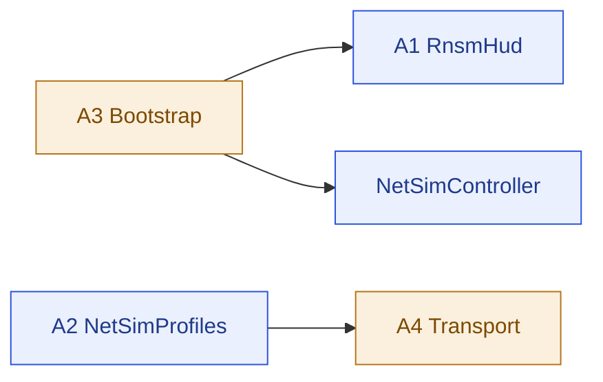

# 05 · spec — A4 SteamP2PRelayTransport (modify) + A3 NetDiagnosticsBootstrap (modify)

> **이 문서는?** 기존 스크립트 2개를 고치는 설계도입니다. [[SteamP2PRelayTransport]](게임↔스팀 사이의 "우체국" — 모든 네트워크 데이터가 거치는 통로)에 ① 시끄러운 로그를 개발용 스위치([[NETCODE_DEBUG]]) 뒤로 숨기고 ② 느린 인터넷 흉내([[PROF-프리셋]])용 "배달 지연 장치"를 달며, [[NetDiagnosticsBootstrap]](계측 장비 자동 설치 스태프)에는 새 장비 2종을 설치 목록에 추가합니다.

## 한눈에 — 의존·관계

## A4 — SteamP2PRelayTransport.cs (modify)
- 경로: [`Assets/Scripts/Networking/SteamP2PRelayTransport.cs`](../../../../Assets/Scripts/Networking/SteamP2PRelayTransport.cs) ← 클릭=실제 파일
- 범주: Script / 변경

### (b) P2-4 수명주기 로그 채널화 — 저위험, 먼저 적용
무조건 `Debug.Log` 11건을 `#if NETCODE_DEBUG`로 래핑(`NetDiag.Event(...)` 계측 호출은 보존):

| 위치(현재 라인) | 로그 |
|---|---|
| L43 | `ClientCallbacks: OnConnecting` |
| L51 | `ClientCallbacks: OnConnected` |
| L60 | `ClientCallbacks: OnDisconnected` |
| L95 | `Instantiating ServerCallbacks` |
| L104 | `ServerCallbacks: OnConnecting` |
| L113 | `ServerCallbacks: OnConnected` |
| L122 | `ServerCallbacks: OnDisconnected` |
| L255 | `DisconnectRemoteClient.` |
| L272 | `DisconnectLocalClient.` |
| L314 | `Shutdown.` |
| L390 | `Initialize.` |

- `OnConnected`(L52·L114)·`OnDisconnected`(L62·L128)의 `InvokeOnTransportEvent`와 `NetDiag.Event` 호출은 **그대로 유지**(기능·계측). 로그 줄만 가드.
- 합격: 정의 없는 빌드에서 위 11건 콘솔 0건(M9), `NETCODE_DEBUG` 정의 시 복원.

### (a) PROF 지연/지터 주입 — 중위험, 채널화 후 적용
- **목표**: `NetSimProfiles.Enabled`일 때 수신 데이터(Data 이벤트)를 release-time 큐로 지연 전달, 비활성이면 기존 즉시 전달.
- **신규 멤버(transport 인스턴스)**:
  - `struct DelayedPacket { public ulong clientId; public byte[] payload; public float releaseAt; }`
  - `readonly Queue<DelayedPacket> simQueue = new();` + `float lastReleaseAt = 0f;`
  - `void DeliverData(ulong clientId, byte[] payload)`:
    - `NetSimProfiles.Enabled == false` → `InvokeOnTransportEvent(NetworkEvent.Data, clientId, new ArraySegment<byte>(payload), Time.realtimeSinceStartup)` 즉시 (기존 동작).
    - 활성 → `now = Time.realtimeSinceStartup; delay = Active.OneWayDelayMs/1000f + 지터; releaseAt = Mathf.Max(now+delay, lastReleaseAt); lastReleaseAt = releaseAt;` enqueue. (FIFO 단조 → 재정렬 없음)
- **호출부 변경**: `ClientCallbacks.OnMessage`(L82)·`ServerCallbacks.OnMessage`(L148)의 `transport.InvokeOnTransportEvent(NetworkEvent.Data, ...)` → `transport.DeliverData(clientId, payload)`. (카운터·정확할당 로직 유지)
- **펌프**: `LateUpdate`(L330) 기존 `socketManager?.Receive()`/`clientConnection?.Receive()` **이후**에 `PumpSimQueue()` 추가:
  - `while (simQueue.Count>0 && simQueue.Peek().releaseAt <= Time.realtimeSinceStartup) { var p=simQueue.Dequeue(); InvokeOnTransportEvent(NetworkEvent.Data, p.clientId, new ArraySegment<byte>(p.payload), Time.realtimeSinceStartup); }`
  - Shutdown(L312)에서 `simQueue.Clear(); lastReleaseAt=0;` 추가.
- **손실 미주입**(G3): drop 로직 없음.
- **무침습 보장**: NetSimProfiles 기본 OFF → `Enabled=false` → 기존 즉시 경로와 100% 동일. 활성화는 F8 수동 토글 시에만.

## A3 — NetDiagnosticsBootstrap.cs (modify · append)
- 경로: [`Assets/Scripts/Utilities/NetDiagnostics/NetDiagnosticsBootstrap.cs`](../../../../Assets/Scripts/Utilities/NetDiagnostics/NetDiagnosticsBootstrap.cs) ← 클릭=실제 파일
- 변경: `Bootstrap()`의 AddComponent 블록(L24~27)에 **2줄 추가**:
  - `go.AddComponent<RnsmHud>();`
  - `go.AddComponent<NetSimController>();`
- 기존 4종(NetEventLogger/StateChecksumV0/BoundaryEchoHarness/SoakHarness)·`#if !NETDIAG_DISABLED` 가드·DontDestroyOnLoad 모두 유지. append만.

## 검증(구현 루프 판정 기준)
1. compile 0 (코드 계열 → 훅 compile).
2. 플레이 진입(StartHost) → `[NetDiagnostics]` GO에 6개 컴포넌트 부착, RNSM HUD 표시.
3. F8 → 콘솔/HUD에 PROF 순환 라벨, `NETSIM` events 기록.
4. 콘솔 error 0 (NETCODE_DEBUG 미정의 시 transport 수명주기 로그도 0).

## 산출물 사용 가이드
> 만든 뒤 어떻게 쓰는지. 코드를 몰라도 켜고·쓰고·주의할 점을 알 수 있게.
- **언제·왜 만들어졌나**: 2026-06-12_netcode 사이클(Step 0 계측), goal G6(P2-4 채널화)+G2. transport 수명주기 Debug.Log 11건이 무조건 출력돼 콘솔이 시끄럽던 것을 정리하고(M9 릴리즈 0), PROF 지연/지터 주입 경로를 추가.
- **Unity 적용법**: 기존 스크립트 2개 수정. 코드 계열이라 컴파일만(reserialize 불요). Bootstrap은 AddComponent 2줄 append. 로그는 `#if NETCODE_DEBUG` 가드.
- **사용법**: 평소(NETCODE_DEBUG 미정의)엔 transport 수명주기 로그 0건. 디버그 시 NETCODE_DEBUG 심볼 정의하면 로그 복원. 지연 주입은 A2의 F8로 제어.
- **주의점**: NETCODE_DEBUG 정의 빌드에서만 로그. NetSimProfiles OFF면 수신 경로는 기존과 동일(무침습). 플레이 중 강제 도메인 리로드 시 컴포넌트 husk 주의(파일명=클래스명 규칙으로 해결됨).

---
## 🔗 관련 문서 (Foam)
- 상위 작업목록: [[2026-06-12_netcode/04_assets|04_assets]] (A3·A4)
- 의존 명세: [[2026-06-12_netcode/05_spec/A2_NetSimProfiles|A2_NetSimProfiles]] · [[2026-06-12_netcode/05_spec/A1_RnsmHud|A1_RnsmHud]]
- 게이트 결정: [[2026-06-12_netcode/decisions|decisions]] (G3 — 손실 미주입·F8)
- 검증·진행: [[2026-06-12_netcode/06_test_env|06_test_env]] · [[2026-06-12_netcode/07_plan|07_plan]] · [[2026-06-12_netcode/08_result|08_result]]
- 용어: [[SteamP2PRelayTransport]] · [[NetDiagnosticsBootstrap]] · [[NETCODE_DEBUG]] · [[PROF-프리셋]] · [[NetSimProfiles]] · [[P0-P1-P2-이슈코드]] → [[_glossary|용어 사전]]
