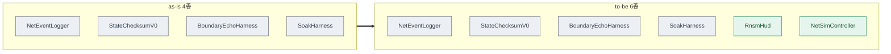

# 06 · test_env — 테스트 환경 정의

> **이 문서는?** 만든 것을 시험할 "실험실 환경"을 현재(as-is)와 목표(to-be)로 적고 적용 방법을 정한 문서입니다. 이 사이클은 씬을 전혀 고치지 않는 구성이라(자동 부착 방식) 적용 위험이 0에 가깝습니다.
> as-is/to-be 를 unity-cli 재현 가능한 수준으로. 적용 전 G5 승인.
> **핵심: 계측은 `RuntimeInitializeOnLoadMethod`(NetDiagnosticsBootstrap)로 자동 부착 → 씬·프리팹 편집 불필요.**
> 따라서 에셋 reserialize 위험 없음. 변경은 전부 코드 계열(.cs) → 훅은 compile만 수행.

## 한눈에 — 환경 변화 (as-is → to-be)



## test_env 매트릭스
| 대상 | as-is | to-be | 적용 방법 |
|---|---|---|---|
| 계측 부트스트랩 (`[NetDiagnostics]` 런타임 GO) | 컴포넌트 4종(NetEventLogger·StateChecksumV0·BoundaryEchoHarness·SoakHarness) | 6종(+RnsmHud·NetSimController) | A3 코드 수정(append) → 훅 compile |
| RNSM HUD | 미부착(패키지만 존재) | RnsmHud가 `RuntimeNetStatsMonitor` 런타임 부착·구성(RTT/Sent/Recv) | A1 신규 코드 → 훅 compile |
| 네트워크 시뮬 | 없음 | NetSimController(F8) + transport 수신 지연/지터 주입(OFF 기본) | A2 신규 + A4 수정 → 훅 compile |
| transport 콘솔 로그 | 수명주기 Debug.Log 11건 무조건 출력 | `#if NETCODE_DEBUG` 가드(릴리즈 0) | A4 수정 → 훅 compile |
| 플레이 스모크 씬 | 활성 씬 `Scene_main_menu_01.unity` (빌드 0번) | (편집 없음) 스모크는 활성 씬에서 진입 — 부트스트랩은 씬 무관 | `editor play --wait` |

## to-be Hierarchy 배치 (`_conventions.md` §15)
> **씬·프리팹 편집 0** — 계측 GO 는 플레이 시작 시 런타임 자동생성된다. 에디트 모드 씬에는 `[NetDiagnostics]` 가 **없는 것이 정상**(있으면 좀비 — 부트스트랩이 청소). transport 수정은 기존 `World Network Manager` 의 컴포넌트에만.
```text
DontDestroyOnLoad  (플레이 중에만 존재)
└─ [NetDiagnostics]            ← ⑤ 런타임 자동생성(RuntimeInitializeOnLoadMethod) · hideFlags=DontSave
   ├─ NetEventLogger           (기구현·검증만)
   ├─ StateChecksumV0          (기구현·검증만)
   ├─ BoundaryEchoHarness      (기구현·검증만)
   ├─ SoakHarness              (기구현·검증만)
   ├─ RnsmHud  →  RuntimeNetStatsMonitor   (A1 신규 + 자동 부착)
   └─ NetSimController         (A2 신규, F8 토글)

━━━━ (활성 씬 루트, 편집 없음) ━━━━
└─ World Network Manager        (④ 씬 단독 루트, NGO)
   └─ [comp] SteamP2PRelayTransport   ← A4 수정(P2-4 채널화 + 지연/지터 주입)
```

## 검증 범위 분리 (G1-Q2 자동화 경계)
**unity-cli 자동 검증 가능 (본 사이클 구현 루프에서 수행)**:
1. compile 0 — 코드 수정 후 훅.
2. `editor play --wait` 진입 → `[NetDiagnostics]` GO 존재 + 컴포넌트 6종 부착 확인(exec).
3. console error 0 (NETCODE_DEBUG 미정의 시 transport 수명주기 로그도 0 확인).
4. F8 토글·OnGUI는 코드 경로 존재만 정적 확인(입력 시뮬은 수동).

**수동/2인 측정 영역 (Step0_Baseline.md로 분리 — 자동화 불가)**:
- RNSM RTT 칸 실제 추종(StartHost + 클라 접속 필요), NetSim 주입 지연 체감, M1~M11 실측, F9/F10 하니스 실행, PROF-A/B 손실은 Clumsy.
- 단일 에디터 StartHost는 Steam 가동 의존 — 데이터 흐름 검증은 수동 항목.

## 적용 스니펫 (플레이 스모크 후 컴포넌트 확인)
```bash
# 플레이 진입은 test-runner/직접 editor play --wait 로. 진입 후 GO·컴포넌트 확인:
unity-cli exec "var go=GameObject.Find(\"[NetDiagnostics]\"); return go==null?\"NO-GO\":string.Join(\",\", go.GetComponents<MonoBehaviour>().Select(c=>c.GetType().Name));" --usings System.Linq,UnityEngine
```

## G5 확인
- 적용 대상: **씬/프리팹 편집 없음**(런타임 부트스트랩). 코드 4파일(.cs)만 변경 → 에셋 정합화 위험 0.
- 영향 범위: 계측 자동 부착 경로 + transport 수신 경로(시뮬 OFF 시 기존과 동일). 게임 로직 무침습.
- 승인 요청: 위 "자동 검증 / 수동 측정" 경계로 진행 동의.

---
## 🔗 관련 문서 (Foam)
- 이전 [[2026-06-12_netcode/04_assets|04_assets]] · **06_test_env**(현재) · 다음 [[2026-06-12_netcode/07_plan|07_plan]]
- 게이트 결정: [[2026-06-12_netcode/decisions|decisions]] (G5)
- 용어: [[NetDiagnosticsBootstrap]] · [[RnsmHud]] · [[NetSimProfiles]] · [[RNSM]] · [[NETCODE_DEBUG]] · [[unity-cli]] → [[_glossary|용어 사전]]
