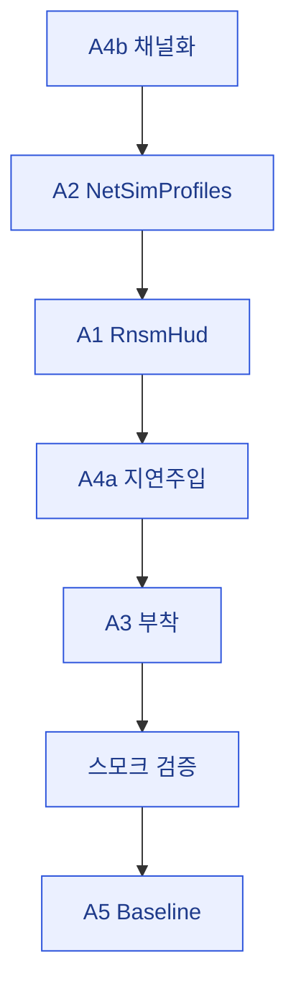

# 07 · plan — 체크리스트·진행관리

> **이 문서는?** 구현 작업을 잘게 쪼갠 할 일 목록입니다. 전부 체크되기 전에는 사이클을 끝낼 수 없습니다(Stop 훅 강제).
> 살아있는 체크리스트. 미완료 `- [ ]` / 완료 `- [x]`. Stop 훅이 미체크 수로 사이클 미완료를 판정.
> 본 사이클 = Step 0 **잔여 갭 마감 + 검증** (G2). 기구현 7종 계측 클래스는 변경 없음(검증만).

## 한눈에 — 작업 순서

## 구현 체크리스트 (의존순: A4b → A2 → A1 → A4a → A3 → smoke → A5)

### 코드 구현
- [x] **A4b** SteamP2PRelayTransport: 수명주기 Debug.Log 11건 `#if NETCODE_DEBUG` 채널화 (NetDiag.Event·InvokeOnTransportEvent 보존) — compile 0
- [x] **A2** NetSimProfiles.cs 신규: `NetSimPreset` struct + `NetSimProfiles`(Off/G/A/B, Active, Enabled, Set, Cycle, ComputeReleaseTime) + `NetSimController`(F8, OnGUI) — compile 0
- [x] **A1** RnsmHud.cs 신규: `RuntimeNetStatsMonitor` 런타임 부착 + `NetStatsMonitorConfiguration` 코드 생성(RTT/Sent/Recv) — compile 0 (using `Unity.Multiplayer.Tools.MetricTypes` 추가)
- [x] **A4a** SteamP2PRelayTransport: `DeliverData()` + `simQueue`/`PumpSimQueue()`(LateUpdate) + OnMessage 2곳 호출 전환 + Shutdown 큐 정리 (손실 미주입) — compile 0
- [x] **A3** NetDiagnosticsBootstrap: AddComponent 2줄(RnsmHud·NetSimController) append — compile 0

### 통합 검증 (자동 — 단일 에디터 스모크)
- [x] compile 에러 0 (전체 4파일 반영 후) — 계측 관련 CS 에러 0
- [x] `editor play --wait` 진입 후 `[NetDiagnostics]` GO에 7 MonoBehaviour 부착 확인(원본 4 + RnsmHud + RuntimeNetStatsMonitor[자동] + NetSimController) — play+exec OK
- [x] 플레이 중 console error 0 (계측 관련) — 잔여 1건은 기존 CaveBiomeSettings 검증 오류(무관)

### 문서 (A5)
- [x] Step0_Baseline.md §0.B "도구 자체 검증" 표에 단일 에디터 스모크 결과 기입 + PROF 손실 Clumsy 보완·NetSim 지연/지터 한정 명시

### 마감 정리 (하네스 규약 — 2026-06-12 소급 적용)
- [x] 용어 사전 갱신 — 본 사이클 용어 25종을 `glossary/`에 등록(concept 9·tool 4·script 9·package 3) + `_glossary.md` 인덱스 반영 + 본문 위키링크
- [x] 검증 증빙 수집 — `evidence/`에 status·console·스크린샷·재검증 기록 저장, `08_result.md` 증빙 섹션 작성 (소급 재검증 21:35~21:44, [[2026-06-12_netcode/08_result|08_result]] 참조)

### 수동 측정 항목 (본 사이클 자동화 범위 밖 — 인계용 명시, 체크 제외)
> 아래는 2인/Steam/실기기 필요 — plan 미완료 판정에서 제외하기 위해 별도 섹션. Step0_Baseline.md로 인계.
- (수동) M1~M11 실측 · RNSM RTT 실추종 · NetSim 주입 체감 · F9 경계 스윕 · F10 30분 soak · PROF-A/B 손실 Clumsy 측정

## 진행 메모
- 기구현 확인분(검증만, 재작성 금지): NetDiagnostics 코어·Bootstrap·NetEventLogger·VerdictLogger(+전투 호출부)·StateChecksumV0·SoakHarness·BoundaryEchoHarness / Step1 코드 전체.
- 착수 순서 근거: A4b(저위험 채널화)로 먼저 컴파일 안정 확보 → A2(API 정의) → A1 → A4a(A2 의존) → A3(부착).

---
## 🔗 관련 문서 (Foam)
- 이전 [[2026-06-12_netcode/04_assets|04_assets]] / [[2026-06-12_netcode/06_test_env|06_test_env]] · **07_plan**(현재) · 다음 [[2026-06-12_netcode/08_result|08_result]]
- 에셋 명세: [[2026-06-12_netcode/05_spec/A1_RnsmHud|A1_RnsmHud]] · [[2026-06-12_netcode/05_spec/A2_NetSimProfiles|A2_NetSimProfiles]] · [[2026-06-12_netcode/05_spec/A3_A4_Transport_and_Bootstrap_mods|A3_A4_Transport_and_Bootstrap_mods]]
- 게이트 결정: [[2026-06-12_netcode/decisions|decisions]]
- 용어: [[RnsmHud]] · [[NetSimProfiles]] · [[SteamP2PRelayTransport]] · [[NETCODE_DEBUG]] · [[베이스라인]] → [[_glossary|용어 사전]]
