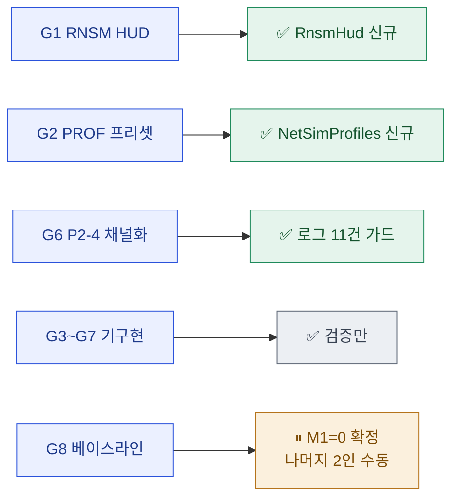
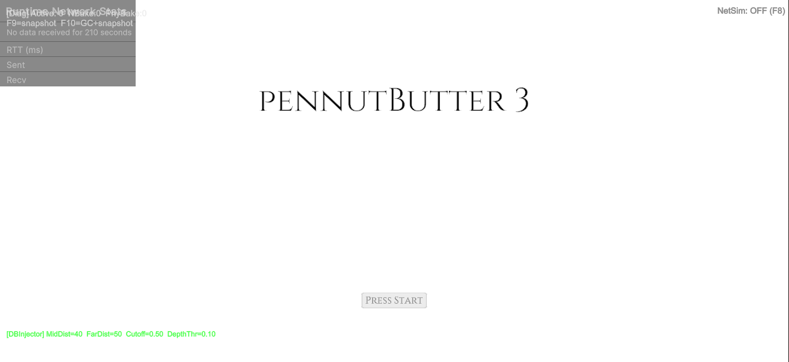

# 08 · result — 결과 보고서

> **이 문서는?** 이번 사이클에서 무엇을 만들었고, 제대로 동작하는지를 **언제·어떻게 확인했는지(증빙 포함)** 정리한 최종 보고서입니다. 경로를 클릭하면 실제 파일이, `[[ ]]`를 클릭하면 용어 풀이가 열립니다.
> 사이클 `2026-06-12_netcode` · 입력 `코옵_Netcode_실행계획_v1.1.md` · 범위 **Step 0(계측 기반)**.

## 요약
- 입력은 6단계(Step 0~5) 전체 실행계획이나, G1 결정으로 **본 사이클은 Step 0(계측 기반 구축)** 으로 한정.
- ③ scope 스캔에서 **Step 0 산출물 대부분이 선행 작업(2026-06-12)으로 이미 기구현**(계측 7종·패키지·절차/증거 문서, +Step 1 코드까지)임을 확인 → 사이클 목적을 **"잔여 갭 마감 + 검증"** 으로 재정의(G2).
- 잔여 갭 3건을 구현하고 단일 에디터 스모크로 검증 완료. 실측(M1~M11)은 2인/Steam 필요 → 수동 항목으로 분리.

## 한눈에 — 달성 요약


## 달성 대비표
| target/goal | 완료 | 비고 |
|---|---|---|
| T4 / G1 (RNSM HUD) | ✅ | `RnsmHud.cs` 신규 — `RuntimeNetStatsMonitor` 런타임 부착 + RTT/Sent/Recv config. 플레이 진입 시 부착 확인 |
| T5 / G2 (PROF 프리셋) | ✅ | `NetSimProfiles.cs` 신규 — PROF-G/A/B 코드 프리셋 + F8 토글. **지연/지터만, 손실 제외**(G3) |
| T9 / G6 (P2-4 채널화) | ✅ | transport 수명주기 Debug.Log 11건 `#if NETCODE_DEBUG` 가드. 패킷 로그는 기존 채널화 유지 → 릴리즈 콘솔 0 |
| T6 / G3 (NetEventLogger) | ✅(기구현) | 변경 없음. 부착·존재 확인만 |
| T7 / G4 (VerdictLogger) | ✅(기구현) | 변경 없음. 호출부 이식(전투 3파일) 확인 |
| T8 / G5 (StateChecksum v0) | ✅(기구현) | 변경 없음. 부착 확인 |
| T10 / G7 (SCN·soak·kill) | ✅(기구현) | SoakHarness·BoundaryEchoHarness·SCN_Procedures.md 존재 확인 |
| T11 / G8 (베이스라인 실측) | ⏸ 보류(수동) | Step0_Baseline.md 양식 완비, 실측란 공란 — **2인/Steam 측정 미집행**(자동화 불가) |

## as-is → to-be diff
- **추가 에셋(new)** (클릭=열기): [`Assets/Scripts/Utilities/NetDiagnostics/RnsmHud.cs`](../../../Assets/Scripts/Utilities/NetDiagnostics/RnsmHud.cs), [`Assets/Scripts/Utilities/NetDiagnostics/NetSimProfiles.cs`](../../../Assets/Scripts/Utilities/NetDiagnostics/NetSimProfiles.cs)
- **변경 에셋(modify)**:
  - [`Assets/Scripts/Utilities/NetDiagnostics/NetDiagnosticsBootstrap.cs`](../../../Assets/Scripts/Utilities/NetDiagnostics/NetDiagnosticsBootstrap.cs) — AddComponent 2종 append(RnsmHud·NetSimController)
  - [`Assets/Scripts/Networking/SteamP2PRelayTransport.cs`](../../../Assets/Scripts/Networking/SteamP2PRelayTransport.cs) — (a) 수신 지연/지터 주입(DeliverData·simQueue·PumpSimQueue, 손실 미주입) (b) 수명주기 로그 11건 채널화
  - [`Reports/netcode/Step0_Baseline.md`](../../../Reports/netcode/Step0_Baseline.md) — §0.B 도구 자체 검증 표에 단일 에디터 스모크 결과 + NetSim/Clumsy 주석 *(2026-06-12 Reports 체계화로 `netcode/` 하위로 이동)*
- **씬·프리팹·에셋(.unity/.prefab/.asset) 변경 0** — 계측은 RuntimeInitializeOnLoadMethod 자동 부착(reserialize 불요).
- **권위 diff = git** (아래). 스냅샷 보조: `snapshots/2026-06-12_netcode_before.json` → `snapshots/2026-06-12_netcode_after.json`.
  - ⚠ unity-cli exec stdout이 ~6KB에서 잘려 전체 AssetDatabase 덤프 불가(before.json도 101줄로 truncated, 실제 Assets/ 2705개). 따라서 after 스냅샷은 **변경 범위 scoped JSON**으로 기록하고 전체 diff는 git을 권위로 삼음.
  - git: `M` SteamP2PRelayTransport.cs · NetDiagnosticsBootstrap.cs · Reports/Step0_Baseline.md / `??` NetSimProfiles.cs · RnsmHud.cs(+ .meta).

## 검증 증빙 (Evidence)
> 원본 증빙 파일은 [evidence/](evidence/) 폴더. 사인오프(19:20) 당시 기록 + 증빙 규약 도입에 따른 **소급 재검증**(21:35~21:44, [상세 기록](evidence/retrofit_smoke_20260612.md))으로 구성.

### 검증 환경·시각
| 항목 | 값 |
|---|---|
| 원검증(사인오프) | 2026-06-12 18:50 ~ 19:20 (G5 승인 → G7 사인오프) |
| 소급 재검증 | 2026-06-12 21:35 ~ 21:44 (플레이 2회 진입, 프로브 3종) |
| Unity / Connector | Unity 6000.3.1f1 · unity-cli Connector 0.3.22 · PID 17540 ([status.txt](evidence/status.txt)) |
| 검증 방법 | compile · `editor play --wait` 스모크 · exec 컴포넌트 조회 · console 덤프 · 스크린샷 |

### task별 검증 기록
| task (A-ID) | 원검증 (≤19:20) | 소급 재검증 (21:35~) | 근거 |
|---|---|---|---|
| A4b 로그 채널화 | compile 0, 릴리즈 콘솔 0 | console error에 transport 로그 0 유지 | [console_error.txt](evidence/console_error.txt) |
| A2 NetSimProfiles | compile 0, F8 토글 라이브(OFF→G→A) | 클래스 정상(프로브 부착·생존), **단 부트스트랩 부착분 파괴 회귀 발견** ⚠ | [retrofit_smoke_20260612.md](evidence/retrofit_smoke_20260612.md) |
| A1 RnsmHud | compile 0, RNSM Visible+Config | 부착·HUD 표시 유지(RTT/Sent/Recv 패널) | [play_smoke_rnsm.png](evidence/play_smoke_rnsm.png) |
| A4a 지연/지터 주입 | compile 0 | 코드 경로 유지(시뮬 OFF 기본 — 기존 경로와 동일) | [components.txt](evidence/components.txt) |
| A3 Bootstrap append | play 진입 7종 부착 | **6종 생존 + NetSimController null** (재현 2/2) ⚠ | 〃 |
| A5 Baseline 기입 | §0.B 기입 완료, M1 RTT=0ms 확정 | 문서 유지 | [`Step0_Baseline.md`](../../../Reports/netcode/Step0_Baseline.md) |

### 콘솔 로그 발췌 (소급 재검증 21:43)
```log
# console --type error — 계측(NetDiag) 관련 에러 0. 잔여는 본 작업과 무관한 기존 이슈:
[치명적 오류] DepthLayerGPUData… (CaveBiomeSettings.cs:339)   ← 기존 Cave 검증 오류
NullReferenceException… DontDestroyOnLoadHelper:Awake() (:54) ← 기존 DDOL 헬퍼 이슈
SSGI URP: Material is not using Hidden/Lighting/… shader      ← 기존 렌더 패키지 경고
```
- 전문: [console_error.txt](evidence/console_error.txt) · [console_tail.txt](evidence/console_tail.txt)

### 스크린샷·산출물
- 
  *메인 메뉴 플레이 스모크: [[RNSM]] HUD 패널 표시("No data received"는 호스트 미가동 상태의 정상 표기), 우상단 "NetSim: OFF (F8)" 라벨.*
- 결과물: [`RnsmHud.cs`](../../../Assets/Scripts/Utilities/NetDiagnostics/RnsmHud.cs) · [`NetSimProfiles.cs`](../../../Assets/Scripts/Utilities/NetDiagnostics/NetSimProfiles.cs) · [`NetDiagnosticsBootstrap.cs`](../../../Assets/Scripts/Utilities/NetDiagnostics/NetDiagnosticsBootstrap.cs) · [`SteamP2PRelayTransport.cs`](../../../Assets/Scripts/Networking/SteamP2PRelayTransport.cs)

### 원검증 세부 (사인오프 당시 기록 — 증빙 파일 없음, decisions.md 기반)
- compile: 계측 관련 CS 에러 **0** (RnsmHud의 `Unity.Multiplayer.Tools.MetricTypes` using 누락 1건 발견·수정).
- play 진입: `[NetDiagnostics]` GO에 7 MonoBehaviour 부착 — 원본 4(NetEventLogger/StateChecksumV0/BoundaryEchoHarness/SoakHarness) + RnsmHud + RuntimeNetStatsMonitor(자동) + NetSimController.
- console error: 계측 관련 **0**. 잔여 1건은 기존 `CaveBiomeSettings` 검증 오류(본 작업 무관).
- P2-4: NETCODE_DEBUG 미정의 빌드에서 transport 콘솔 로그 0 확인.
- **단일 에디터 베이스라인 부분 측정(G7 사용자 요청)**: StartHost 성공(isHost·listening·로컬클라1, Steam valid). **M1 RTT=0ms 확정**(loopback — 계획의 M1 베이스라인 증거와 일치). NetSim 토글 라이브 동작(OFF→PROF-G→PROF-A, Enabled=True). RNSM Visible+Configuration 정상. → `Step0_Baseline.md` 기입. 원격 클라(2번째) 부재로 M2/3/5/6/7/8/10/11·NetSim 주입 지연은 2인/Steam 측정 대기.
- ⚠ 당시에는 증빙 규약(§10) 이전이라 콘솔 덤프·스크린샷이 저장되지 않았다. 위 "소급 재검증"이 이를 보완하며, 그 과정에서 NetSimController 회귀를 발견했다(잔여 이슈 0번).

## 산출물 인수인계 (어떻게 적용·사용하나 — `_conventions.md` §16)
> 이번 사이클 산출물을 한눈에. 상세는 각 ⑤ spec "산출물 사용 가이드" 참조. **계측은 전부 런타임 자동생성 — 씬 손댈 것 없음.**
| 산출물 | 무엇 | 적용 | 사용법 한 줄 | 주의 |
|---|---|---|---|---|
| [`RnsmHud.cs`](../../../Assets/Scripts/Utilities/NetDiagnostics/RnsmHud.cs) | [[RNSM]] HUD 부착 | 자동생성 | 플레이+StartHost → 좌상단 RTT/Sent/Recv 패널 | NetworkManager 살아야 갱신. "No data"는 호스트 미가동 정상 |
| [`NetSimProfiles.cs`](../../../Assets/Scripts/Utilities/NetDiagnostics/NetSimProfiles.cs) + [`NetSimController.cs`](../../../Assets/Scripts/Utilities/NetDiagnostics/NetSimController.cs) | [[PROF-프리셋]] 토글 | 자동생성 | 플레이 중 **F8** 로 OFF→G→A→B 순환(우상단 라벨) | 손실 미주입(Clumsy 보완). 기본 OFF=무침습 |
| [`SteamP2PRelayTransport.cs`](../../../Assets/Scripts/Networking/SteamP2PRelayTransport.cs) | 전송계층(로그 채널화+지연 주입) | 기존 컴포넌트 수정 | 평소 콘솔 로그 0. 디버그 시 `NETCODE_DEBUG` 심볼 정의 | `World Network Manager` 의 컴포넌트. OFF면 기존과 동일 |
| [`NetDiagnosticsBootstrap.cs`](../../../Assets/Scripts/Utilities/NetDiagnostics/NetDiagnosticsBootstrap.cs) | 계측 자동부착 진입점 | 자동(RuntimeInitialize) | 플레이 시작 시 `[NetDiagnostics]` 자동 생성·부착 | 릴리즈는 `NETDIAG_DISABLED` 심볼로 전체 비활성 |
| [`Step0_Baseline.md`](../../../Reports/netcode/Step0_Baseline.md) | M1~M11 측정 양식 | 문서 | 2인/실기기 측정값 기입(M1=0 기입됨) | 나머지 실측은 2인/Steam 필요(수동) |

## 다측면 이점 (이번 사이클이 가져온 가치)
> 이번 사이클은 **계측 인프라**라 플레이어 직접 체감 변화는 없지만, 이후 모든 네트워크 개선의 토대를 깔았다.
| 측면 | 이점 |
|---|---|
| 게임(플레이어 체감) | 직접 변화 없음(계측). 단, [[RTT]]·[[desync]] 등 멀티플레이 품질을 **측정→개선**할 토대 마련 — 향후 랙·동기화 개선의 출발점 |
| 개발(생산성·안정성) | ① [[RNSM]] HUD 로 플레이 중 네트워크 상태 **즉시 가시화** ② [[PROF-프리셋]] F8 토글로 나쁜 망 **재현 가능** ③ 로그 [[NETCODE_DEBUG]] 채널화로 콘솔 소음 제거 ④ 회귀([[NetSimController]] husk) 발견·근본수정 + **"파일명=클래스명" 규칙**을 _conventions §1 에 영구 등재 |
| 기획(검증·의사결정) | [[M-지표]] 측정 체계 + [[베이스라인]](M1=0 확정)로 "효과 입증" 가능 — Step 1~5 착수의 **형식적 전제**(측정 없이 수정 금지) 충족 |
| 아트(작업 기반) | 해당 없음 |
| 운영(측정·이력) | [[SCN-시나리오]] 절차·[[soak-테스트]]·증거 문서 체계 가동. 하네스 사이클 자체가 분석→명세→검증→증빙→이관의 **재사용 가능한 이력**으로 누적(용어 26종 사전화) |

## 잔여 이슈 / 후속 제안
0. ⚠ **[소급 재검증 발견] NetSimController 초기화 윈도우 파괴 회귀** — 부트스트랩이 부착한 [[NetSimProfiles|NetSimController]]만 시작 직후 파괴됨(재현 2/2, 수동 재부착은 생존). 현재 상태에서 **F8 PROF 토글이 부트스트랩 경로로 동작 불가**. 사인오프(19:20) 후 프로젝트 변경에 의한 회귀로 추정 — 원인 조사·수정 필요. 상세: [retrofit_smoke_20260612.md](evidence/retrofit_smoke_20260612.md)
   - ✅ **해결됨(2026-06-12 23:05 추보)** — "사인오프 후 프로젝트 변경" 추정은 기각. 실제 원인은 **파일명≠클래스명(m_Script 미바인딩) + 도메인 리로드 husk화 + DontSave 좀비 GO 누적**. 수정 4건·재검증(플레이 2회 연속 + 플레이 중 강제 리로드에서 7종 전원 생존) 완료 — 하단 "추보" 섹션 및 [retrofit_smoke_20260612.md](evidence/retrofit_smoke_20260612.md) §해결 참조.
1. **베이스라인 실측(M1~M11) 수동 집행** — 2인 실기기(또는 단일 에디터 다중 인스턴스 + Steam) + NetSim(F8)/F9/F10 하니스로 `Step0_Baseline.md` 채우기. 이것이 Step 1 진입의 형식 전제.
2. **PROF 손실률은 Clumsy로 보완** — 코드 시뮬은 지연/지터만. PROF-A(2%)·PROF-B(5%) 손실 측정 시 OS레벨 Clumsy 병행.
3. **후속 사이클**: Step 1(코드 기구현·측정 대기) → Step 2~5는 각각 `/cycle-start`. Step 1 코드는 이미 적용돼 있어 다음 사이클은 "검증·측정 + 잔여" 성격이 될 가능성.
4. (선택) NetDiagnostics asmdef 분리 — 릴리즈 빌드 격리 필요 시 Step 5에서.

## 게이트 결정 요약 (`decisions.md` 참조)
- **G1**: 범위=Step 0 단독 / 자동화=단일 에디터 근사 / 기존 자산 재사용 / PROF=Network Simulator.
- **G2**: 전제 변경(Step 0 거의 기구현) → 목적=잔여 갭 마감+검증 / PROF=코드 프리셋+토글.
- **G3**: PROF 시뮬 지연·지터만(손실 제외, Clumsy 보완) / 토글 키 F8 / 파일 5건 확정.
- **G5**: 씬 편집 없음 / 자동=compile+play 스모크, 수동=실측 분리.
- **G7**: (본 보고서 사인오프 대기)

## 용어 사전 갱신 (소급 등록 — 2026-06-12)
- 본 사이클에서 추출·등록한 용어 25종 → [[_glossary|용어 사전 인덱스]]
  - concept(9): [[RNSM]] · [[RTT]] · [[M-지표]] · [[SCN-시나리오]] · [[베이스라인]] · [[soak-테스트]] · [[desync]] · [[NETCODE_DEBUG]] · [[P0-P1-P2-이슈코드]]
  - tool(4): [[PROF-프리셋]] · [[unity-cli]] · [[Clumsy]] · [[Network-Profiler]]
  - script(10): [[NetEventLogger]] · [[VerdictLogger]] · [[StateChecksumV0]] · [[RnsmHud]] · [[NetSimProfiles]] · [[NetSimController]] · [[NetDiagnosticsBootstrap]] · [[SteamP2PRelayTransport]] · [[SoakHarness]] · [[BoundaryEchoHarness]]
  - package(3): [[Multiplayer-Tools]] · [[NGO]] · [[Facepunch-Steamworks]]

## 다음 사이클 이관
- 잔여·후속을 차기 후보로 구조화 → [[2026-06-12_netcode/09_next|⑨ next]] (N1 베이스라인 실측 · N2 Step 1 검증 · N3 Clumsy · N4 asmdef)

---
## 🔗 관련 문서 (Foam)
- 이전 [[2026-06-12_netcode/07_plan|07_plan]] · **08_result**(현재, 사인오프 완료) · 다음 [[2026-06-12_netcode/09_next|⑨ next]]
- 전체 파이프라인: [[2026-06-12_netcode/01_target|01_target]] · [[2026-06-12_netcode/02_goal|02_goal]] · [[2026-06-12_netcode/03_scope|03_scope]] · [[2026-06-12_netcode/04_assets|04_assets]] · [[2026-06-12_netcode/06_test_env|06_test_env]]
- 에셋 명세: [[2026-06-12_netcode/05_spec/A1_RnsmHud|A1_RnsmHud]] · [[2026-06-12_netcode/05_spec/A2_NetSimProfiles|A2_NetSimProfiles]] · [[2026-06-12_netcode/05_spec/A3_A4_Transport_and_Bootstrap_mods|A3_A4_Transport_and_Bootstrap_mods]]
- 게이트 결정: [[2026-06-12_netcode/decisions|decisions]] (G1·G2·G3·G5·G7)
- 증거 문서: [[Step0_Baseline]] · 재검증 [retrofit_smoke_20260612.md](evidence/retrofit_smoke_20260612.md)

---
## 추보 — 잔여 이슈 0 해결 (2026-06-12 23:05)
> append-only 규약에 따라 사인오프 본문은 수정하지 않고 덧붙인다. 상세 증빙: [retrofit_smoke_20260612.md](evidence/retrofit_smoke_20260612.md) §"✅ 해결".

- **근본 원인**: ① `NetSimController` 가 `NetSimProfiles.cs` 내 정의(파일명≠클래스명) → MonoScript(m_Script) 미바인딩 — 살아있어도 missing 1로 집계됨 ② 도메인 리로드 시 직렬화 복원 실패 → missing-script null 슬롯(세션#1은 Editor.log 36869→37040~37186 의 플레이 중 강제 리로드로 확증) ③ `HideFlags.DontSaveInEditor` GO 가 플레이 종료 후 미파괴·누적(좀비 5개 실측) → 세션#2 "재현"은 `GameObject.Find` 가 잡은 구세대 좀비. **외부 Destroy 코드는 없었음** — 기존 배제 가설들과 모두 정합.
- **수정 4건**: [`NetSimController.cs`](../../../Assets/Scripts/Utilities/NetDiagnostics/NetSimController.cs) 신규 분리(본질 수정) · [`NetSimProfiles.cs`](../../../Assets/Scripts/Utilities/NetDiagnostics/NetSimProfiles.cs) 클래스 제거 · [`NetDiagnosticsBootstrap.cs`](../../../Assets/Scripts/Utilities/NetDiagnostics/NetDiagnosticsBootstrap.cs) 좀비 스윕+ExitingPlayMode 정리(에디터 전용) · [`RnsmHud.cs`](../../../Assets/Scripts/Utilities/NetDiagnostics/RnsmHud.cs) config SO 누수 정리.
- **재검증(23:00~23:05)**: compile 0 → play #1: goCount=1(좀비 5 회수)·7종 생존·missingCnt=0 → **플레이 중 강제 리로드(`refresh --compile --force`) 후에도 생존** → play #2: 7종 생존(**2회 연속**) → stop 후 zombieGOs=0 → console NetDiag 에러 0.
- **판정 갱신**: "task별 검증 기록" 표의 A2·A3 ⚠ 항목은 본 추보로 해소 — **F8 PROF 토글 부트스트랩 경로 정상화**.
- **재발 방지 규칙**: MonoBehaviour/ScriptableObject 는 파일명=클래스명 단독 파일(런타임 AddComponent 전용이라도 동일) · 검증 플로우는 stop→refresh→play 순서 유지(플레이 중 refresh 는 도메인 리로드 유발, CLI v0.3.22 는 기본 차단·`--force` 시 수행).
