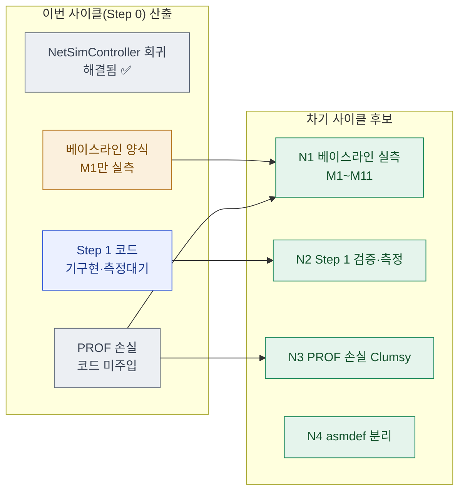

# 09 · next — 다음 사이클 이관

> **이 문서는?** 이번 Step 0 사이클에서 다 못 했거나 새로 발견해 **다음으로 넘길 것**을, 바로 다음
> `/cycle-start` 입력이 되게 구조화한 인계장입니다(무엇). Step 0 는 "측정 인프라 구축"이고 실측·후속
> Step 은 별도 사이클이라(왜) 잔여를 차기 후보로 승격해 흐름으로 보이며(어떻게), ⑧ 사인오프 후
> Claude 가 작성하고 **끝에서 사람에게 "바로 진행?"을 질의**합니다(언제·누가).

## 한눈에 — 이관 흐름

## 차기 후보 매트릭스
| 차기후보 | 유형 | 출처 | 우선순위 | 비고 |
|---|---|---|---|---|
| N1 베이스라인 실측(M1~M11) | 측정 | [⑧ 잔여 1](08_result.md#잔여-이슈--후속-제안) | P0 | **2인 실기기/Steam 선행 필수**. Step 1 진입의 형식 전제. F8/F9/F10 하니스 사용 |
| N2 Step 1 검증·측정 | 이월 | [③ scope 보너스행](03_scope.md) | P1 | Step 1 코드는 이미 적용됨("코드 완료, 측정 대기") → 다음 사이클은 "검증·측정+잔여" 성격 |
| N3 PROF 손실률 Clumsy 측정 | 측정 | [⑧ 잔여 2](08_result.md) · [[Clumsy]] | P2 | 코드 시뮬은 지연/지터만(G3). PROF-A(2%)·B(5%) 손실은 OS레벨 Clumsy 병행 |
| N4 NetDiagnostics asmdef 분리 | 신규 | [⑧ 잔여 4](08_result.md) | P2 | 릴리즈 빌드 격리 필요 시(원 계획 Step 5) |

## 권장 다음 사이클
- **slug 제안**: `netcode-step1-verify` (또는 측정 우선이면 `netcode-baseline`)
- **입력 문서 제안**: [`Reports/netcode/Step1_Evidence.md`](../../../Reports/netcode/Step1_Evidence.md) + [`Reports/netcode/코옵_Netcode_실행계획_v1.1.md`](../../../Reports/netcode/코옵_Netcode_실행계획_v1.1.md) (Step 1 절)
- **선행 조건**: N1 베이스라인 실측은 **2인 실기기 또는 단일 에디터 다중 인스턴스+Steam** 필요 — 사용자 환경 준비가 전제. 코드 검증(단일 에디터)만이면 선행 없이 가능.

## ▶ 다음 사이클 진행 질의 (G8)
> 이 사이클(`2026-06-12_netcode`, Step 0 계측 기반)은 사인오프 완료. 우선 후보는 **N2 Step 1 검증·측정**
> (코드 기구현 상태라 단일 에디터로 착수 가능) 또는 **N1 베이스라인 실측**(2인 측정 환경 필요).
> **다음 사이클을 바로 시작할까요?**
> - 예 → `/cycle-start Reports/netcode/Step1_Evidence.md netcode-step1-verify` 안내·실행
> - 아니오 → 본 인계장 보관 후 종료(다음 세션이 이 문서로 재개)
> - 조정 → 다른 후보(N1/N3/N4)·범위로 재설정

---
## 🔗 관련 문서 (Foam)
- 이전 [[2026-06-12_netcode/08_result|⑧ result]] · **⑨ next**(현재, 사이클 종단)
- 게이트 결정: [[2026-06-12_netcode/decisions|decisions]] (G8)
- 용어: [[베이스라인]] · [[M-지표]] · [[Clumsy]] · [[SCN-시나리오]] → [[_glossary|용어 사전]]
