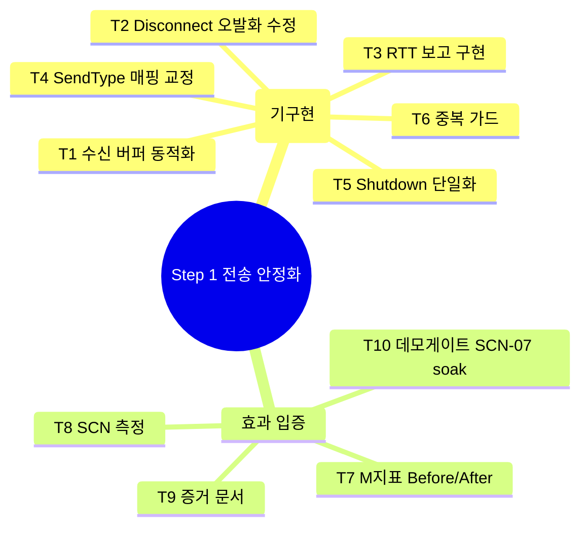

# 01 · target — 기획 내용 정리

> **이 문서는?** Step 1(전송 안정화) 작업 단위(T1~T10 — 코드 6건 + 효과 입증·게이트 4건)를 재리스트하고
> 기획 원문과 개발 해석을 분리해 둔 target 매트릭스입니다(무엇). 직전 `2026-06-12_netcode`가 Step 0을
> 사인오프해 다음 단계가 Step 1이므로(왜) 원문(§번호)·해석(개발 관점)을 열로 나누고 기구현 여부를 해석란에
> 명시하며(어떻게), Step 0 사인오프 직후 작성하고 모호 항목은 [G1](decisions.md#G1) 에서 확인합니다(언제·누가).
> 입력: `00_input/코옵_Netcode_실행계획_v1.1.md`. 모호도 "높음"은 G1 에서 확인.
> **범위 가설: 이 사이클 = Step 1(전송 안정화)**. 직전 `2026-06-12_netcode` 사이클이 Step 0(계측 기반)을 사인오프했고, 6단계 전체 target(T1~T41)은 그 사이클 [[2026-06-12_netcode/01_target|01_target]]에 기록됨. 본 문서는 **Step 1 작업 단위만** 재리스트한다.

## 한눈에 — Step 1 분류 트리

## Step 1 · 전송 안정화 — target 매트릭스 (계획 §1·§Step1)

| T-ID | 항목 | 분류 | 원문근거 | 해석 | 모호도 |
|---|---|---|---|---|---|
| T1 | [[P0-P1-P2-이슈코드\|P0-1]] 수신 버퍼 동적화 | 기능 | 1.A.1 "실제 size만큼 정확 할당, 고정 버퍼 재사용 폐기, 서버 TODO 제거·통일" | [[SteamP2PRelayTransport]] 수신 경로. 경계값(1023/1024/1025/MTU~1300/4096/64KB) 무손상. **직전 scope 스캔서 기구현 확인** | 보통 |
| T2 | P0-2 Disconnect 오발화 수정 | 기능 | 1.A.2 "`ServerCallbacks.OnDisconnected`의 `NetworkEvent.Connect`→`Disconnect` (1단어)" | 끊김 정리 체인(ready맵·로비·세션카운트)을 [[NetEventLogger]] 타임라인으로 재검증. **기구현 확인** | 낮음 |
| T3 | P0-4 [[RTT]] 보고 구현 | 기능 | 1.A.3 "[[Facepunch-Steamworks\|Facepunch]] Connection ping/상태 조회로 연결별 RTT 반환" | clientId→Connection 매핑. **기구현**(`GetCurrentRtt`→`QuickStatus().Ping`). API명 리플렉션 확정됨 | 낮음 |
| T4 | P1-2 SendType 매핑 교정 | 기능 | 1.A.4 "[[NGO]] `NetworkDelivery` ↔ Steam send flag 매핑 재정의(Sequenced 보존/Reliable 승격)" | UnreliableSequenced→Reliable 승격. **기구현**(매핑표 문서화됨) | 낮음 |
| T5 | P1-1 RunCallbacks/Shutdown 단일화 | 기능 | 1.A.5 "펌핑·수명 SteamClient 단일화, Transport.Shutdown은 소켓만(`SteamClient.Shutdown()` 금지)" | 재호스팅 시 Steam 초기화 1회 유지(M8). **기구현**(SteamClient/SteamLobbyManager 펌핑 단일화) | 보통 |
| T6 | P2-8 최소 중복 가드 (R7) | 기능 | 1.A.6 "DontDestroyOnLoad 싱글톤에 중복 인스턴스 즉시 파괴 가드만 선행" | SCN-02 측정 오염 방지. **기구현**(WorldItemSpawner Awake 가드). 전면 정리는 Step 5 | 낮음 |

## 횡단 — 효과 입증·게이트

| T-ID | 항목 | 분류 | 원문근거 | 해석 | 모호도 |
|---|---|---|---|---|---|
| T7 | [[M-지표\|M1·M2·M3·M8]] Before/After 입증 | 제약 | §Step1 1.B "Baseline(Step 0) 대비 합격 기준" | M1 RTT 추종 / M2 64KB 무손상 / M3 Disconnect 정상 / M8 재호스팅 10/10. **[[베이스라인\|Before]]는 Step 0 미집행(2인 대기)** → After도 동일 제약 | **높음** |
| T8 | [[SCN-시나리오\|SCN-01·02·07]] 측정 | 제약 | 1.B 표 "SCN-01 경계값, SCN-02 kill×5·재호스팅×10, SCN-07 30분 soak" | 2인/Steam 필요. SCN-02 재호스팅·SCN-07 [[soak-테스트\|soak]]는 단일 에디터 근사 한계 | **높음** |
| T9 | `Step1_Evidence.md` 증거 문서 | 제약 | §1 "각 Step `StepN_Evidence.md`가 게이트 판정 유일 근거" | **기존재**(구현 내역·매핑표 작성됨, Before/After 실측란 공란) → 채우기 대상 | 보통 |
| T10 | **데모 게이트 1차** = SCN-07 30분 soak 통과 | 제약 | §1 "SCN-07 30분 soak 통과 (데모 게이트 1차)", §7 "데모 게이트=Step0~2" | Step 1 통과 = Step 2 착수 조건. R2: "재접속 재합류"는 본 단계 제외(Step 3) | 보통 |

## 모호·누락 항목 (G1 질문 대상)

### Q1. 이 사이클 범위 = Step 1 단독 확정?
- 가설: Step 0 사인오프 후 자연 다음 단계 = **Step 1(전송 안정화)**. Step 2~5는 후속 `/cycle-start`.
- 동의 시 진행. (이론상 Step 1+2 묶음도 가능하나 데모 게이트 단위로 Step 1 권장.)

### Q2. Step 1 코드 기구현 → 사이클 목적 = 검증 + 측정 (Step 0와 동일 양상)
- 직전 scope 스캔 + `Step1_Evidence.md`("코드 완료 2026-06-12, 측정 대기")로 **T1~T6 전부 기구현 확인**.
- 따라서 본 사이클도 **신규 구현이 아니라 ① 기구현 코드 재검증(컴파일·단일 에디터 스모크) + ② 측정 집행(수동)** 으로 재정의될 가능성 높음 → ③ scope에서 정밀 확인 후 G2.

### Q3. 측정 자동화 경계 (Step 0 G1-Q2 계승)
- M1/M2/M3/M8·SCN-02 재호스팅·SCN-07 30분 soak는 **2인 실기기/Steam** 전제 → 단일 에디터 근사 + 오차 명시. 자동화 가능 범위는 컴파일·플레이 스모크·StartHost 단일 호스트 확인까지.
- 동일 경계 유지 동의 여부 확인.

### Q4. 직전 사이클 transport 변경과의 정합
- 직전 `netcode` 사이클이 [[SteamP2PRelayTransport]]에 PROF 지연주입·P2-4 채널화를 추가함. Step 1 코드(P0-1/2/4·P1-2/1)와 **동일 파일에 공존** — 재검증 시 충돌·회귀 없는지 확인 필요(낮은 리스크).

## as-is 스냅샷
- `snapshots/2026-06-13_netcode2_before.txt` 참조 (Editor 가 직접 기록 — 2706 항목, 잘림 없음)

---
## 🔗 관련 문서 (Foam)
- 파이프라인: **① target**(현재) → [[2026-06-13_netcode2/02_goal|② goal]] → [[2026-06-13_netcode2/03_scope|③ scope]] → [[2026-06-13_netcode2/04_assets|④ assets]] → [[2026-06-13_netcode2/06_test_env|⑥ test_env]] → [[2026-06-13_netcode2/07_plan|⑦ plan]] → [[2026-06-13_netcode2/08_result|⑧ result]] → [[2026-06-13_netcode2/09_next|⑨ next]]
- 게이트 결정: [[2026-06-13_netcode2/decisions|decisions]] (G1)
- 직전 사이클: [[2026-06-12_netcode/08_result|netcode(Step 0) 결과]] · [[2026-06-12_netcode/03_scope|Step 0 scope(기구현 스캔)]]
- 용어: [[P0-P1-P2-이슈코드]] · [[RTT]] · [[SteamP2PRelayTransport]] · [[NetEventLogger]] · [[Facepunch-Steamworks]] · [[NGO]] · [[M-지표]] · [[SCN-시나리오]] · [[soak-테스트]] · [[베이스라인]] → [[_glossary|용어 사전]]
