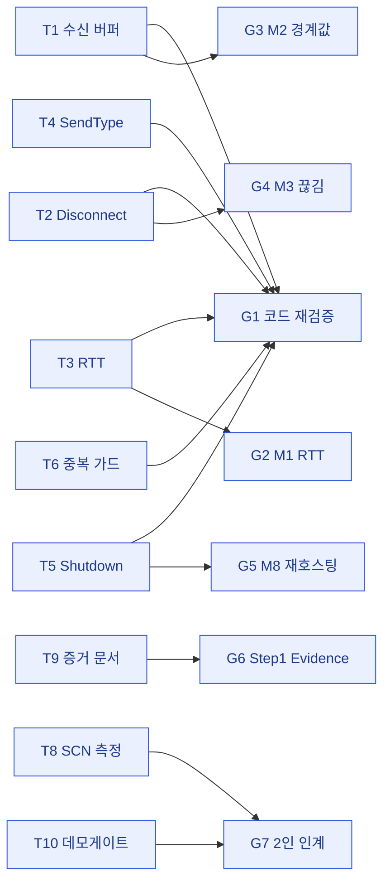

# 02 · goal — 개발 요구사항 도출[[]]

> **이 문서는?** target(T1~T10)을 개발 요구사항(G1~G7 — 코드 재검증·지표 측정·증거 문서·수동 인계)
> 단위로 변환한 goal 매트릭스입니다(무엇). 기획 항목이 빠짐없이 작업으로 이어지는지 보장하려고(왜)
> target ID 를 goal 행에 연결하고 매핑 점검으로 누락을 막으며(어떻게), Step 0 사인오프 직후 작성합니다(언제·누가).
> **본 사이클 = Step 1(전송 안정화)**. 코드는 기구현 추정(③ scope 확정) → 요구사항은 **검증 + 근사 측정** 중심.

## 한눈에 — target → goal 매핑

## goal 매트릭스
| G-ID              | 연결 target                                                           | 개발 요구사항                                                                                        | 필요 시스템                                                                   | 에셋 범주       | 우선순위   |
| ----------------- | ------------------------------------------------------------------- | ---------------------------------------------------------------------------------------------- | ------------------------------------------------------------------------ | ----------- | ------ |
| G1 | [T1](01_target.md#T1)~[T6](01_target.md#T6)                         | Step 1 코드 기구현 **재검증** — compile 0 + 단일 에디터 플레이 스모크. 직전 사이클 PROF 지연주입·P2-4 채널화와 **회귀 없이 공존** 확인 | SteamP2PRelayTransport, SteamClient, SteamLobbyManager, WorldItemSpawner | Script(검증만) | P0     |
| G2 | [T3](01_target.md#T3), [T7](01_target.md#T7)                        | **M1 RTT** 재확인 — StartHost loopback에서 0 측정(Step0 Before와 동일) + 원격 클라 RTT는 수동 대기                | GetCurrentRtt, RNSM                                                      | 측정          | P0     |
| G3 | [T1](01_target.md#T1), [T7](01_target.md#T7), [T8](01_target.md#T8) | **M2 경계값 근사 측정** — BoundaryEchoHarness를 exec로 구동(키 F9 대체) 시도, 512~64KB 무손상 확인. 2번째 피어 필요 여부 판정 | BoundaryEchoHarness, NetDiagnostics(echo.csv)                            | 측정          | P1     |
| G4 | [T2](01_target.md#T2), [T7](01_target.md#T7), [T8](01_target.md#T8) | **M3 끊김 정합 근사** — Shutdown/강제 끊김 → events.csv에 `Disconnect` 짝 기록 확인(P0-2 효과: Connect 오발화 0)    | NetEventLogger(events.csv), Transport                                    | 측정          | P1     |
| G5 | [T5](01_target.md#T5), [T7](01_target.md#T7), [T8](01_target.md#T8) | **M8 재호스팅 근사** — StartHost→Shutdown→StartHost 반복(에디터 내) → Steam 재초기화 에러 0, events.csv 정합       | SteamClient(P1-1), NetEventLogger                                        | 측정          | P1     |
| G6 | [T9](01_target.md#T9)                                               | `Step1_Evidence.md` Before/After 표 기입 — 자동 확인분 채우고 2인 필요분 명시 분리                                | 측정 결과                                                                    | Doc         | P0     |
| G7 | [T8](01_target.md#T8), [T10](01_target.md#T10)                      | **2인/실기기 측정 인계** — SCN-02 재호스팅 ×10, SCN-07 30분 soak(데모 게이트 1차), 원격 클라 M1~M8. 자동화 불가분 명문화       | soak/kill 하네스                                                            | Doc(인계)     | 보류(수동) |

## 매핑 점검
- 범위 내 target 전부 연결: T1→G1·G3, T2→G1·G4, T3→G1·G2, T4→G1, T5→G1·G5, T6→G1, T7→G2~G5, T8→G3·G4·G5·G7, T9→G6, T10→G7.
- 범위 외: Step 2~5(후속 사이클). EnvFlagRegistry는 Step 0+1 완료 후 진입(§6).

## 우선순위 근거
- **P0**: G1(코드 정합 — 직전 transport 수정과 공존 회귀가 가장 큰 리스크), G2(M1 즉시 확인 가능), G6(증거 문서).
- **P1(근사 측정 적극 시도 — G1-Q2)**: G3·G4·G5 — 단일 에디터/exec 구동 가능 범위를 ③ scope에서 판정 후 실행.
- **보류(수동)**: G7 — 2인/Steam/30분 soak 본질적 자동화 불가.

---
## 🔗 관련 문서 (Foam)
- 이전 [[2026-06-13_netcode2/01_target|① target]] · **② goal**(현재) · 다음 [[2026-06-13_netcode2/03_scope|③ scope]]
- 게이트 결정: [[2026-06-13_netcode2/decisions|decisions]]
- 용어: [[M-지표]] · [[RTT]] · [[SCN-시나리오]] · [[soak-테스트]] · [[BoundaryEchoHarness]] · [[NetEventLogger]] · [[SteamP2PRelayTransport]] → [[_glossary|용어 사전]]
