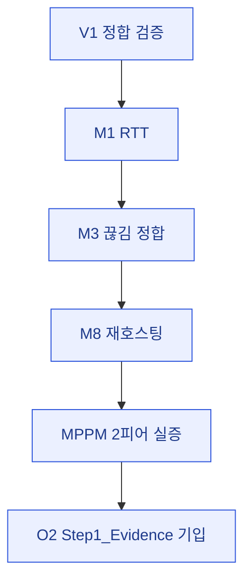

# 07 · plan — 체크리스트·진행관리

> **이 문서는?** Step 1 기구현 코드의 재검증·근사 측정 작업을 항목별로 쪼갠 살아있는 체크리스트입니다(무엇,
> 신규 코드 0). 게이트 통과 여부를 항목별로 명확히 기록하려고(왜) V1→M1→M3→M8→MPPM→O2 순서로 실행하며
> 각 항목에 증빙을 첨부하고(어떻게), 06_test_env 확정 후 실행자가 자동 범위를 채우고 2인 필요분은 수동 인계합니다(언제·누가).

## 한눈에 — 측정 순서

## 검증·측정 체크리스트
- [x] V1 정합 검증 — compile 계측 CS 에러 0 + `[NetDiagnostics]` 7종 부착 — OK
- [x] M1 RTT — StartHost → `GetCurrentRtt(0)`=**0ms**(loopback 정상) — evidence 기록
- [x] M3 끊김 정합 — Shutdown → events.csv `OnClientDisconnectCallback` 정상·`Connect` 오발화 0 (P0-2) — evidence
- [x] M8 재호스팅 — StartHost↔Shutdown ×3 → SteamClient 생존·에러 0 (P1-1) — evidence
- [x] MPPM 2피어 1회 실증 — CLI 구동 API 없음(GUI 전용) + Steam 단일계정 self-connect 차단 → **2피어 불가 확정** — evidence
- [x] O2 `Step1_Evidence.md` Before/After 기입 — host-only 합격분 채움 + 2인 필요분 ◐/☐ 분리, 게이트 부분통과 명기

## 마감 정리 (하네스 규약 — 삭제 금지)
- [x] 용어 사전 갱신 — 본 사이클 용어 전부 기등록 확인, 신규 0
- [x] 검증 증빙 수집 — `evidence/Step1_smoke_20260613.md` 저장, `08_result.md` 증빙 섹션 작성
- [x] **최종 재검증 스모크** — compile 0 + 계측 console error 0(회귀 없음)
- [x] 링크 정합 검사 — `check-links.sh` checked=604 **broken=0**

## 수동 인계 (자동화 범위 밖 — 체크 제외, Step1_Evidence로 인계)
> 2인 실기기/Steam/시간 필요 — plan 미완료 판정에서 제외.
- (수동) M2 경계값(F9 원격 클라) · M8 정량 10/10 · SCN-02 kill×5 · SCN-07 30분 soak(데모 게이트 1차) · 원격 RTT 추종

## 진행 메모
- Step 1 코드·계측 7종 전부 기구현 — 재작성 금지, 측정·검증만.
- 측정 순서: V1 → M1 → M3 → M8 → MPPM 실증 (한 플레이 세션에서 연속 수행 가능).

---
## 🔗 관련 문서 (Foam)
- 이전 [[2026-06-13_netcode2/04_assets|④ assets]] / [[2026-06-13_netcode2/06_test_env|⑥ test_env]] · **⑦ plan**(현재) · 다음 [[2026-06-13_netcode2/08_result|⑧ result]]
- 게이트 결정: [[2026-06-13_netcode2/decisions|decisions]]
- 용어: [[M-지표]] · [[RTT]] · [[NetEventLogger]] · [[soak-테스트]] → [[_glossary|용어 사전]]
