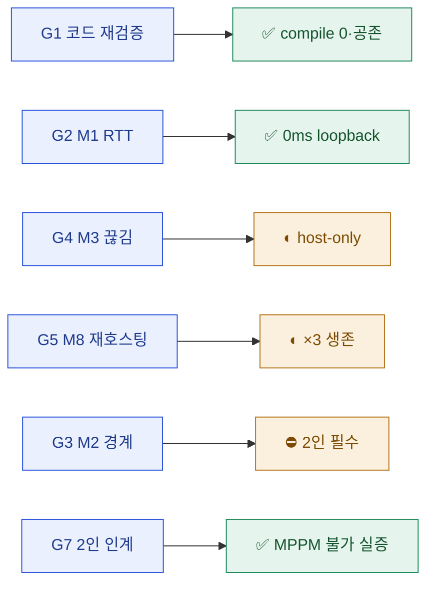

# 08 · result — 결과 보고서

> **이 문서는?** 이번 사이클에서 무엇을 했고 제대로 동작하는지를 **언제·어떻게 확인했는지(증빙)** 정리한
> 최종 보고서입니다(무엇). 사이클 가치를 결산하고 사인오프 근거가 되므로(왜) 달성 대비표·증빙·다측면
> 이점·인수인계를 함께 싣고(어떻게), ⑦ 완료 후 작성해 사람이 [G7](decisions.md#G7) 에서 사인오프합니다(언제·누가).
> 사이클 `2026-06-13_netcode2` · 입력 `코옵_Netcode_실행계획_v1.1.md` · 범위 **Step 1(전송 안정화)**.

## 요약
- 직전 `2026-06-12_netcode`(Step 0) 사인오프 후 **Step 1** 사이클. ③ scope에서 **Step 1 코드 전부 기구현**(transport P0-1/2/4·P1-2/1 + WorldItemSpawner P2-8가드, Step1_Evidence "코드 완료 2026-06-12") 확인 → 목적을 **기구현 재검증 + 근사 측정**으로 확정(G2).
- 신규 코드 0. 단일 에디터에서 **M1·M3·M8(host-only) 근사 측정** 수행, MPPM 2피어는 실증 결과 불가 확정.

## 한눈에 — 달성 요약


## 달성 대비표
| target/goal | 완료 | 비고 |
|---|---|---|
| [T1](01_target.md#T1)~[T6](01_target.md#T6) / [G1](02_goal.md#G1) (코드 정합 재검증) | ✅ | compile 0, Step 0(PROF/채널화)과 공존. transport 마커 11곳 보존 |
| [T3](01_target.md#T3) / [G2](02_goal.md#G2) (M1 RTT) | ✅ | StartHost loopback = **0ms** (정상, P0-4) |
| [T2](01_target.md#T2) / [G4](02_goal.md#G4) (M3 끊김) | ◐ | host Shutdown → OnClientDisconnectCallback 정상·Connect 오발화 0 (P0-2). 원격 이탈 경로는 2인 대기 |
| [T5](01_target.md#T5) / [G5](02_goal.md#G5) (M8 재호스팅) | ◐ | ×3 SteamClient 생존·StartHost 성공·에러 0 (P1-1). 정량 10/10은 2인 대기 |
| [T1](01_target.md#T1) / [G3](02_goal.md#G3) (M2 경계값) | ⛔→보류 | host 루프백 무의미(BoundaryEchoHarness L70) → 2인 필수 |
| [G7](02_goal.md#G7) (2인 인계·MPPM) | ✅(실증) | MPPM 2.0.1 있으나 CLI 구동 API 없음 + Steam 단일계정 self-connect 차단 → 2인 실기기 확정 |
| [T10](01_target.md#T10) / 데모 게이트 1차 | 보류 | SCN-07 30분 soak 미집행(2인/시간) |

## as-is → to-be diff
- **신규/변경 Unity 에셋: 없음** (검증·측정 사이클).
- 변경 문서: [`Reports/netcode/Step1_Evidence.md`](../../../Reports/netcode/Step1_Evidence.md) (Before/After 표·게이트 판정 기입).
- 증빙: `evidence/Step1_smoke_20260613.md`.
- 스냅샷: `snapshots/2026-06-13_netcode2_before.txt` (2706 항목). 코드 변경 0이라 after 동일 — 별도 after 생략, 권위 기록은 git(변경 없음).

## 검증 증빙 (Evidence)
### 검증 환경·시각
| 항목 | 값 |
|---|---|
| 검증 일시 | 2026-06-13 14:26~14:30 |
| Unity / Connector | 6000.3.1f1 / unity-cli 0.3.22 (ready) |
| 검증 방법 | compile + play smoke + exec(StartHost/Shutdown) + events.csv |

### task별 검증 기록
| task | 방법 | 판정 | 근거 |
|---|---|---|---|
| V1 정합 | compile + exec | ✅ | 계측 CS 에러 0, `[NetDiagnostics]` 7종 |
| M1 RTT | exec GetCurrentRtt | ✅ | 0ms (loopback) |
| M3 끊김 | exec Shutdown + events.csv | ◐ | [evidence](evidence/Step1_smoke_20260613.md) |
| M8 재호스팅 | exec ×3 | ◐ | SteamClient 생존·에러 0 |
| MPPM 실증 | API 조사 + 관찰 | ✅ | 2피어 불가 확정 |

### 콘솔/CSV 로그 발췌 (events.csv — M3)
```log
25.546,HOST,TRANSPORT-RAW,"Transport.Shutdown — 소켓/연결만 정리 (P1-1 수정)"
25.552,OFFLINE,NGO,"OnClientDisconnectCallback clientId=0 reason='…[TransportShutdown]…'"
25.554,OFFLINE,NGO,"OnServerStopped wasHost=True"
```
(전문·M8 루프 로그: [evidence/Step1_smoke_20260613.md](evidence/Step1_smoke_20260613.md))

## 산출물 인수인계 (어떻게 적용·사용하나 — `_conventions.md` §16)
> **신규 Unity 에셋 0** — 산출물은 측정 증빙·문서. 검증된 Step 1 코드는 직전 사이클 산출물(플레이 시 자동 동작).
| 산출물 | 무엇 | 적용 | 사용법 한 줄 | 주의 |
|---|---|---|---|---|
| [`Step1_Evidence.md`](../../../Reports/netcode/Step1_Evidence.md) | Step 1 Before/After·게이트 판정 | 문서(권위 기록) | 2인 측정 시 실측값 추가 기입 | host-only분만 채움 — 2인 필요분은 ◐/☐ 로 분리 |
| [Step1_smoke_20260613.md](evidence/Step1_smoke_20260613.md) | 단일 에디터 측정 덤프(M1·M3·M8·MPPM) | 증빙 | 재측정·회귀 비교 시 참조 | 단일 에디터 host-only 한계 명시됨 |
| Step 1 코드(검증 결론) | 전송 안정화(P0-1/2/4·P1-1/2·P2-8) | 기구현 — 플레이 시 자동 동작 | 별도 조작 불요. transport 가 NGO↔Steam 중계 | **데모 게이트(SCN-07 soak)는 2인 측정 후 최종 판정** — 현재는 코드 정합까지만 |

## 다측면 이점 (이번 사이클이 가져온 가치)
> 검증·측정 사이클이라 새 기능은 없지만, **Step 1 코드가 회귀 없이 동작함을 입증**해 Step 2 착수의 발판을 놓았다.
| 측면 | 이점 |
|---|---|
| 게임(플레이어 체감) | 직접 변화 없음(검증). 단, 끊김·재호스팅·[[RTT]] 보고 등 **전송 안정화 코드가 정상 동작** 확인 → 멀티플레이 연결 신뢰성의 토대 재확인 |
| 개발(생산성·안정성) | ① 직전 [[SteamP2PRelayTransport]] 수정(PROF/채널화)과 Step 1 코드의 **공존·회귀 0 확인**(최대 리스크 해소) ② M1·M3·M8 **host-only 근사 측정 범위 확립**(단일 에디터로 어디까지 가능한지) ③ [[Multiplayer-Tools|MPPM]] 2피어 한계(Steam self-connect 차단)를 **실증**으로 확정 — 측정엔 2대 필요 |
| 기획(검증·의사결정) | 데모 게이트 1차([[soak-테스트|SCN-07 soak]]) 잔여를 명확히 분리 → **Step 2 착수 조건 가시화**. Before/After 양식 host-only분 기입 |
| 아트(작업 기반) | 해당 없음 |
| 운영(측정·이력) | 검증·측정 사이클의 **증빙 패턴 확립**(events.csv 발췌·StartHost/Shutdown 로그). [[베이스라인|Step1_Evidence]] 권위 기록 갱신. 신규 에셋 0 사이클도 하네스로 이력화됨을 실증 |

## 잔여 이슈 / 후속 제안
1. **데모 게이트 1차 = SCN-07 30분 soak + M2/정량 M8 = 2인 실기기 측정 필수** — Step1_Evidence.md로 인계. 본 사이클은 코드 정합·host-only 측정까지.
2. MPPM 2피어는 동일 머신/계정 Steam self-connect 차단으로 불가 — 측정엔 2대(또는 2계정) 필요.
3. **후속 사이클**: Step 2(권위 일원화) → `/cycle-start`. Step 1 데모 게이트는 2인 측정 후 최종 판정.

## 게이트 결정 요약
- [[2026-06-13_netcode2/decisions|decisions]] 참조: **G1**(범위=Step 1, 측정=근사 적극) · **G2**(목적=재검증+근사측정, MPPM 1회 실증) · **G5**(씬 편집 0, 측정 절차 1~5) · **G7**(본 보고서).

## 용어 사전 갱신
- 신규 등록 없음 — 본 사이클 용어 전부 기등록(P0-P1-P2-이슈코드·RTT·M-지표·SCN-시나리오·soak-테스트·SteamP2PRelayTransport·NetEventLogger·BoundaryEchoHarness·Facepunch-Steamworks 등).

## 다음 사이클 이관
- 잔여(데모 게이트 2인 측정)·후속(Step 2)을 차기 후보로 구조화 → [[2026-06-13_netcode2/09_next|⑨ next]] (N1 Step 2 · N2 데모게이트 측정 · N3 원격 측정)

---
## 🔗 관련 문서 (Foam)
- 이전 [[2026-06-13_netcode2/07_plan|⑦ plan]] · **⑧ result**(현재, 사인오프 완료) · 다음 [[2026-06-13_netcode2/09_next|⑨ next]]
- 전체 파이프라인: [[2026-06-13_netcode2/01_target|①]] · [[2026-06-13_netcode2/02_goal|②]] · [[2026-06-13_netcode2/03_scope|③]] · [[2026-06-13_netcode2/04_assets|④]] · [[2026-06-13_netcode2/06_test_env|⑥]]
- 증빙: [Step1_smoke_20260613.md](evidence/Step1_smoke_20260613.md) · 권위 [`Step1_Evidence.md`](../../../Reports/netcode/Step1_Evidence.md)
- 직전 사이클: [[2026-06-12_netcode/08_result|netcode(Step 0)]]
- 게이트 결정: [[2026-06-13_netcode2/decisions|decisions]]
- 용어: [[M-지표]] · [[RTT]] · [[SteamP2PRelayTransport]] · [[Facepunch-Steamworks]] · [[NetEventLogger]] → [[_glossary|용어 사전]]
