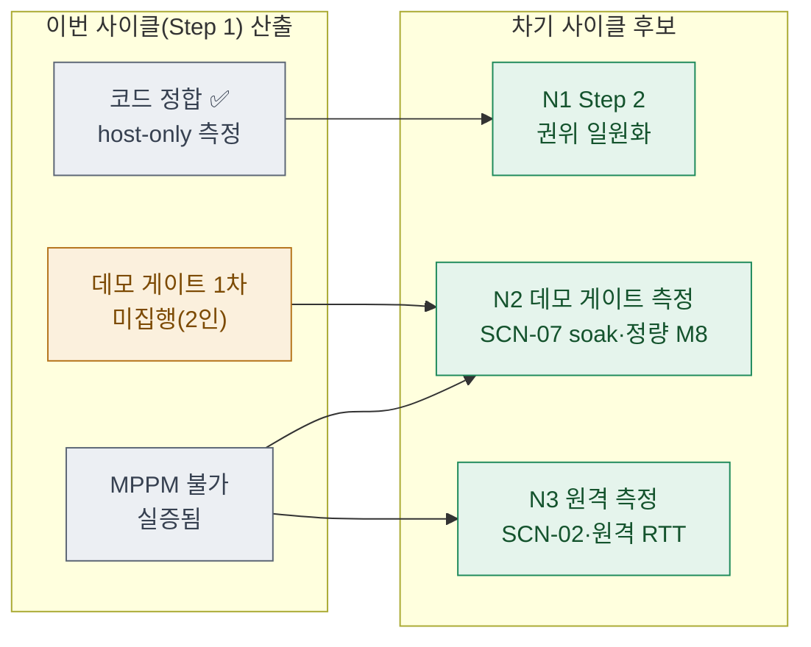

# 09 · next — 다음 사이클 이관

> **이 문서는?** 이번 Step 1 사이클에서 다 못 했거나 새로 발견해 **다음으로 넘길 것**을, 바로 다음
> `/cycle-start` 입력이 되게 구조화한 인계장입니다(무엇). 작업은 사이클 단위로 끊기되 맥락은 이어지게(왜)
> 잔여·후속을 차기 후보로 승격하고 흐름으로 보이며(어떻게), ⑧ 사인오프 후 작성하고 **끝에서 "바로 진행?"을
> 질의**합니다(언제·누가). (이 문서는 하네스 v4 9단계화로 소급 신설 — 2026-06-13.)

## 한눈에 — 이관 흐름

## 차기 후보 매트릭스
| 차기후보 | 유형 | 출처 | 우선순위 | 비고 |
|---|---|---|---|---|
| N1 Step 2 권위 일원화 | 신규(다음 단계) | [⑧ 후속 3](08_result.md#잔여-이슈--후속-제안) · 계획 §Step2 | P0 | 데미지·아이템 획득 권위 단일화. Step 0·1처럼 코드 기구현일 가능성 → "검증·측정" 성격 예상 |
| N2 데모 게이트 1차 측정 | 측정(이월) | [⑧ 잔여 1](08_result.md) · [[soak-테스트]] | P0 | **2인 실기기 필수**: SCN-07 30분 soak + M2 경계값 + 정량 M8 10/10. **Step 2 착수의 형식 전제** |
| N3 원격 측정 잔여 | 측정 | [⑧ 잔여 2](08_result.md) · [[SCN-시나리오]] | P1 | SCN-02 kill×5 · 원격 RTT 추종 — 2대(또는 2계정) 필요 |

## 권장 다음 사이클
- **slug 제안**: `netcode-step2-authority` (Step 2 권위 일원화)
- **입력 문서 제안**: [`Reports/netcode/코옵_Netcode_실행계획_v1.1.md`](../../../Reports/netcode/코옵_Netcode_실행계획_v1.1.md) (Step 2 절)
- **선행 조건**: N2(데모 게이트 1차 = Step 0~2 누적 데모 게이트)는 **2인 측정 환경**이 전제. Step 2 코드 검증(단일 에디터)은 선행 없이 착수 가능하나, **데모 게이트 최종 판정은 2인 측정 완료 후**.

## ▶ 다음 사이클 진행 질의 (G8)
> 이 사이클(`2026-06-13_netcode2`, Step 1 전송 안정화)은 사인오프 완료. 우선 후보는 **N1 Step 2(권위 일원화)**
> — Step 0·1 패턴상 코드가 이미 기구현이면 단일 에디터로 검증 착수 가능. 단 **데모 게이트 1차(N2)는 2인 측정 대기**.
> **다음 사이클을 바로 시작할까요?**
> - 예 → `/cycle-start Reports/netcode/코옵_Netcode_실행계획_v1.1.md netcode-step2-authority` 안내·실행
> - 아니오 → 본 인계장 보관 후 종료(2인 측정 환경 준비 후 N2 우선 가능)
> - 조정 → 다른 후보(N2 측정 우선/N3)·범위로 재설정

---
## 🔗 관련 문서 (Foam)
- 이전 [[2026-06-13_netcode2/08_result|⑧ result]] · **⑨ next**(현재, 사이클 종단)
- 게이트 결정: [[2026-06-13_netcode2/decisions|decisions]] (G8)
- 직전 사이클: [[2026-06-12_netcode/09_next|netcode(Step 0) ⑨ next]] (N2 가 본 사이클이었음)
- 용어: [[soak-테스트]] · [[SCN-시나리오]] · [[M-지표]] → [[_glossary|용어 사전]]
