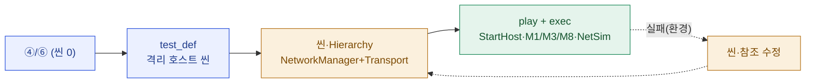

# test_run · 테스트 정의 — 2026-06-13_netcode2

> **이 문서는?** netcode2(계측·측정 사이클)의 계측 스택을 **격리 씬에서 단독 검증**하기 위한 실행 사양입니다.
> 사이클 ④/⑥에는 신규 씬이 없어(런타임 자동부착) test-run용으로 최소 호스트 씬을 새로 정의한다(§0 질문 결과 = "계측 격리 검증 씬 생성").
> 경로·규약: [[_conventions#17. `/test-run <cycle>` — 테스트 씬 자동 셋업·플레이 검증|_conventions §17]].

## 근거 (이 시점 사이클 문서)
- 출처: [[2026-06-13_netcode2/04_assets|④ assets]](Unity 에셋 변경 0) · [[2026-06-13_netcode2/06_test_env|⑥ test_env]](씬 편집 0·런타임 자동부착·measurement 절차 1~5)
- G-질문 보강(§0): ④/⑥에 셋업할 씬·GO가 없음 → 사용자 확인 후 **계측 격리 검증 씬**을 본 test_def로 신규 정의.

## 테스트 씬
- 경로: [`Assets/_TestRuns/2026-06-13_netcode2/2026-06-13_netcode2_TestScene.unity`](../../../../Assets/_TestRuns/2026-06-13_netcode2/2026-06-13_netcode2_TestScene.unity) (빌드 미포함)
- 렌더/월드 셋팅: 기본 — Main Camera(Skybox clear) + Directional Light. URP 기본 파이프라인.

## to-be Hierarchy (셋업 목표)
```text
2026-06-13_netcode2_TestScene
└─ ━━━━ Environment ━━━━
   ├─ Main Camera        [Camera, AudioListener]   (pos 0,1,-10)
   └─ Directional Light  [Light: type=Directional] (rot 50,-30,0)
└─ ━━━━ Netcode ━━━━
   └─ TestNetworkManager [NetworkManager(NGO), SteamP2PRelayTransport]
        · NetworkManager.NetworkConfig.NetworkTransport = (동일 GO의) SteamP2PRelayTransport
        · PlayerPrefab = (비움 — 계측 검증엔 불요, StartHost 시 플레이어 미스폰 허용)
        · ConnectionApproval = false

(런타임 자동 — 씬에 배치하지 않음)
DontDestroyOnLoad
└─ [NetDiagnostics]  ← NetDiagnosticsBootstrap.RuntimeInitializeOnLoadMethod 가 생성
   └─ NetEventLogger·StateChecksumV0·BoundaryEchoHarness·SoakHarness·RnsmHud·(RuntimeNetStatsMonitor)·NetSimController
```

## 에셋 슬롯 (→ asset_map.md 와 1:1)
| 슬롯 | 무엇 | 범주 | 기대 경로 |
|---|---|---|---|
| — | **없음** | — | 커스텀 prefab/material/SO 불요 — 모든 컴포넌트가 프로젝트 기존 타입(NGO `NetworkManager`·`SteamP2PRelayTransport`·NetDiag 자동부착). 더미 생성 없음. |

## 월드/런타임 셋팅
- **본 코드 무침습**: StartHost 스타터 스크립트를 씬에 추가하지 않는다. play 진입 후 **test-runner가 exec로 `NetworkManager.Singleton.StartHost()` 구동**(측정 사이클과 동일 방식).
- **전제**: Steam 클라이언트 실행 중(`SteamClient.IsValid==true`). 아니면 StartHost 실패 → result에 기록(차단 아님, 부착·로드 검증은 계속).

## 검증 항목 (플레이 테스트 합격 기준)
- [ ] 씬 로드 → console error 0 (무관 기존 에러: CaveBiomeSettings 등 제외)
- [ ] `TestNetworkManager` 의 `NetworkConfig.NetworkTransport` 참조 연결됨(missing 0)
- [ ] play --wait 진입 → `[NetDiagnostics]` 7 MonoBehaviour 자동부착
- [ ] (Steam valid 시) `StartHost()` 성공 → **M1 `GetCurrentRtt(0)`=0**(loopback) / RNSM `Configuration!=null`·`Visible`
- [ ] **NetSim 토글**: `NetSimProfiles.Cycle()` OFF→G→A, `Enabled` 전환
- [ ] **M3**: `Shutdown()` → 세션 events.csv 에 `OnClientDisconnectCallback`·`Connect` 오발화 0
- [ ] **M8**: StartHost↔Shutdown ×2 → `SteamClient.IsValid` 유지·에러 0

## 한눈에 — 셋업 흐름


---
## 🔗 관련 문서 (Foam)
- 사이클: [[2026-06-13_netcode2/04_assets|④ assets]] · [[2026-06-13_netcode2/06_test_env|⑥ test_env]] · [[2026-06-13_netcode2/08_result|⑧ result]]
- 테스트: **test_def**(현재) · [[2026-06-13_netcode2/test_run/asset_map|에셋 매핑]] · [[2026-06-13_netcode2/test_run/result|테스트 결과]]
- 용어: [[SteamP2PRelayTransport]] · [[NetDiagnosticsBootstrap]] · [[RnsmHud]] · [[NetSimProfiles]] · [[NetEventLogger]] · [[RTT]] · [[RNSM]] → [[_glossary|용어 사전]]
