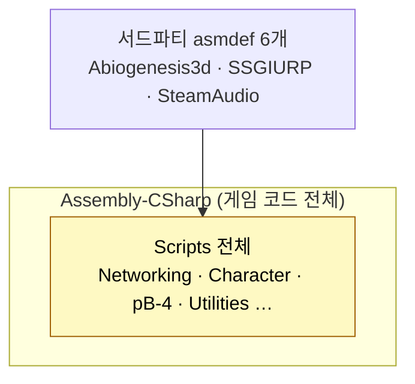
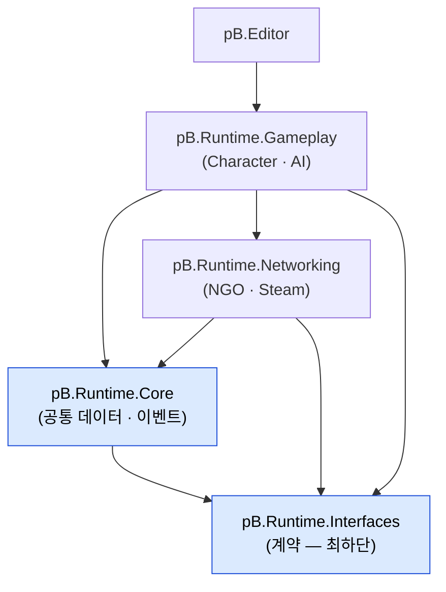

# assembly-definition

asmdef로 컴파일 타임과 의존성을 관리하는 전략 상세. **현재 게임 코드는 단일 어셈블리(Assembly-CSharp)에 집중돼 있으며, 서드파티 6개만 별도 분리된 상태다.**

## 현황 (pB)

> **다이어그램 — 현재: 단일 Assembly-CSharp** (게임 코드 전체가 한 어셈블리):



### 실제 asmdef 파일 목록 (glob 실측, 2026-06-15)

```
Assets/Abiogenesis3d/Campfire/Campfire.asmdef
Assets/Abiogenesis3d/Shared/Shared.asmdef
Assets/Package Install/UnitySSGIURP-main/Editor/SSGIURP.Editor.asmdef
Assets/Package Install/UnitySSGIURP-main/Runtime/SSGIURP.asmdef
Assets/Plugins/SteamAudio/Scripts/Editor/SteamAudioUnityEditor.asmdef
Assets/Plugins/SteamAudio/SteamAudioUnity.asmdef
```

**총 6개. 전부 서드파티·플러그인 어셈블리다. 게임 자체 코드(Assets/Scripts/, Assets/Scripts/pB-4/ 등)의 asmdef는 0개.**

### 결과적 어셈블리 구조

| 어셈블리 | 타입 | 대상 |
|---|---|---|
| `Assembly-CSharp` | 기본(자동) | `Assets/Scripts/` 전체 + `Assets/Scripts/pB-4/` 전체 |
| `Assembly-CSharp-Editor` | 에디터(자동) | 모든 `Editor/` 폴더 |
| `Campfire` | 서드파티 asmdef | `Assets/Abiogenesis3d/Campfire/` |
| `Abiogenesis3d.Shared` | 서드파티 asmdef | `Assets/Abiogenesis3d/Shared/` (URP 의존) |
| `SSGIURP` | 플러그인 asmdef | `Assets/Package Install/UnitySSGIURP-main/Runtime/` (URP ≥ 14.0.0) |
| `SSGIURP.Editor` | 플러그인 에디터 asmdef | `Assets/Package Install/UnitySSGIURP-main/Editor/` |
| `SteamAudioUnity` | 플러그인 asmdef | `Assets/Plugins/SteamAudio/` |
| `SteamAudioUnityEditor` | 플러그인 에디터 asmdef | `Assets/Plugins/SteamAudio/Scripts/Editor/` |
| `TDA.PB4.Tests.PlayMode` | 테스트 | Play Mode 테스트 전용 |

### 테스트 어셈블리

`TDA.PB4.Tests.PlayMode.csproj` 가 존재한다. Play Mode 테스트 어셈블리가 별도 분리됐다는 점은 긍정적이나, 게임 코드 자체가 asmdef로 분리돼 있지 않아 테스트 어셈블리에서 접근 가능한 범위에 한계가 있다.

## 설계·결정

- **현재 결정**: 아무 결정 없이 Unity 기본값(asmdef 없음 → Assembly-CSharp 통합) 유지 중
- **서드파티만 분리**: 구매/포함한 에셋 패키지(Campfire, SSGI, SteamAudio)는 자체 asmdef를 가져왔고, 게임 코드는 그에 의존하는 형태
- **언어 버전**: C# 9.0 (`LangVersion` in csproj)

## 🎯 목표·권장 (target)

> **다이어그램 — 권장 asmdef 분리** (화살표 = 의존 방향, 순환 불가):



- **규칙: 화살표는 위로(의존)만.** `Interfaces`(계약)를 최하단에 두면 누구도 역의존하지 않아 순환이 원천 차단된다.
- AI와 Character는 서로 직접 참조하지 않고 **Interfaces + Bridge**로만 만난다([[ai-bridge-architecture]]) → 순환 불가.
- **효과**: AI만 고치면 AI 어셈블리만 재컴파일 → 이터레이션 가속. 클라/서버 코드 경계가 생겨 전용 서버 빌드 분리도 쉬워진다.
- **착수 순서**: 한 번에 쪼개지 말고 `Interfaces → Core → Networking → Gameplay → Editor` 순으로 점진 분리(초기 누락 참조 정리 비용이 큼). 신규 시스템부터 asmdef로 시작하는 것도 방법.

## ⚠ 비판·리스크

- **심각도 높음**: 게임 코드 전체(Networking, Character, pB-4, Cave Genderator, Utilities 등)가 단일 `Assembly-CSharp`에 있다. 파일이 많아질수록 전체 재컴파일 트리거가 된다. 씬 하나의 스크립트 변경이 네트워크 코드 재컴파일을 유발한다.
- **심각도 높음**: 의존성 방향 강제가 불가능하다. `Assets/Scripts/Networking/`이 `Assets/Scripts/Character/`를 자유롭게 참조할 수 있고 역방향도 마찬가지다. 순환 의존을 Unity 컴파일러가 감지하지 못한다.
- **심각도 높음**: 클라이언트 전용 코드(렌더링, UI)와 공통 게임 로직의 경계가 없다. 향후 전용 서버 빌드를 시도할 때 클라이언트 코드를 제외하기 어렵다.
- **심각도 보통**: 에디터 전용 코드(`Editor/` 폴더 내 스크립트)가 `Assembly-CSharp-Editor`로 자동 분리되기는 하지만, 에디터/런타임 경계를 명시적으로 선언한 asmdef가 없어 실수로 에디터 코드를 런타임에 참조하는 오류가 컴파일 시 감지되지 않을 수 있다.
- **심각도 낮음**: `TDA.PB4.Tests.PlayMode` 테스트 어셈블리가 존재하지만, 게임 코드가 asmdef로 분리되지 않아 테스트 대상 코드의 `internal` 접근자를 쓸 수 없다.
- **권고**: `Assets/Scripts/` 하위를 최소한 다음 3~4개 asmdef로 분리 시작 권고: `pB.Runtime.Core`(공통 데이터/이벤트) · `pB.Runtime.Networking`(NGO/Steam) · `pB.Runtime.Gameplay`(Character/AI) · `pB.Editor`(에디터 도구). 초기 분리 비용보다 후기 결합도 해소 비용이 훨씬 크다.

## 관련 문서

- [[project-structure|프로젝트-구조]]
- [[coding-conventions|코딩-컨벤션]]

---
← [[01-foundation-hub|01 · 기반 (협업/구조/컨벤션)]] · [[index|인덱스]]
