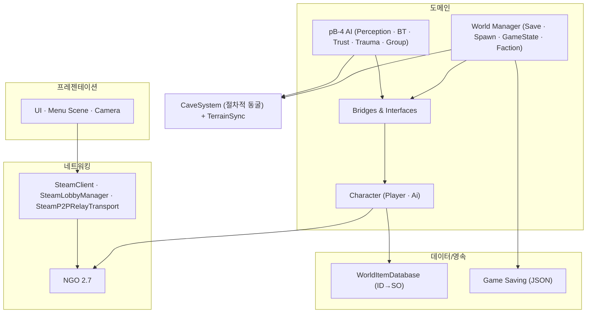

# 프로젝트-구조

폴더 구조와 어셈블리 경계 설계. **pB의 실제 폴더 트리를 glob으로 실측한 결과다.**

## 현황 (pB)

> **다이어그램 — 코어 모듈 맵** (논리 모듈; 컴파일은 단일 Assembly-CSharp → [[assembly-definition]]):



### 루트 구조

```
pB/                              ← 프로젝트 루트
├── Assets/
│   ├── Abiogenesis3d/           ← 서드파티: Campfire, Shared asmdef
│   ├── Arts/                    ← 아트 에셋 (모델, 텍스처 등)
│   ├── Package Install/         ← 수동 설치 패키지 (SSGIURP)
│   ├── Plugins/                 ← 네이티브 플러그인 (SteamAudio)
│   ├── Scenes/                  ← 모든 씬 파일
│   ├── Scripts/                 ← 게임 C# 스크립트 (Assembly-CSharp)
│   └── _Recovery/               ← 복구용 씬 스냅샷 (깃이그노어 처리됨)
├── Docs/
│   └── game-dev-wiki/           ← 이 위키
├── .harness/                    ← 개발 자동화 하네스 (Assets 밖)
├── Packages/                    ← Unity Package Manager manifest
├── ProjectSettings/
├── Reports/                     ← 측정·증거 문서
└── Tools/
```

### `Assets/Scripts/` 상세 트리 (실측)

```
Assets/Scripts/
├── Animator/                    ← 캐릭터 애니메이션 이벤트·SO·파라미터 해시
├── Bridges&Interfaces/          ← 도메인 간 브릿지·계약·목(Mock)·인터페이스
├── Camera/                      ← 카메라 디렉팅·프리뷰·에디터 도구
├── Character/
│   ├── Ai/                      ← AI 캐릭터 매니저 + 상태 머신 (Idle/Patrol/Combat/Flee 등)
│   └── Player/                  ← 플레이어 캐릭터 전용
├── Colliders/
├── Data/
├── Effects/
├── Game Saving/
├── Helper/
│   └── DontDestroyOnLoadHelper.cs  ← 씬 간 매니저 유지 헬퍼
├── Interaction/
├── Inventory/
├── Items/
├── Menu Scene/
│   ├── TitleScreenManager.cs
│   └── TitleScreenLoadMenuInputManager.cs
├── Networking/
│   ├── SteamClient.cs           ← Steam API 초기화·수명 관리
│   ├── SteamLobbyManager.cs     ← NGO + Steam 로비 생성/관리
│   └── SteamP2PRelayTransport.cs ← NetworkTransport 구현체
├── Slicing/
├── UI/
├── Utilities/
│   ├── Cave Genderator/         ← Marching Cubes + Compute Shader 동굴 지형
│   ├── NetDiagnostics/          ← 네트워크 진단 도구 (NetSimController, RnsmHud 등)
│   ├── Prefabs/
│   └── Simple Procedural Map Generator/
├── VFX/
├── Weapon Actions/
├── World Manager/
└── pB-4/                        ← 주차별 개발 기능 레이어
    ├── week0_Core/              ← GameBlackboard, EventBus, 공통 SO 정의
    ├── week1_AI_HumanoidAI/     ← HumanoidAIBrain
    ├── week1_AI_GroupPolicy/
    ├── week1_AI_MobAI/
    ├── week1_Audio/
    ├── week1_BT_AI/             ← BT(Behavior Tree) 루트
    ├── week1_BT_Actions/
    ├── week1_BT_Conditions/
    ├── week1_BT_Data/
    ├── week1_BT_Debugger/
    ├── week1_BT_Perception/
    ├── week1_Bridge/
    ├── week1_Perception/
    ├── week1_Scenario/          ← ScenarioArcManager
    ├── week1_Terrain/
    ├── week2_AI/, week2_AI_Day3/, week2_AI_Day4/
    ├── week2_Bootstrap/
    ├── week2_Data/
    ├── week2_Scenario/
    ├── week2_Terrain/
    ├── week2_Tooling/           ← BiomeMapDebugger, HumanoidVisualAutoVerifier 등
    ├── week3_* ~ week8_*        ← 이후 주차 기능
    ├── SO/, SO_PB4/             ← ScriptableObject 에셋
    ├── Editor/
    └── Temp/
```

### `Assets/Scenes/` 씬 목록 (실측)

```
Assets/Scenes/
├── Scene_main_menu_01.unity     ← 타이틀/메인 메뉴
├── Scene_World_01.unity         ← 메인 게임플레이 월드
├── Scene_pB2.unity              ← 레거시(pB2 버전) 씬
├── Scene_S6.unity
├── Scene_S11.unity
├── Scene_S13.unity              ← 섹션별 개발/테스트 씬
├── Scene_AI_Test.unity
├── AI TEST.unity                ← AI 테스트 씬 2종
├── Scene_Fog.unity              ← 포그 시각화 테스트
├── Scene_Simple_map_generator.unity
├── Wk3_NaturalEmergenceScene.unity  ← Week 3 자연 발생 테스트
└── (Utilities/Cave Genderator/ 내)
    ├── CaveScene.unity
    └── CaveLightingTestScene.unity
```

### 하네스 구조 (Assets 밖)

```
.harness/
├── _conventions.md              ← 단일 진실원: 네이밍·규약·도구·용어
├── cycles/                      ← 개발 사이클 산출물
├── glossary/                    ← 용어 사전
├── hooks/                       ← Git/Stop/PreToolUse 훅
└── usage-guide.html
```

## 설계·결정

- **기능별 폴더 분리**: `Character/`, `Networking/`, `Utilities/` 등 기능 영역별 폴더
- **주차별 레이어링**: `pB-4/weekN_*` 구조로 기능을 주차 단위로 적층. week0이 코어, week1 이후가 그 위에 의존
- **하네스는 Assets 밖**: `.harness/`를 `Assets/` 밖에 배치해 Unity `.meta` 파일 생성 방지(`_conventions.md` §1)
- **서드파티 격리**: `Assets/Abiogenesis3d/`, `Assets/Plugins/`, `Assets/Package Install/`로 서드파티 분리

## ⚠ 비판·리스크

- **심각도 높음**: `Assets/Scripts/` 전체가 단일 어셈블리(Assembly-CSharp)다. `Networking/`이 `Character/`에, `Character/`가 `Utilities/`에 자유롭게 참조 가능하며 방향 강제가 없다. 상세 → [[assembly-definition|assembly-definition]]
- **심각도 높음**: 테스트용 씬(AI TEST, Fog, Simple map generator)과 프로덕션 씬(main_menu_01, World_01)이 구분 없이 `Assets/Scenes/`에 혼재한다. 빌드에서 제외되는지 확인 필요. 빌드 설정에 포함되면 불필요한 씬 로딩이 가능해진다.
- **심각도 보통**: `pB-4/week*/` 폴더가 8주차까지 83개 이상 하위 폴더로 증식됐다. 폴더 수가 많아 Unity Inspector·Project 뷰에서 탐색이 어렵다. 주차별 구조는 개발 중 추적은 쉽지만 완성 후에는 기능별 재구조화가 필요할 수 있다.
- **심각도 보통**: `Assets/Scripts/Utilities/Cave Genderator/` 폴더명 오타("Genderator"). 네임스페이스·주석·문서에도 이 오타가 전파될 수 있다. 폴더명 변경 시 Unity가 GUID 기반으로 참조를 유지하지만 `.meta` 재생성이 필요하다.
- **심각도 낮음**: `Assets/_Recovery/` 폴더(복구용 씬 스냅샷 29개 이상)가 `.gitignore`로 일부 제외됐지만, Unity가 임포트하므로 에디터 로딩 시간에 영향을 준다.
- **심각도 낮음**: `Assets/Scripts/Bridges&Interfaces/`와 `Assets/Scripts/Bridges_Interfaces/`가 중복으로 보이는 두 폴더가 존재한다(`&`와 `_` 차이). 이름이 다른 두 폴더가 실제로 다른 목적인지 확인 필요.

## 관련 문서

- [[coding-conventions|코딩-컨벤션]]
- [[assembly-definition|assembly-definition]]
- [[build-automation|빌드-자동화]]

---
← [[01-foundation-hub|01 · 기반 (협업/구조/컨벤션)]] · [[index|인덱스]]
