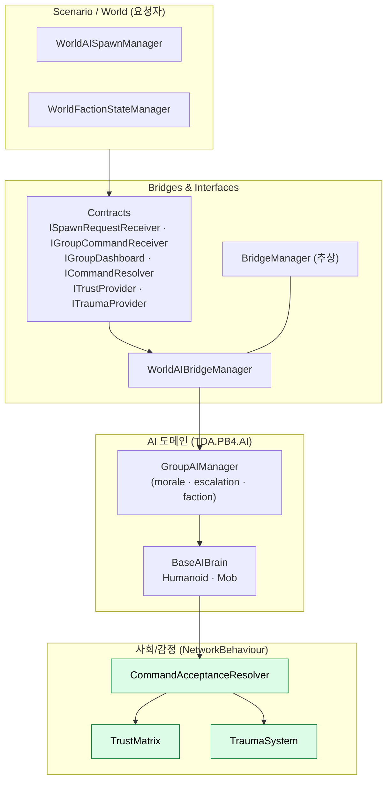

# ai-bridge-아키텍처

pB의 휴머노이드 AI(팩션·신뢰·트라우마·명령 수용)는 Character 도메인과 직접 결합하지 않고 **Bridge 패턴 + Interface(Contract) 계층**으로 분리된다. 정적 싱글톤 그물망([[di-container]])과 대비되는, pB에서 가장 명시적으로 결합을 끊어둔 영역이다.

## 현황 (pB)

> **다이어그램 — AI 도메인 & Bridge 결합 구조** (초록 = NetworkBehaviour 동기화):

**Bridge 계층** (`Assets/Scripts/Bridges&Interfaces/Bridges/`)
- `BridgeManager`(추상) → `WorldAIBridgeManager` 등 도메인별 브릿지.
- Scenario/World가 AI 구현을 모른 채 **Contract(인터페이스)** 로만 호출: `ISpawnRequestReceiver`, `IGroupCommandReceiver`, `IGroupDashboard`(읽기 전용 폴링) — `Bridges/Contracts/AIBridgeContracts.cs`.

**도메인 인터페이스** (`Bridges&Interfaces/Interfaces/Domain/`)
- `CharacterDomainInterfaces.cs`: `ITrustProvider`, `ITraumaProvider`, `IAlignmentProvider`, `ICommandResolver`.
- `AIDomainInterfaces.cs`: `IUtilityScorer`, `IGroupAIInfo`, `IContextProvider` 등.

**사회/감정 시스템** (`pB-4/week4_AI_Social/`, `pB-4/week2_AI_Day3/`) — NGO `NetworkBehaviour`
- `TrustMatrix`: 플레이어별 신뢰(`Dictionary<ulong, float>`) 4티어(Hostility/Doubt/Cooperation/BlindTrust).
- `TraumaSystem`: 트라우마 4단계 → 명령 수용의 공포 계수.
- `CommandAcceptanceResolver`: 신뢰 × 심각도 × 공포 × 충성 가중으로 명령 수용/거부 → BT 승자 덮어쓰기.

**그룹 AI** (`pB-4/week3_AI/GroupAIManager*.cs` — partial: `.Escalation` / `.Faction` / `.AttackToken` / `.Debug`)
- 사기·에스컬레이션·팩션 임계치 관리. `IGroupAIInfo` / `IGroupDashboard` 구현.

## 설계·결정

| 결정 | 근거 |
|---|---|
| Bridge + Interface 분리 | AI를 Character/Scenario와 컴파일·지식 결합 없이 독립 교체·테스트 가능하게 |
| 신뢰/트라우마를 NetworkBehaviour로 | 멀티에서 NPC의 플레이어별 신뢰·감정이 동기화 대상 |
| 주차별(weekN) 적층 | week0 코어 → week1 인지/BT → week2 명령수용 → week3 그룹 → week4 사회 |

## ⚠ 비판·리스크

**[심각도: 보통] AI 아키텍처 문서 부재 — 본 문서로 착수**: pB 코드의 최대 비중(pB-4 week0~8)인 AI가 그동안 위키에 문서화되지 않았다. 본 문서는 **구조 매핑까지만** 반영했고(`status: researching`), 각 시스템 내부 로직·완결성·실제 배선 여부는 미검증이다. 코드 실측 기반 `## 현황` 보강이 필요하다.

**[심각도: 보통] Bridge 계약의 런타임 검증·수명 미확인**: `BridgeManager` 등록 순서(`DefaultExecutionOrder`)와 브릿지 누락 시 동작(널 브릿지 폴백)이 문서화되지 않았다. di-container의 싱글톤 파괴 순서 문제([[di-container]])와 동일한 수명 리스크가 잠재한다.

**[심각도: 보통] 동기화된 Trust/Trauma 대역폭 영향 미측정**: NPC 다수 × 플레이어별 신뢰 딕셔너리가 `NetworkBehaviour`로 동기화될 때의 트래픽이 [[bandwidth-budget]]에 반영되지 않았다(2인 실측 미집행과 연동).

**[심각도: 낮음] week 단위 폴더 증식**: AI가 주차별 80+ 폴더로 분산되어 있다([[project-structure]]). 완성 후 기능별 재구조화가 필요할 수 있다.

**권고**: 각 AI 시스템(Trust/Trauma/CommandAcceptance/Group)의 현황·비판을 별도 문서로 분리해 이 항목 아래로 확장하라. 동기화 대역폭은 [[bandwidth-budget]] 실측에 포함하라.

## 관련 문서

- [[di-container|di-컨테이너]]
- [[assembly-definition|assembly-definition]]
- [[state-sync|상태-동기화]]
- [[project-structure|프로젝트-구조]]

---
← [[02-architecture-hub|02 · 아키텍처 기반 결정]] · [[index|인덱스]]
