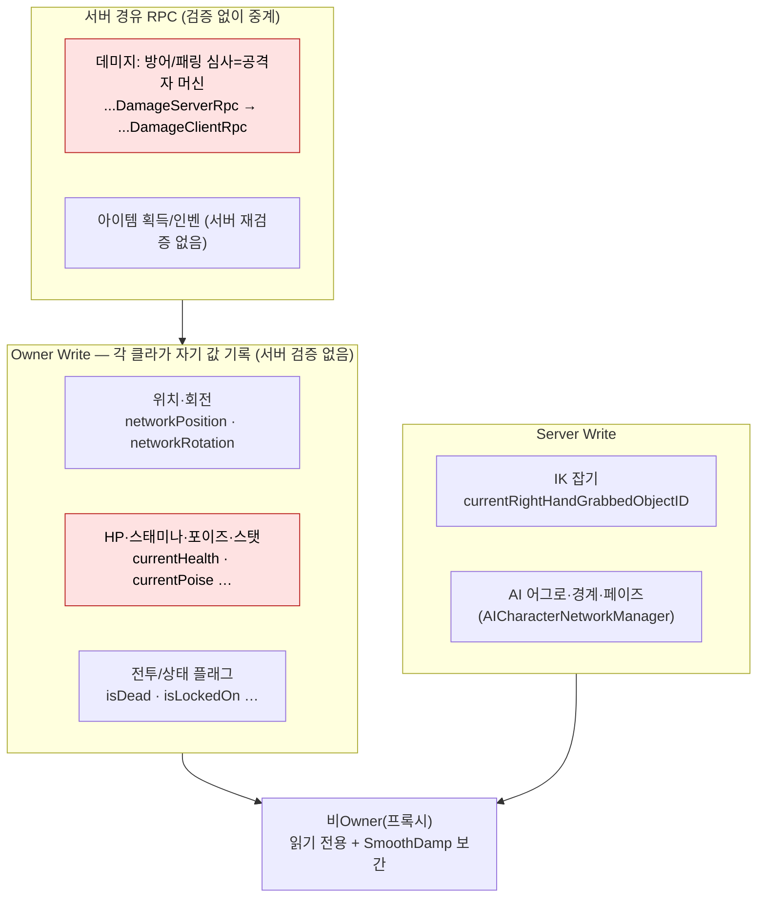

# 권한-모델

pB의 권위 모델은 **호스트(서버) 권위**를 기본으로 하나, 현재(Step 1 완료 시점)는 다수 게임 로직이 올바른 권위 지점에 배선되지 않은 상태다. 목표는 **일관성(desync 방지)이지 치팅 방지가 아니다**(실행계획 v1.1 R6). 친선 코옵 전제이므로 호스트 조작에 대한 방어는 설계 범위 밖이다.

## 현황 (pB)

> **다이어그램 — 권한별 write 주체** (빨강 = 치팅/desync 취약 지점):



**위치·회전** — Owner Write, 비Owner는 SmoothDamp 보간

`CharacterNetworkManager.Update()`:
```csharp
if (IsOwner)
{
    networkPosition.Value = transform.position;
    networkRotation.Value = transform.rotation;
}
else
{
    transform.position = Vector3.SmoothDamp(..., networkPosition.Value, ...);
}
```
Owner가 매 프레임 자신의 물리 위치를 서버에 쓴다. 서버가 위치를 검증하거나 보정하지 않는다. 호스트 플레이어는 자기 위치를 임의로 조작 가능.

**HP·스태미나·포이즈·스탯** — Owner Write

```csharp
public NetworkVariable<int> currentHealth = new NetworkVariable<int>(
    100, NetworkVariableReadPermission.Everyone, NetworkVariableWritePermission.Owner);
public NetworkVariable<float> currentPoise = new NetworkVariable<float>(
    0f, NetworkVariableReadPermission.Everyone, NetworkVariableWritePermission.Owner);
```
피격자 Owner가 수치를 차감한다. 서버가 재검증하지 않는다.

**IK 잡기 상태** — Server Write

```csharp
public NetworkVariable<ulong> currentRightHandGrabbedObjectID = new NetworkVariable<ulong>(
    0, NetworkVariableReadPermission.Everyone, NetworkVariableWritePermission.Server);
```
잡기 상태는 서버가 기록(`NotifyServerOfGrabActionServerRpc` → 서버에서 Value 갱신).

**데미지 파이프라인** (P0-3 미수정 — Step 2 대상)

현재 흐름:
```
공격자 MeleeWeaponDamageCollider.DamageTarget
 → 방어/패링 심사(공격자 머신에서!)   ← VerdictLogger.LogDefenseEval(①)
 → NotifyTheServerOfCharacterDamageServerRpc
 → NotifyTheServerOfCharacterDamageClientRpc (전 클라 브로드캐스트)
    → ProcessCharacterDamageFromServer → TakeDamageEffect.CalculateDamage
       → Owner Write 수치 차감         ← VerdictLogger.LogHpApply(④)
```
방어·패링 심사가 **공격자 머신**에서 이루어진다(P0-3 미해결). 네트워크 지연이 크면 피격자의 패링이 공격자 화면에 반영되지 않아 불일치 발생. Step 2에서 `HitCandidateRpc(SendTo.Server)` → 피격자 Owner 위임으로 재설계 예정.

**아이템 획득** (P0-5 미수정 — Step 2 대상)

클라이언트가 직접 인벤토리를 수정한다. `RequestPickupServerRpc` 라우팅이 없어 서버 검증 없이 아이템이 중복 획득되거나 동기화 실패가 발생한다(M4 클라 줍기 = 0% 예상 베이스라인).

**사망 권위** (P1-3 미수정 — Step 2 대상)

`CheckHP`에서 Owner가 자기 사망 이벤트를 발동시킨다. 동시 타격·동시 사망 시 드롭·연출 중복 가능성 미해결.

**인벤토리 서버 검증** (P1-4 미수정 — Step 2 대상)

서버에서 `IsSpaceAvailable` 재검증이 없다. 클라이언트 측 인벤 조작이 서버에 그대로 반영된다.

**VerdictLogger 계측 배선** (Step 0 완료)

전투 데미지 체인 4지점(`DEFENSE_EVAL` / `SEND` / `RECV` / `HP_APPLY`)에 로깅 삽입. 양측 CSV diff로 M5(판정 일치율) 측정 가능.

## 설계·결정

| 결정 | 근거 |
|---|---|
| 호스트 권위 기준 | NGO 호스트-클라이언트 아키텍처의 자연스러운 선택 |
| 치팅 방지 비목표(R6) | 친선 코옵 — 악의적 사용자 없음. 목표는 desync 방지·일관성 유지 |
| Owner Write 수치 | 당초 Owner가 자신의 스탯을 가장 정확하게 알기 때문. Step 2에서 일부 서버 재검증 추가 예정 |
| 피격자 Owner 최종 심사(Step 2 목표) | 패링·무적 타이밍이 피격자 화면 기준이므로, 피격자 Owner가 최종 판정해야 공정 |

## ⚠ 비판·리스크

**심각도: 높음**

- **R1 방어/패링 판정이 공격자 화면 기준 (P0-3 미해결)**: 현행 `DamageTarget`이 공격자 머신에서 패링 여부를 심사한다. 클라이언트 핑이 150ms 이상일 때 피격자의 패링 타이밍이 공격자 화면에 전달되기 전에 판정이 내려져 불일치 발생 가능. Step 2 미착수.
- **R2 클라 줍기 라우팅 없음 (P0-5 미해결)**: 아이템 획득이 서버 검증 없이 클라이언트에서 직접 처리된다. 2인 동시 획득 시 아이템 복제 또는 소실 가능. M4 베이스라인 0%.
- **R3 "일관성이지 치팅 방지 아님" — 호스트가 게임 전체 지배**: 호스트는 자신의 위치·HP·데미지를 Owner Write로 임의 조작 가능하다. 친선 코옵에서는 실질적 문제가 없지만, 이 사실을 문서에 명시하지 않으면 보안 설계를 오인한 코드가 추가될 위험이 있다. 현재 README나 아키텍처 문서에 이 제약이 명시되어 있지 않다.

**심각도: 보통**

- **R4 Owner Write 위치의 서버 검증 없음**: 클라이언트가 `networkPosition.Value`를 임의 값으로 쓸 수 있다. 검증 없이 서버가 수용한다. 친선 코옵 범위라도 버그에 의한 위치 왜곡(예: 물리 버그로 인벤 밖 좌표)이 다른 클라에 전파된다.
- **R5 사망 이중 처리 가능성 (P1-3 미해결)**: 동시 히트 패킷이 두 클라이언트에서 거의 동시에 처리되면 `ProcessDeathEvent`가 중복 실행될 수 있다. 드롭 아이템 중복 스폰 위험.
- **R6 인벤토리 클라 조작 무방비 (P1-4 미해결)**: 서버 `IsSpaceAvailable` 재검증 없음. 클라이언트의 인벤 상태와 서버의 인벤 상태가 달라도 서버가 탐지하지 못한다. StateChecksumV0 인벤 해시(M11)가 이를 탐지하도록 설계되어 있으나 Step 0 골격 상태(30초 주기 검출, 재동기화 없음).

**권고**: Step 2(권위 일원화)를 데모 이전에 완료해 P0-3·P0-5+P1-10을 해결하라. 코드베이스 어딘가에 "이 프로젝트는 치팅 방지가 목표가 아님"을 아키텍처 문서로 명기하고, 향후 기능 추가 시 이 제약을 고려하게 하라.

## 관련 문서

- [[network-topology|네트워크-토폴로지]]
- [[state-sync|상태-동기화]]
- [[prediction-reconciliation|예측-재조정-보간]]
- [[lag-compensation|랙-보상]]

---
← [[03-network-hub|03 · 네트워크 아키텍처]] · [[index|인덱스]]
