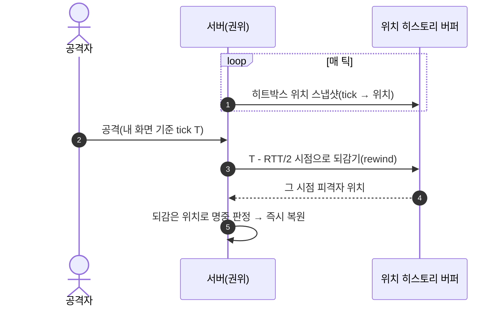

# 랙-보상

pB에는 히트 판정 lag compensation(서버 측 되감기·히스토리 버퍼) 구현이 없다. 모든 전투 판정이 호스트(서버) 현재 시점 기준으로 이루어진다. Grep 결과 `LagComp`, `Rewind`, 히트 히스토리 버퍼 관련 코드가 존재하지 않는다.

## 현황 (pB)

> **다이어그램 — 일반적 랙보상(rewind) 기법** (미구현·참고용. pB의 Step 2 방향은 *피격자 Owner 위임* — 아래 설계·결정 참조):



**히트 판정 경로** (코드 실측)

```
공격자 MeleeWeaponDamageCollider.DamageTarget()
  → 방어/패링 심사 (공격자 머신 현재 시점)   ← VerdictLogger.LogDefenseEval
  → NotifyTheServerOfCharacterDamageServerRpc
  → (서버 경유 브로드캐스트)
  → NotifyTheServerOfCharacterDamageClientRpc (전 클라)
     → ProcessCharacterDamageFromServer
        → TakeDamageEffect.CalculateDamage     ← VerdictLogger.LogHpApply
```

서버가 히트 이벤트를 수신하는 시점은 공격자 입력 발생 후 RTT/2 이후다. 서버는 그 RTT/2 전 과거의 피격자 위치로 되감아 판정하지 않는다.

**RTT 보고** (`SteamP2PRelayTransport.GetCurrentRtt`)

Step 1(P0-4) 이후 `Connection.QuickStatus().Ping`으로 실측 RTT를 반환한다. RNSM HUD의 RTT 칸이 이를 표시하지만, 이 값이 전투 판정 로직에서 사용되지는 않는다.

**전투 판정 계측** (`VerdictLogger`)

4개 지점(DEFENSE_EVAL/SEND/RECV/HP_APPLY)에 로깅이 삽입되어 있어 양측 CSV diff로 판정 불일치율(M5)을 측정할 수 있다. 단, M5 베이스라인이 2인 실측 미집행 상태로 불일치율의 실제 수치가 확보되지 않았다.

## 설계·결정

lag compensation 미채택 결정의 명시적 ADR이 없다. 친선 코옵 PvE 전제에서 FPS/경쟁 게임 수준의 정밀 판정 보상이 불필요하다고 판단한 것으로 추정된다.

현재 데미지 파이프라인 개선 방향(Step 2 P0-3)은 lag compensation 도입이 아니라 **피격자 Owner에게 판정 권위를 이전**하는 것이다:

```
[Step 2 목표]
공격자: HitCandidateRpc(SendTo.Server)  (히트 후보 보고만)
서버: 피격자 Owner에게 단일 RPC 전달
피격자 Owner: 자기 화면 기준 방어/패링/무적 최종 심사 → Owner-Write 수치 차감
결과: 연출 전용 브로드캐스트
```

이 방식은 lag compensation(서버 되감기)과 달리, 피격자 본인 화면 기준 공정성을 추구한다. 히스토리 버퍼가 없고 추가 RTT 교환(공격자→서버→피격자→서버→전파)이 발생한다.

## ⚠ 비판·리스크

**심각도: 높음**

- **R1 핑 높은 클라이언트는 항상 불리**: 현재 공격자 화면에서 명중처럼 보여도 서버에 도달하는 시점의 피격자 위치가 달라 miss로 처리될 수 있다. 역으로 피격자 화면에서 피했어도 서버 현재 위치로는 맞은 것으로 판정된다. lag compensation이 없어 RTT가 높을수록 클라이언트의 체감 판정이 불공정해진다. PROF-A(150ms) 이상 환경에서 얼마나 자주 불일치가 발생하는지 M5 실측이 없다.

**심각도: 보통**

- **R2 Step 2의 피격자 Owner 위임도 lag compensation이 아님**: Step 2에서 피격자 Owner에게 판정 권위를 이전하면, 공격자 화면에서 명중 → 서버 → 피격자 → 피격자의 패링 심사 순으로 추가 RTT가 발생한다. 고핑 환경에서 공격자의 타격 피드백이 더 늦어질 수 있다. 공정성(피격자 화면 기준)과 응답성(공격자 즉시 피드백) 간 트레이드오프를 측정 없이 결정했다.
- **R3 판정 불일치율(M5) 베이스라인 없음**: VerdictLogger가 구현되어 있으나 2인 실측이 없어 현재 판정 불일치가 얼마나 발생하는지 알 수 없다. "PROF-A 환경에서 불일치 존재"라는 정적 분석 추정만 있고 실수치가 없다. 개선 전·후 비교가 불가능한 상태다.

**심각도: 낮음**

- **R4 PvE 코옵에서 lag compensation 필요성 자체가 불명확**: 플레이어 대 플레이어 판정이 없고(PvE), AI는 서버(호스트)가 권위를 갖는다. 핵심 불공정은 클라이언트가 AI를 타격할 때 클라의 화면과 서버 AI 위치 불일치다. AI에 대한 lag compensation(AI 위치 되감기)이 필요한지 여부가 플레이 테스트 없이 결론 내기 어렵다. 현재 설계 단계에서 선제적 구현보다 **M5 실측 후 판단**이 타당하다.

**권고**: M5 베이스라인 실측(2인 실기기, PROF-A 환경)을 Step 2 착수 전에 확보하라. 불일치율이 수용 불가 수준이면 Step 2의 피격자 Owner 위임 방향을 재검토하라. 친선 코옵 범위에서 lag compensation 도입 필요 여부는 그 데이터를 보고 결정하는 것이 타당하다.

## 관련 문서

- [[authority-model|권한-모델]]
- [[prediction-reconciliation|예측-재조정-보간]]
- [[state-sync|상태-동기화]]

---
← [[03-network-hub|03 · 네트워크 아키텍처]] · [[index|인덱스]]
