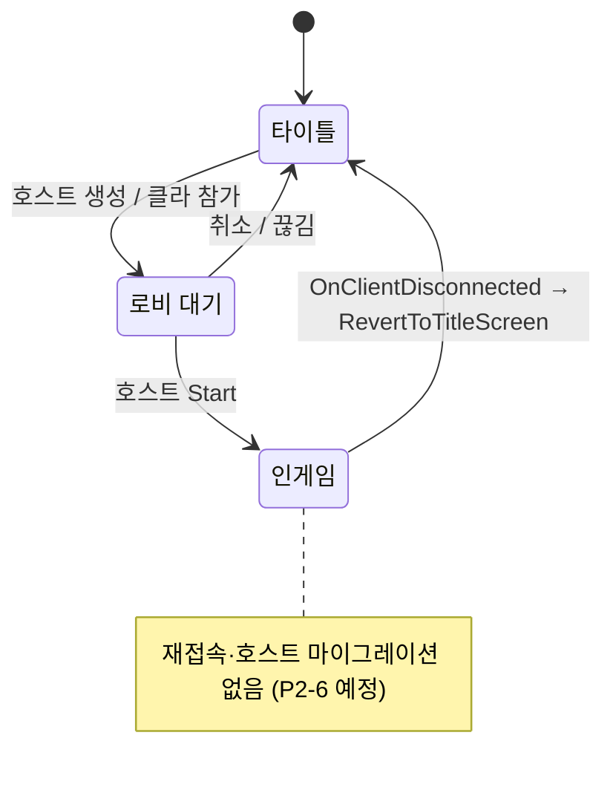

# 네트워크-토폴로지

pB는 Steam 릴레이(SDR) 경유 호스트-클라이언트 P2P 구조를 채택한다. 전용 서버 없음. 2~N인 코옵 PvE 전용.

## 현황 (pB)

> **다이어그램 — 연결/세션 상태** (재접속·호스트 마이그레이션 없음):

**호스트-클라이언트 P2P, Steam relay 경유**

- `SteamLobbyManager.StartHostWithLobby()` — Steam 로비 생성 후 NGO `StartHost()` 가동. 로비 데이터에 호스트 SteamId 기록.
- `SteamLobbyManager.JoinLobby(lobby)` / `OnLobbyEntered` — 클라이언트가 로비 진입 시 로비 데이터에서 호스트 SteamId 추출 → `SteamP2PRelayTransport.serverId`에 주입 → NGO `StartClient()` 호출.
- 연결 경로: NGO → `SteamP2PRelayTransport` → `SteamNetworkingSockets.ConnectRelay` / `CreateRelaySocket` → Steam SDR(서버리스 릴레이).
- `maxPlayers = 4` (직렬화 설정, `SteamLobbyManager.cs` L36).
- 접속 승인(ConnectionApproval) 콜백 미구현(Step 3 P2-6 대상).

**세션 종료 조건**

`SteamLobbyManager.OnClientDisconnected` 콜백에서 `clientId == NetworkManager.ServerClientId` 이면 `RevertToTitleScreen()` 즉시 호출 → **호스트 이탈 = 세션 종료**. 재접속·호스트 마이그레이션 미구현.

**게임 식별자** — 로비 데이터 `GameUniqueId = "PennutButterProject"`. 테스트 AppID 480(Spacewar) 사용 중.

## 설계·결정

| 결정 | 근거 |
|---|---|
| P2P(전용 서버 X) | 친선 코옵 소규모, 인프라 비용 절감 |
| Steam relay(SDR) 경유 | IP 노출 없음, NAT 우회. 직접 연결 시 IP 노출 차단 |
| NGO 호스트-클라이언트 | 개발자 친숙도·Unity 공식 지원·Steam 통합 용이 |
| 전용 서버 제외 | 소규모 코옵 수익 규모 대비 운영 비용 과잉 |
| 호스트 이탈=세션 종료 | 마이그레이션 구현 복잡도 회피(친선 코옵 단순화), Step 3 P2-6에서 재검토 예정 |

## ⚠ 비판·리스크

**심각도: 높음**

- **R1 호스트 이탈=세션 소멸**: `OnClientDisconnected`에서 `NetworkManager.ServerClientId` 끊김 시 전원 타이틀로 복귀. 호스트가 의도치 않게 끊기거나(ISP 순단, 충돌) 이탈하면 진행 중인 세션 전체가 날아간다. 호스트 마이그레이션·이탈 시 세이브 보장이 Step 3(P2-6)에서 예정되어 있지만 **현재 미구현**.
- **R2 접속 승인 없음**: ConnectionApproval 콜백이 없어 정원 초과·버전 불일치 접속 거절 불가능. 4인 한도가 Steam 로비 레벨에서만 존재(NGO 레벨 미검증). Step 3 P2-6 대상.
- **R3 Steam self-connect 불가 — 2인 실측 불가능**: `Multiplayer Play Mode(MPPM) 2.0.1`이 설치되어 있으나 동일 계정 Steam relay self-connect 차단으로 2피어 연결이 에디터 내에서 불가능(2026-06-13 실증). 모든 M2~M11 실측이 2대의 물리 기기를 요구한다. 이것이 **Step 0 베이스라인 미집행의 직접 원인**.
- **R4 테스트 AppID 480**: Spacewar 공개 AppID로 개발 중. 다른 480 앱 사용자와 로비가 혼재할 수 있어 QA 환경이 오염된다. 출시 전 실제 AppID 교체 필수(현재 추적 항목 없음).
- **R5 재접속·난입 미지원**: `P2-6`(재접속 재합류)·`P2-5`(Door 난입 동기화)가 미착수. 30분 세션 후 난입 플레이어는 문 상태·요리 진행·잡기 등 현재 상태를 받지 못함.

**권고**: 데모 이전에 호스트 이탈 시 세이브 보장(Step 3 P2-6)과 ConnectionApproval(정원 제한)을 우선 적용하라. Steam AppID 교체 일정을 EA 로드맵에 명기하라.

## 관련 문서

- [[authority-model|권한-모델]]
- [[netcode-solution|netcode-솔루션]]
- [[transport-layer|transport-레이어]]
- [[state-sync|상태-동기화]]

---
← [[03-network-hub|03 · 네트워크 아키텍처]] · [[index|인덱스]]
