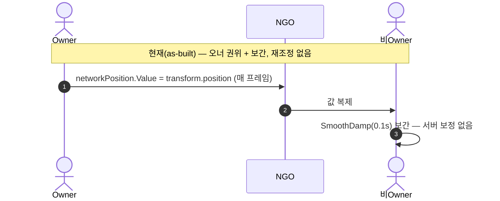
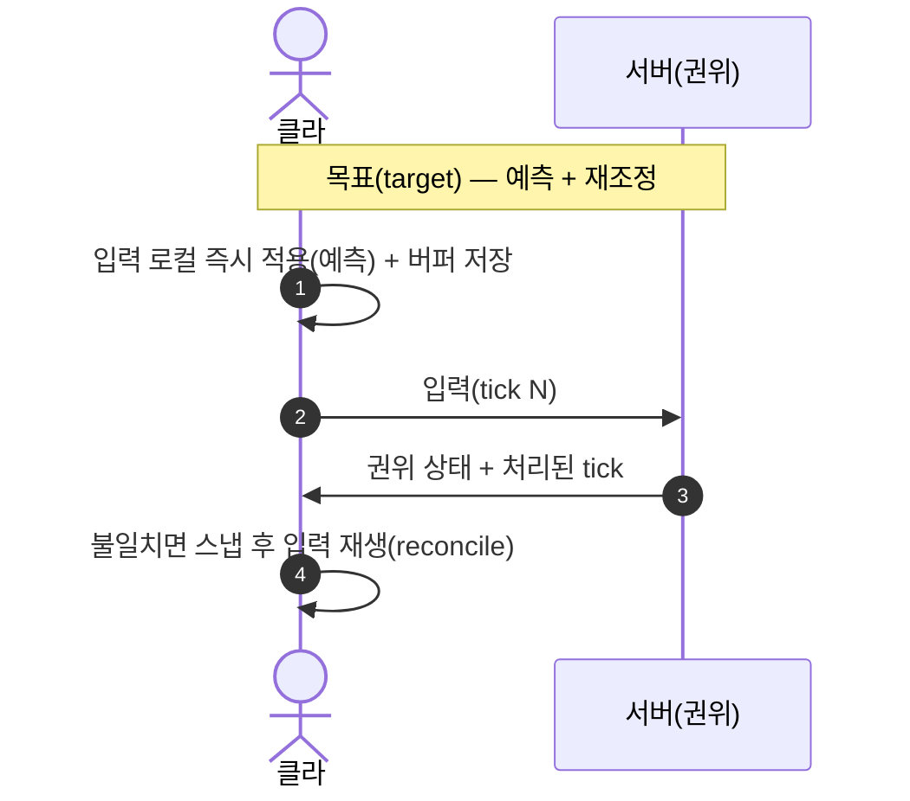

# 예측-재조정-보간

pB에는 클라이언트 측 예측(Client-Side Prediction) 및 서버 재조정(Reconciliation) 커스텀 구현이 없다. NGO의 표준 보간 기능도 활용하지 않는다. 원격 캐릭터에 대해 `SmoothDamp` / `Quaternion.Slerp` 기반 단순 보간만 존재한다.

## 현황 (pB)

> **다이어그램 — 현재: 오너 권위 + 보간 (재조정 없음)**:



**예측 현황 — 미구현**

코드베이스 전체에서 `ClientPrediction`, `Rollback`, `Reconcil` 패턴이 네트워크 레이어에 존재하지 않는다(Grep 확인). `CharacterNetworkManager.cs`의 주석에 "Client-side Prediction"이라는 용어가 등장하지만 실제 구현이 아니라 **위치를 Owner가 직접 쓰는 것**을 가리키는 명칭이다:

```csharp
// [P0-01 신규 추가] 위치 동기화 및 애니메이션(Strafe) 보간 로직 (Client-Side Prediction)
protected virtual void Update()
{
    if (IsOwner)
    {
        networkPosition.Value = transform.position;  // Owner가 직접 쓴다
    }
    else { /* SmoothDamp 보간 */ }
}
```

이것은 진정한 의미의 예측(입력을 로컬에서 즉시 반영 → 서버 확인 후 재조정)이 아니다. Owner는 자신의 물리를 직접 구동하고 결과를 서버에 알릴 뿐이며, 서버는 해당 위치를 재검증하거나 보정하지 않는다.

**보간 현황 — SmoothDamp + Slerp만 존재**

```csharp
// CharacterNetworkManager.Update() — IsOwner false
transform.position = Vector3.SmoothDamp(
    transform.position,
    networkPosition.Value,
    ref networkPositionVelocity,
    networkPositionSmoothTime);   // 0.1f

float rotSpeed = networkRotationSmoothTime > 0 ? (1f / networkRotationSmoothTime) : 15f;
transform.rotation = Quaternion.Slerp(
    transform.rotation, networkRotation.Value, Time.deltaTime * rotSpeed);
```

- 목표값(`networkPosition.Value`)이 갱신될 때마다 SmoothDamp가 수렴. 네트워크 지연이 높을수록 표시 위치와 서버 위치 간 격차 증가.
- 회전 보간이 `Time.deltaTime` 비례로 프레임률 의존(P2-2 미수정).
- NGO `Interpolation` 토글(NetworkObject 설정)이 별도로 켜져 있는지 미확인 — CharacterNetworkManager가 Update에서 직접 위치를 처리하므로 NGO 내장 보간과 중복될 수 있다.

**모션 워핑 메타데이터 — 시그니처만**

```csharp
// CharacterNetworkManager.cs
[Rpc(SendTo.ClientsAndHost)]
public virtual void NotifyWarpAttackClientRpc(ulong targetId, int boneIndex)
{
    // 베이스 클래스는 다형성을 위한 서명만 유지하며 아무 동작도 하지 않습니다.
}
```
오버라이드(`PlayerNetworkManager`)에서 "핑 지연을 무시하는 로컬 예측 보간"을 한다는 주석이 있으나, 실제 구현 내용은 코드에서 확인이 필요하다.

**NGO Prediction API 미사용**

NGO 2.7.0은 `ClientNetworkTransform`, `NetworkRigidbody`, `NetworkTransform`(서버 권위 / 오너 권위 전환) 등의 보간·예측 도구를 제공한다. pB는 이를 활용하지 않고 `CharacterNetworkManager`에서 수동으로 NetworkVariable을 관리한다.

## 설계·결정

| 결정 | 근거(추정) |
|---|---|
| 예측·재조정 미구현 | 코옵 PvE 특성상 FPS 수준의 정밀 예측 필요성이 낮다고 판단한 것으로 추정 |
| Owner Write 위치 | 서버가 위치를 판정할 필요 없이 Owner가 결과를 직접 게시 — 구현 간결 |
| SmoothDamp 보간 | 구현 단순성. 네트워크 상태 변화에 대한 탄력성은 검증되지 않음 |

결정의 명시적 ADR 문서가 없다. 추정에 근거하므로 확인이 필요하다.

## 🎯 목표·권장 (target)

> **다이어그램 — 목표: 예측 + 재조정**:



도입 시 필요한 요소 (현재 전부 없음):

| 요소 | 현재 | 목표 |
|---|---|---|
| 서버 틱 클럭 | ❌ 프레임 기반 | ✅ 고정 틱 |
| 입력 버퍼/시퀀스 | ❌ | ✅ tick별 입력 큐 |
| 서버 권위 시뮬레이션 | ❌ (오너가 위치 기록) | ✅ 서버가 이동 계산 |
| 오예측 정정(reconcile) | ❌ | ✅ 스냅 + 재생 |

- 코옵 PvE라 우선순위는 낮지만, RTT 150ms+ 체감 측정(R1) 후 도입 여부를 판단할 것. 최소한 **위치 스냅 임계**(Step 4 P2-2)부터 적용 권장.

## ⚠ 비판·리스크

**심각도: 높음**

- **R1 예측 없음 → 호스트 외 플레이어 입력 지연 체감**: 클라이언트 입력이 즉시 물리에 반영되지만 그 결과(위치)가 NetworkVariable → 서버 → 비Owner 클라이언트까지 전달되려면 RTT 절반이 걸린다. 비Owner 화면에서 원격 플레이어가 RTT 지연만큼 뒤처져 보인다. PROF-A(RTT 150ms) 환경에서 약 75ms의 표시 지연이 발생한다. 재조정이 없어 이 지연을 숨길 방법이 없다.
- **R2 원격 위치 보간이 프레임률 의존 (P2-2 미수정)**: `Quaternion.Slerp(cur, target, Time.deltaTime * rotSpeed)` — `Time.deltaTime` 비례 Slerp는 프레임률이 낮을수록(30FPS) 느리게 수렴하고, 높을수록(144FPS) 빠르게 수렴한다. 프레임률이 다른 두 플레이어가 같은 타이밍에 회전을 다르게 볼 수 있다. Step 4 P2-2에서 `1 - Mathf.Exp(-k * Time.deltaTime)` 보정으로 교체 계획.

**심각도: 보통**

- **R3 "Client-Side Prediction" 용어 오용이 코드 독해를 혼란스럽게 함**: `CharacterNetworkManager.cs` L163의 주석이 실제 예측 구현이 존재한다는 인상을 준다. 신규 개발자가 예측·재조정 로직이 있다고 오해할 수 있다. 주석 교정이 필요하다.
- **R4 NGO 내장 보간과의 중복 여부 미확인**: NetworkObject의 `Interpolation` 설정과 `CharacterNetworkManager.Update()` 보간이 동시에 동작하면 이중 보간으로 위치 진동이 발생할 수 있다. 씬 설정 점검이 필요하다.
- **R5 목표 갱신 시 SmoothDamp 재시작 없음**: `networkPosition.Value`가 큰 폭으로 갱신되면(원격 텔레포트·스폰·호스트 씬 전환) SmoothDamp가 여전히 이전 위치에서 느리게 수렴한다. 스냅 임계 거리 검사가 없어 원격 캐릭터가 긴 거리를 미끄러져 이동하는 현상이 발생할 수 있다. Step 4 P2-2 항목 중 "일정 거리 초과 시 텔레포트 스냅"이 대응 예정.

**권고**: 코오퍼레이티브 액션 게임에서 RTT 150ms 이상 플레이어의 체감을 측정하라(PROF-A 환경, 실측 미집행). 허용 가능하면 현 상태 유지; 아니면 최소한 위치 스냅 임계(Step 4 P2-2)를 조기 적용하라. 코드 주석의 "Client-Side Prediction" 표현을 교정하라.

## 관련 문서

- [[lag-compensation|랙-보상]]
- [[state-sync|상태-동기화]]
- [[authority-model|권한-모델]]
- [[bandwidth-budget|대역폭-예산]]

---
← [[03-network-hub|03 · 네트워크 아키텍처]] · [[index|인덱스]]
