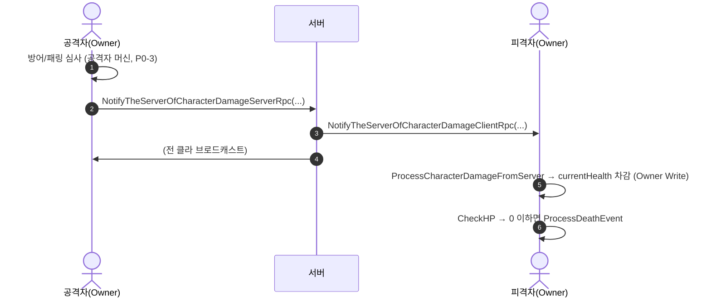

# 상태-동기화

pB는 NGO의 `NetworkVariable`과 RPC로 상태를 동기화한다. 스냅샷·델타 압축·관심 영역(AoI) 등의 고급 기법은 미구현이다. desync 감지를 위한 `StateChecksumV0`(30초 주기 해시 비교)가 Step 0에서 도입됐다.

## 현황 (pB)

> **다이어그램 — 데미지 RPC 왕복** (방어/패링 심사가 공격자 머신에서 일어남에 주의 — P0-3):



**캐릭터 NetworkVariable 백본** (`CharacterNetworkManager.cs`)

| 범주 | 변수 | 권위 |
|---|---|---|
| 위치·회전 | `networkPosition`, `networkRotation` | Owner Write |
| 애니메이터 | `animatorHorizontalMovement`, `animatorVerticalMovement`, `animatorMoveAmountMovement` | Owner Write |
| 전투 플래그 | `isDead`, `isLockedOn`, `isSprinting`, `isJumping`, `isChargingAttack`, `isUsingRightHand`, `isUsingLeftHand` | Owner Write |
| 자원 | `currentHealth`, `maxHealth`, `currentStamina`, `maxStamina`, `currentPoise`, `maxPoise` | Owner Write |
| 스탯 | `endurance`, `vitality`, `currentMadness`, `maxMadness` | Owner Write |
| 락온 타겟 | `currentTargetNetworkObjectID` | Owner Write |
| IK 잡기 | `currentRightHandGrabbedObjectID` | Server Write |

모든 변수가 매 프레임 `NetworkVariableReadPermission.Everyone`으로 브로드캐스트된다. 변경 없을 때의 전송 억제(`SendIfChanged`) 여부는 NGO 내부 정책에 의존하며, 명시적 게이팅 코드는 없다.

**원격 캐릭터 위치 보간**

```csharp
// CharacterNetworkManager.Update() — IsOwner false 경로
transform.position = Vector3.SmoothDamp(
    transform.position, networkPosition.Value,
    ref networkPositionVelocity, networkPositionSmoothTime);
float rotSpeed = networkRotationSmoothTime > 0 ? (1f / networkRotationSmoothTime) : 15f;
transform.rotation = Quaternion.Slerp(
    transform.rotation, networkRotation.Value, Time.deltaTime * rotSpeed);
```
`networkPositionSmoothTime = 0.1f`(직렬화 설정). `SmoothDamp` 기반이라 목표 갱신 시점과 실제 이동이 분리되지 않는다. 프레임률 의존성이 있다(P2-2 미수정).

**스폰 시 초기 위치 스냅**

```csharp
// OnNetworkSpawn() — IsOwner false
if (!IsOwner) { transform.position = networkPosition.Value; transform.rotation = networkRotation.Value; }
```
스폰 순간 한 번만 스냅. 이후는 보간.

**RPC 동기화**

- `NotifyTheServerOfActionAnimationServerRpc` → `PlayActionAnimationFromAllClientsClientRpc` — 액션 애니메이션 강제 동기화.
- `NotifyTheServerOfCharacterDamageServerRpc` → `NotifyTheServerOfCharacterDamageClientRpc` — 데미지 브로드캐스트.
- `NotifyServerOfGrabActionServerRpc` / `NotifyServerOfReleaseActionServerRpc` — 잡기·놓기.
- 모션 워핑 메타데이터 RPC(`NotifyWarpAttackServerRpc`, `NotifyWarpAttackClientRpc`) — 베이스 클래스에 시그니처만 존재.

**StateChecksumV0** (`Assets/Scripts/Utilities/NetDiagnostics/StateChecksumV0.cs`)

- 클라이언트 30초 주기: `SyncedWorldSeed` + 플레이어 인벤토리 NetworkList를 FNV-1a 64비트 해시 → `CustomMessagingManager` 네임드 메시지로 서버에 보고(≈20B).
- 서버: 동일 해시 재계산 후 비교. 불일치 시 `Debug.LogError` + `checksum.csv` 기록.
- v0 범위: 지형 시드 + 인벤토리. 문 상태·요리 상태·EnvFlag는 Step 5 확장 예정.

**Door 상태** (P2-5 미수정 — Step 3 대상)

Door 상태가 NetworkVariable 아님. 난입 플레이어가 현재 문 개폐 상태를 자동 수신하지 못한다.

**요리 진행 상태** (P2-3 미수정 — Step 4 대상)

요리 4종 진행도를 매 틱 전송하는 것으로 추정(실측 미집행). `{state, startServerTime}` 변환으로 트래픽 제거 예정(M7 = 0 목표).

## 설계·결정

| 결정 | 근거 |
|---|---|
| NetworkVariable 중심 | NGO의 표준 방식, 구독 기반 자동 동기화 |
| RPC로 이벤트·애니메이션 | 일회성 이벤트(공격·획득)는 변수보다 RPC가 명확 |
| StateChecksumV0 | desync를 사후 탐지. 재동기화보다 탐지 먼저 구현 |
| 델타 압축/AoI 미채택 | 현재 2~4인 소규모, 구현 복잡도 대비 효과 미측정 |

## ⚠ 비판·리스크

**심각도: 높음**

- **R1 Door·요리·QTE·잡기 상태 비동기화 (P2-3/5/9/11 미해결)**: 난입 플레이어가 세션 중 접속하면 문 개폐·요리 진행·잡기 상태·QTE 결과를 받지 못한다. 현재 그 항목들이 NetworkVariable로 승격되지 않았거나(Door), 매 틱 전송 비효율이 미수정 상태다(요리).
- **R2 StateChecksumV0가 탐지만 하고 복구를 못 함**: 30초마다 불일치를 `LogError`로 알리지만 재동기화 트리거가 없다. desync 발생 → 30초 후 탐지 → 사람이 수동 확인 구조. EA 이전에 불일치 시 재동기화 또는 경고 HUD가 필요하다(Step 5 계획).
- **R3 RPC clientId 매개변수 패턴 사용(P1-7 미수정)**: `PlayActionAnimationFromAllClientsClientRpc(ulong clientID, ...)` 처럼 clientId를 인자로 전달하는 구형 패턴이 혼재한다. NGO 2.x에서는 `RpcParams.Receive.SenderClientId`를 사용하는 것이 공식 권장이고, 구형 패턴은 조작 가능하다. Step 3 P1-7에서 일괄 교체 예정.

**심각도: 보통**

- **R4 원격 위치 보간이 프레임률 의존 (P2-2 미수정)**: `SmoothDamp(..., Time.deltaTime * ...)` 형태가 아니라 `networkRotationSmoothTime`을 역수로 변환해 `Time.deltaTime`과 곱하는 방식이 사용된다. `Quaternion.Slerp(cur, target, Time.deltaTime * rotSpeed)` — Lerp가 아닌 Slerp이지만 프레임률 의존 지수 감쇠 문제는 동일하다. FPS 변동 시 보간 속도가 달라진다. Step 4 P2-2에서 수정 예정.
- **R5 NetworkVariable 변경 없을 때 전송 억제 미확인**: Owner 캐릭터가 정지 상태에서도 매 틱 `networkPosition.Value = transform.position`을 쓴다. NGO 내부에서 동일 값 변화 없음 시 전송 억제를 하는지 명시적으로 검증되지 않았다. Step 4 P2-1의 AI 송신 게이팅과 유사한 이슈가 플레이어에도 잠재적으로 존재한다.
- **R6 StateChecksumV0 해시 범위가 지형+인벤만**: 문·요리·잡기·QTE 상태가 해시에 포함되지 않아 그 항목의 desync는 탐지되지 않는다. Step 5 확장 전까지 M11 검출 범위가 제한된다.

**권고**: Door NetworkVariable 승격(Step 3 P2-5)을 데모 전에 처리하고, StateChecksumV0 HUD 경보를 EA 이전에 추가하라. 요리 `{state, startServerTime}` 전환(Step 4 P2-3)으로 M7을 0으로 만들어 대역폭 여유를 확보하라.

## 관련 문서

- [[authority-model|권한-모델]]
- [[bandwidth-budget|대역폭-예산]]
- [[prediction-reconciliation|예측-재조정-보간]]

---
← [[03-network-hub|03 · 네트워크 아키텍처]] · [[index|인덱스]]
