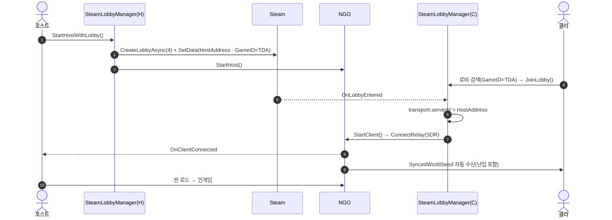

# 로비-매치메이킹

Facepunch.Steamworks `SteamMatchmaking` API로 공개 로비를 생성·검색하고, NGO `StartHost`/`StartClient` 를 연동해 P2P(SDR Relay) 세션을 맺는다. 지연 기반 매칭·파티 초대는 부분 구현.

## 현황 (pB)

> **다이어그램 — 접속 전체 흐름** (호스트 생성 → 클라 검색/참가 → 핸드셰이크 → 인게임):



### 로비 생성 (호스트)

`SteamLobbyManager.StartHostWithLobby()` (`Assets/Scripts/Networking/SteamLobbyManager.cs:156`)

```csharp
var lobbyOpt = await SteamMatchmaking.CreateLobbyAsync(maxPlayers);  // maxPlayers = 4
lobby.SetPublic();
lobby.SetJoinable(true);
lobby.SetData("HostAddress", SteamClient.SteamId.ToString());
lobby.SetData("LobbyName", $"{SteamClient.Name}의 탐험대");
lobby.SetData("GameUniqueId", "PennutButterProject");  // Spacewar 유저와 분리용 필터
lobby.SetData("GameID", "TDA");
NetworkManager.Singleton.StartHost();
```

- 이전 세션 소켓 찌꺼기 방어: 기존 `IsListening` 또는 `CurrentLobby.HasValue` 감지 시 1.5초 대기 후 재생성.
- `isCreatingRoom` 플래그로 중복 호출 차단.

### 로비 검색·참가 (클라이언트)

`LobbyUIManager` 에서 `SteamMatchmaking` 목록 조회 후 항목 클릭 → `SteamLobbyManager.JoinLobby(lobby)` 호출.

```csharp
// OnLobbyEntered 콜백
string hostSteamIDStr = lobby.GetData("HostAddress");
transport.serverId = hostSteamID;
NetworkManager.Singleton.StartClient();
```

### 이벤트 구독

```
SteamMatchmaking.OnLobbyCreated  → OnLobbyCreated
SteamMatchmaking.OnLobbyEntered  → OnLobbyEntered
SteamMatchmaking.OnLobbyMemberJoined → HandleMemberJoined
NetworkManager.OnClientDisconnectCallback → OnClientDisconnected
```

- `OnEnable`/`OnDisable` 에서 구독·해제. 싱글톤 인스턴스 외 중복 오브젝트는 구독 생략.

### 난입(Late-join)

`TerrainSyncNetworkManager` (`Assets/Scripts/Utilities/Cave Genderator/TerrainSyncNetworkManager.cs`) 의 `NetworkVariable<int> SyncedWorldSeed` 로 구현. NGO NetworkVariable 의 자동 초기 스냅샷 전송 덕분에 게임 진행 중 접속한 클라이언트도 시드를 수신한다.

### 연결 해제·복귀

`SteamLobbyManager.RevertToTitleScreen()`:

1. `CurrentLobby.Value.Leave()` — Steam 로비 퇴장
2. `NetworkManager.Singleton.Shutdown()` — NGO 종료
3. BuildIndex != 0이면 씬 0으로 로드, 이미 타이틀이면 `TitleScreenManager.ShowTitleScreen()`

### 스팀 친구 초대

`LobbyUIManager` 의 `inviteFriendButton` 이 존재. 실제 `SteamFriends.OpenGameInviteOverlay` 또는 `lobby.InviteFriend` 연결 코드는 코드에서 확인되지 않음 — **UI 버튼만 있고 로직 연결 여부 미확인**.

### ConnectionApproval·재접속

**미구현**. `Reports/netcode/코옵_Netcode_실행계획_v1.1.md` Step 3 P2-6 항목으로 명시적 이관됨:
- `ApprovalCallback`(정원·버전 검증) 없음 — 정원 초과 접속도 현재 거절 불가.
- 끊긴 뒤 재합류(reconnect + state restoration) 정의 없음.

## 설계·결정

**왜 자체 매치메이커를 쓰지 않는가**: 친선 코옵(4인 이하, 공개/초대 로비) 규모에서 Steam 로비 API로 충분. 서버 비용 없음.

**왜 SDR Relay인가**: Steam Relay(SDR)는 NAT 관통을 Valve 서버가 처리하므로 홀펀칭 구현 불필요. P2P 직결 대비 약간의 RTT 오버헤드를 감수하고 안정성을 택함.

**GameIdValue 필터**: AppID 480(Spacewar) 공유 환경에서 외부 로비와 섞이지 않도록 로비 데이터 키-값 필터를 삽입. API 수준 분리가 아닌 소프트 필터.

## ⚠ 비판·리스크

**[높음] ConnectionApproval 미구현**: 정원 초과·버전 불일치 클라이언트를 거절하는 `NetworkManager.ConnectionApprovalCallback` 이 없다. 출시 전 P2-6 구현 필수 — Step 3 예정.

**[높음] 재접속 재합류 미구현**: 연결 끊긴 후 재합류 시 게임 상태 스냅샷 수신 흐름 미정의. 현재는 끊기면 타이틀로 귀환만 가능. Step 3 P2-6 이관 명시됨.

**[중간] 1.5초 하드코딩 대기**: `StartHostWithLobby` 의 소켓 클린업 대기가 `await Task.Delay(1500)` 고정. 저사양 PC 또는 Steam 서버 지연 상황에서 불충분할 수 있음. Steam 소켓 해제 완료 이벤트가 없어 정확한 대기 시간 보장 불가.

**[중간] 최대 플레이어 4인 인스펙터 의존**: `maxPlayers = 4` 가 `SerializeField` 이므로 프리팹/씬 설정에 의존. 코드 변경 없이 변경 가능하나, 게임 설계 상한과 명시적으로 연동되지 않음.

**[중간] 친구 초대 버튼 로직 미연결 추정**: `inviteFriendButton` UI 요소가 선언되어 있으나, 실제 Steam 친구 초대 API 호출 코드가 `LobbyUIManager.cs` 내에서 확인되지 않음. 버튼이 동작하지 않을 가능성 있음 — 검증 필요.

**[낮음] 로비 검색 필터 신뢰도**: `GetData("GameUniqueId") == "PennutButterProject"` 는 소프트 필터. 악의적 사용자가 동일 데이터를 설정한 Spacewar 로비를 만들면 목록에 노출됨. 정식 AppID 교체 전까지 임시방편.

## 관련 문서

- [[steamworks-integration|steamworks-통합]]
- [[network-topology|네트워크-토폴로지]]
- [[transport-layer|transport-레이어]]
- [[netcode-solution|netcode-솔루션]]

---
← [[04-steam-hub|04 · Steam 통합 (Steamworks)]] · [[index|인덱스]]
