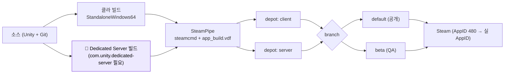

# steam-빌드-파이프라인

SteamPipe(steamcmd)를 통한 빌드 업로드 자동화.

## 현황 (pB)

**미구현**.

프로젝트 전체에 `steamcmd`, `depot`, `appbuild`, `ContentBuilder`, `SteamPipe` 관련 스크립트·VDF 파일이 없다. Grep 결과: 해당 키워드가 등장하는 파일은 이 위키 문서(`steam-build-pipeline.md`, `ci-cd.md`, `steamworks-admin.md`) 뿐이다.

현재 빌드는 Unity Editor 수동 빌드 + 파일 복사 방식으로 추정된다.

Steamworks 파트너 계정·AppID 상태도 미확인(`steamworks-admin.md` 참조 — 파트너 등록 여부 미확인).

## 설계·결정

미결정. 출시 전 최소 아래 구성이 필요하다.

> **다이어그램 — 권장 빌드 파이프라인 (target)**:

**SteamPipe 최소 구성**:
1. `steamcmd` 설치.
2. Steamworks 파트너 대시보드에서 Depot 구성(예: Win64 Depot, macOS Depot).
3. `app_build_<AppID>.vdf` — 빌드 설명, Depot 목록, 브랜치(`default`, `beta`) 정의.
4. `depot_build_<DepotID>.vdf` — 파일 매핑(`LocalPath`, `DepotPath`, 제외 패턴).
5. 업로드 커맨드: `steamcmd +login <계정> +run_app_build app_build.vdf +quit`.

**CI 연계 방향**: `ci-cd.md` 에 "SteamPipe 업로드 연계" 항목 미결. Unity 빌드 자동화(`build-automation.md`)와 연계하여 Unity → 빌드 산출물 → steamcmd 업로드 순서의 파이프라인을 구성하면 된다.

권고: 먼저 수동 SteamPipe 업로드 흐름을 한 번 검증한 뒤 자동화를 붙이는 순서를 권장. Steamworks 파트너 계정 발급이 선행 조건.

## ⚠ 비판·리스크

**[높음] EA 전 전제 조건 미비**: SteamPipe 업로드 없이는 Steam 스토어에 게임을 올릴 수 없다. `steamworks-admin.md` 의 파트너 계정 등록·AppID 발급 미완료가 직접 블로커.

**[높음] 수동 빌드 의존 — 반복 출시 비용**: 릴리즈마다 수동으로 Unity 빌드 → 파일 복사 → steamcmd 업로드를 반복하면 오류 가능성이 높다. 빌드 번호·매니페스트 관리도 손실되기 쉬움.

**[중간] 브랜치 정책 미정**: `default`, `beta`, `internal` 등 브랜치 구성이 없으면 QA 빌드와 공개 빌드를 분리할 수 없다. EA 단계에서 특히 필요.

**[낮음] 멀티플랫폼 Depot 미설계**: 현재 Win32/Win64/Posix DLL을 모두 탑재 중이지만, Depot 분리 계획이 없어 불필요한 플랫폼 파일이 빌드에 포함될 수 있다.

## 관련 문서

- [[build-automation|빌드-자동화]]
- [[ci-cd|ci-cd]]
- [[steamworks-integration|steamworks-통합]]

---
← [[04-steam-hub|04 · Steam 통합 (Steamworks)]] · [[index|인덱스]]
