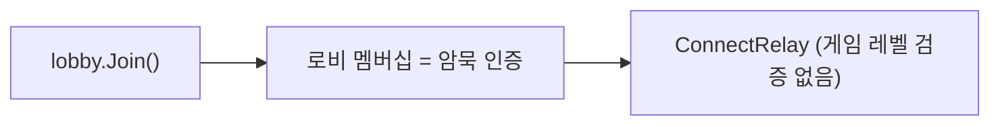
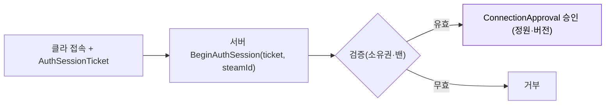

# steamworks-통합

Facepunch.Steamworks DLL 직접 삽입 방식으로 Steam API를 초기화·종료한다. `SteamClient.cs` 가 수명 단독 소유 인스턴스이며, `SteamP2PRelayTransport.cs` 가 NGO 트랜스포트 레이어를 담당한다.

## 현황 (pB)

> **다이어그램 — 현재 인증: 로비 멤버십 = 암묵 인증** (세션 티켓 없음):



**래퍼**: Facepunch.Steamworks (Steamworks.NET 아님). Unity Package Manager 미등록 — DLL을 직접 `Assets/Plugins/Facepunch/` 에 적재한다.

```
Assets/Plugins/Facepunch/
  Facepunch.Steamworks.Win64.dll   ← 런타임 (Win64)
  Facepunch.Steamworks.Win32.dll   ← Win32
  Facepunch.Steamworks.Posix.dll   ← Linux/macOS
  redistributable_bin/
    win64/steam_api64.dll
    linux64/libsteam_api.so
    osx/libsteam_api.dylib
```

**AppID**: `steam_appid.txt` 루트에 `480` (Spacewar 개발용 공개 ID).

**초기화 — `SteamClient.cs`** (`Assets/Scripts/Networking/SteamClient.cs`)

```csharp
// Awake()
Steamworks.SteamClient.Init(steamAppId);   // AppID 480
isInitialized = true;
isOwner = true;                            // [P1-1] 이 인스턴스만 종료 권한 보유
DontDestroyOnLoad(gameObject);

// Update()
if (isInitialized) Steamworks.SteamClient.RunCallbacks();  // 프레임당 1회, 단독
```

- `isOwner` 플래그로 중복 인스턴스의 `OnDestroy` → `Shutdown` 호출을 차단(P1-1 수정).
- `RunCallbacks` 는 `SteamClient.Update` 에서만 호출 — `SteamLobbyManager` 의 이중 펌핑은 r314 이전에 제거됨.

**트랜스포트 — `SteamP2PRelayTransport.cs`** (`Assets/Scripts/Networking/SteamP2PRelayTransport.cs`)

NGO `NetworkTransport` 를 상속. `SteamNetworkingSockets`의 Relay(SDR) 경로를 사용한다.

```csharp
// 서버
socketManager = Steamworks.SteamNetworkingSockets.CreateRelaySocket<SocketManager>(0);
// 클라이언트
clientConnection = Steamworks.SteamNetworkingSockets.ConnectRelay<ConnectionManager>(serverId, 0);
```

- P2P 직접 홀펀칭이 아니라 **Steam Relay(SDR)** 경유 — NAT 관통 보장, 지연은 SDR 경유 오버헤드만큼 추가.
- `Initialize` 에서 `SteamNetworkingUtils.InitRelayNetworkAccess()` 호출.
- `Shutdown` 은 소켓/연결만 닫고 Steam API 자체는 건드리지 않음(P1-1).

**NetworkDelivery → Steam SendType 매핑** (`CastToSendType`, P1-2 교정):

| NGO NetworkDelivery | Steam SendType | 비고 |
|---|---|---|
| Unreliable | Unreliable | 의미 일치 |
| UnreliableSequenced | Reliable | Steam에 Sequenced-Unreliable 부재 — 순서 보장 위해 승격 |
| Reliable | Reliable | |
| ReliableSequenced | Reliable | |
| ReliableFragmentedSequenced | Reliable | Steam 512KB 네이티브 지원 |

## 설계·결정

**왜 Facepunch.Steamworks인가**: Steamworks.NET 대비 C# 네이티브 async/await API 제공 → `SteamMatchmaking.CreateLobbyAsync()` 패턴 사용 가능. Heathen은 제외(불필요한 추상화 레이어 증가).

**DLL 직접 배치 이유**: Facepunch.Steamworks 는 Unity Package Manager 공식 패키지가 아님. NuGet 통합도 없으므로 `Assets/Plugins/` 에 DLL을 복사하는 방식이 사실상 유일 옵션.

**AppID 480 사용 이유**: 정식 출시 전 개발 단계에서 전 세계 Spacewar 앱 유저들의 로비와 섞이지 않도록 `GameIdKey = "GameUniqueId"`, `GameIdValue = "PennutButterProject"` 필터를 로비 데이터로 추가 삽입(`SteamLobbyManager.OnLobbyCreated`에서 `GameID = "TDA"` 태그도 추가).

**Steam API 수명 단독 소유(P1-1)**: 기존에는 씬 전환이나 중복 인스턴스 파괴 시 `OnDestroy → ShutdownSteam()` 이 살아있는 Steam API를 꺼 재호스팅이 불안정했다. `isOwner` 플래그로 소유 인스턴스만 종료 가능하도록 수정됨.

## 🎯 목표·권장 (target)

> **다이어그램 — 목표: 세션 티켓 검증**:



- 협동·친구초대 중심이면 현재 암묵 인증으로 충분하나, **공개 매치/전용 서버**로 확장하면 위장 접속 방지를 위해 `GetAuthSessionTicket` → `BeginAuthSession` 검증이 필요하다.
- 현재 미사용인 NGO `ConnectionApprovalCallback`을 입장 게이트로 연결하면 정원·버전 검증까지 함께 처리된다([[lobby-matchmaking]] P2-6).
- 선행 조건: AppID 480 → 실 AppID 교체.

## ⚠ 비판·리스크

**[높음] AppID 480 고정 — 출시 전 필수 교체**: `SteamClient.cs:15` `steamAppId = 480` (Spacewar). 정식 AppID 발급 후 수동 교체 + `steam_appid.txt` 갱신 안 하면 Steam 로비가 Spacewar 사용자와 섞임. GameIdValue 필터가 있지만 API 레벨 분리가 아니라 소프트 필터임.

**[높음] DLL 버전 고정 — 업데이트 미자동화**: `Assets/Plugins/Facepunch/` 는 수동 복사본. Facepunch.Steamworks 신버전의 API 변경·보안 패치가 자동으로 반영되지 않는다. 마지막 교체일을 기록하지 않으면 stale 여부 불명.

**[중간] 오프라인/비-Steam 폴백 없음**: `SteamClient.Init` 실패 시 `Debug.LogError` 출력 후 아무것도 하지 않는다. 비-Steam 환경(에디터에서 Steam 미실행)에서 모든 멀티 기능이 조용히 실패함. 스텁 항목이었던 "오프라인 폴백"은 미구현.

**[낮음] Win32/Posix DLL 탑재됐으나 플랫폼 설정 미검증**: `Facepunch.Steamworks.Win32.dll`, `Posix.dll` 의 Unity Inspector 플랫폼 설정이 코드로 확인되지 않음. 잘못 설정 시 빌드 포함 여부 오류 가능.

**[낮음] `SteamNetworkingUtils.InitRelayNetworkAccess()` 지연 미처리**: Relay 네트워크 접근 준비가 완료되기 전에 연결을 시도하면 첫 호스팅 지연 또는 실패가 발생할 수 있으나, 현재 완료 콜백 대기 로직 없음.

## 관련 문서

- [[lobby-matchmaking|로비-매치메이킹]]
- [[steam-cloud|steam-cloud]]
- [[transport-layer|transport-레이어]]
- [[04-steam-hub|04 · Steam 통합]]

---
← [[04-steam-hub|04 · Steam 통합 (Steamworks)]] · [[index|인덱스]]
