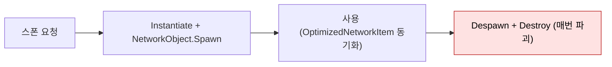
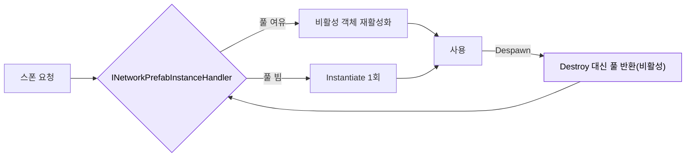

# 오브젝트-풀링

범용 오브젝트 풀 시스템은 미구현이다. 지형 청크 전용 내부 풀(`CaveChunkManager`)만 존재하며, 아이템·AI·VFX·투사체는 모두 `Instantiate`/`Destroy` 또는 `NetworkObject.Spawn`/`Despawn` 으로 처리한다.

## 현황 (pB)

> **다이어그램 — 현재 NetworkObject 생애: 매번 생성/파괴**:

### CaveChunkManager 내부 청크 풀 (`Assets/Scripts/Utilities/Cave Genderator/CaveChunkManager.cs`)
- `MaxPoolSize = 100`, `ChunkPrefab` Inspector 설정
- 지형 메시 청크를 재사용하는 전용 풀. `"Pooling System"` 헤더 명시.
- 범위: 지형 청크 오브젝트 한정. 공개 API 없음.

### AI 스폰 (`WorldAISpawnManager.cs`)
- AI 캐릭터는 스폰 큐 기반 `Instantiate` + `NetworkObject.Spawn()` 방식.
- 풀링 없음. 전투 후 사망 시 `Destroy` 추정.

### VFX / 이펙트
- `HitSparkVFXRegistry.asset` 확인. VFX 재생은 `GameObject` 인스턴스화 + `Utility_DestroyAfterTime` 자동 소멸 패턴 추정.
- Unity VFX Graph 풀 API 미사용.

### 드롭 아이템
- `WorldSaveGameManager.SpawnDroppedItems()` 에서 씬 로드 시 `Instantiate` + `NetworkObject.Spawn()` 한 번에 생성. 풀 없음.

### 네트워크 오브젝트 풀 (NGO)
- NGO 2.x 에 내장된 `NetworkObjectPool` API가 존재하나, 프로젝트에서 사용하지 않는다. 현재 모든 `NetworkObject` 는 `Spawn`/`Despawn` 시마다 인스턴스화/파괴.

## 설계·결정

- 현재 EA 전 프로토타입 단계로 스폰 빈도가 낮아 `Instantiate`/`Destroy` 선택.
- 청크 풀만 존재하는 이유: 지형 청크는 전체 화면 메시이므로 생성 비용이 크고, 뷰 거리 내 재진입 빈도가 높음.

## 🎯 목표·권장 (target)

> **다이어그램 — 목표: NGO 풀 재사용**:

- `NetworkManager.PrefabHandler.AddHandler(prefab, handler)`로 `Instantiate/Destroy`를 가로채 재사용. **드롭 아이템·투사체·히트 VFX**가 1순위 후보(자주 생성/파괴 → GC 스파이크).
- 이미 있는 동굴 청크 풀(`CaveChunkManager.chunkPool`) 패턴을 **NGO 오브젝트로 확장**하면 일관적이다.
- AI 20기 전투(`SCN-06`)의 사망/재스폰 반복에서 효과가 가장 크다.

## ⚠ 비판·리스크

| 심각도 | 항목 | 근거 | 권고 |
|---|---|---|---|
| 높음 | **범용 풀 미구현 — GC 스파이크 위험** | AI 20기 전투(`SCN-06`) 중 사망/재스폰 반복 시 `GC.Alloc` 급증으로 프레임 드롭. 특히 VFX(HitSpark) 과 네트워크 동기화 드롭 아이템이 문제. | Unity `ObjectPool<T>` 또는 NGO `NetworkObjectPool` 도입 |
| 높음 | **NetworkObject 재사용 없음** | NGO `Despawn(false)` 로 오브젝트를 비활성화 후 재스폰하는 패턴 미사용. 스폰 시마다 NGO 내부 ID 등록/해제 오버헤드 발생. | `NetworkObjectPool` 로 AI·드롭 아이템 최소화 |
| 보통 | **VFX 소멸 타이머 방식** | `Utility_DestroyAfterTime` 패턴은 정확한 풀 반환 시점 보장 어려움. 파티클이 남아 있으면 Destroy 전에 오브젝트가 파괴되어 NRE. | VFX 완료 콜백(`VisualEffect.stopped`) 또는 코루틴 대기 후 풀 반환 |
| 낮음 | **CaveChunkManager 풀 API 미공개** | 지형 청크 풀이 클래스 내부에만 존재. 다른 지형 컴포넌트가 직접 청크를 관리해야 할 때 재사용 불가. | `IObjectPool<T>` 인터페이스로 추상화 |

## 관련 문서

- [[state-sync|상태 동기화]]
- [[scriptableobject-architecture|ScriptableObject 아키텍처]]

---
← [[05-core-framework-hub|05 · 재사용 코어 프레임워크]] · [[index|인덱스]]
