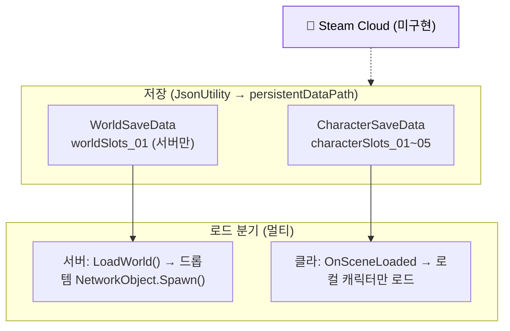

# 세이브-로드

`WorldSaveGameManager` + `SaveFileDataWriter` 조합의 JSON 파일 기반 세이브/로드 시스템. 캐릭터 슬롯 5개, 월드 슬롯 1개를 `Application.persistentDataPath` 에 저장한다.

## 현황 (pB)

> **다이어그램 — 세이브/로드 흐름** (서버=월드 권위 / 클라=자기 캐릭터 로컬, Steam Cloud 없음):

### 세이브 파일 구조
- **경로**: `Application.persistentDataPath` (플랫폼별 Documents/AppData 계열)
- **형식**: `JsonUtility.ToJson` → UTF-8 텍스트 파일
- **캐릭터 슬롯**: `characterSlots_01` ~ `characterSlots_05` (5개 고정)
- **월드 슬롯**: `worldSlots_01` (1개, 향후 확장 구조 미비)

### CharacterSaveData 필드 (`Assets/Scripts/Game Saving/CharacterSaveData.cs`)
- `sceneIndex`, `characterName`, `secondsPlayed`
- 위치(`xPosition`, `yPosition`, `zPosition`)
- 현재 HP/스태미나, 스탯(`vitality`, `endurance`)
- 인벤토리 리스트(`List<InventoryItem>`)
- 장착 슬롯 ID 7개(양손 무기, 헬멧, 갑옷, 바지, 레깅스, 배낭)

### WorldSaveData 필드 (`Assets/Scripts/Game Saving/WorldSaveData.cs`)
- `removedInteractableIDs` — 루팅되어 영구 제거된 오브젝트 ID 목록
- `objectStates` — 문/상자 등 상태 변경 오브젝트 (`SerializableDictionary<int, WorldObjectState>`)
- `droppedItems` — 바닥에 버려진 아이템 재생성 데이터 (`List<WorldItemSaveData>`)

### 멀티플레이 분기 (`WorldSaveGameManager.cs`)
- **호스트(서버)만** `SaveWorld()`·`LoadWorld()` 수행. 드롭 아이템은 `NetworkObject.Spawn()` 으로 전파.
- **클라이언트**: 씬 로드 이벤트(`OnSceneLoaded`) 에서 로컬 캐릭터 파일만 읽어 자신의 플레이어에 주입.
- 로비 씬에서 PlayerManager가 없을 때 `PrepareOrCreateSlotForLobby()` 로 player 참조 없이 Writer 직접 저장.

### Steam Cloud
- 미구현. `Application.persistentDataPath` 로컬 파일만 사용. Steam Cloud 연동 코드 부재.

## 설계·결정

- `JsonUtility` 선택 이유: 외부 라이브러리 의존 없이 Unity 내장. 성능·용량보다 호환성 우선.
- 5슬롯 고정: 다크소울 류 참조. 슬롯 추가 시 코드 수동 확장 필요(switch-case 구조).
- 서버 전용 월드 저장: NGO 권위 모델에서 클라이언트가 월드 상태를 쓰면 충돌 발생. 의도적 선택.
- `DontDestroyOnLoad` 싱글톤: 씬 전환 시 데이터 유지를 위해 `WorldSaveGameManager` 가 루트 오브젝트로 영속.

## ⚠ 비판·리스크

| 심각도 | 항목 | 근거 | 권고 |
|---|---|---|---|
| 높음 | **세이브 버전 마이그레이션 없음** | `CharacterSaveData` 필드 추가 시 구 파일이 로드되면 신규 필드 기본값 적용, 제거 시 JSON 역직렬화 묵시적 무시. 버전 필드 부재. | `saveVersion` 정수 필드 추가 + 마이그레이션 함수 체인 도입 |
| 높음 | **Steam Cloud 연동 없음** | 플레이어가 다른 PC에서 접속 시 세이브 소실. Steam EA 출시 전 필수 항목. | `SteamRemoteStorage` API 또는 Steam Cloud Auto-Save 설정 추가 |
| 높음 | **월드 슬롯 1개 고정** | `WorldSlots` enum 에 `WorldSlots_01` 만 존재. 코옵 세션이 여럿일 때 덮어쓰기. | WorldSlot 열거 확장 또는 세션 ID 기반 동적 파일명 |
| 보통 | **JsonUtility 한계** | `Dictionary<>` 미지원으로 `SerializableDictionary` 래퍼 사용(`objectStates`). 직렬화 에러 시 묵시적 빈 딕셔너리로 복구 없이 데이터 소실. | Newtonsoft.Json(Unity 공식 지원) 또는 MessagePack 전환 검토 |
| 보통 | **파일 암호화·체크섬 없음** | 텍스트 JSON이므로 외부 편집기로 무한 스탯 주입 가능. 친선 코옵 모델이므로 당장 치팅 방지가 목표는 아니나, Steam 리뷰 점수에 영향 가능. | 최소 XOR 스크램블 또는 HMAC 체크섬 |
| 낮음 | **`secondsPlayed` 미갱신 확인 필요** | `CharacterSaveData.secondsPlayed` 필드 존재하나 `SaveGame()` 호출 경로에서 갱신 코드 미발견 | 저장 전 `Time.realtimeSinceStartup` 누산 갱신 |

## 관련 문서

- [[steam-cloud|Steam Cloud]]
- [[data-pipeline|데이터 파이프라인]]
- [[scene-manager|씬 매니저]]

---
← [[05-core-framework-hub|05 · 재사용 코어 프레임워크]] · [[index|인덱스]]
