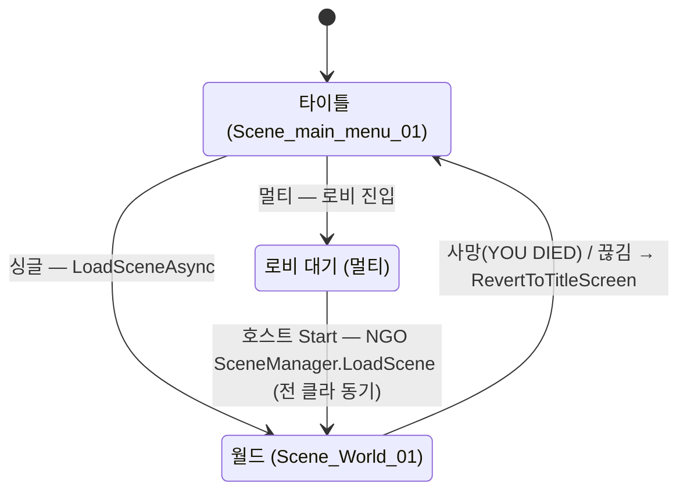
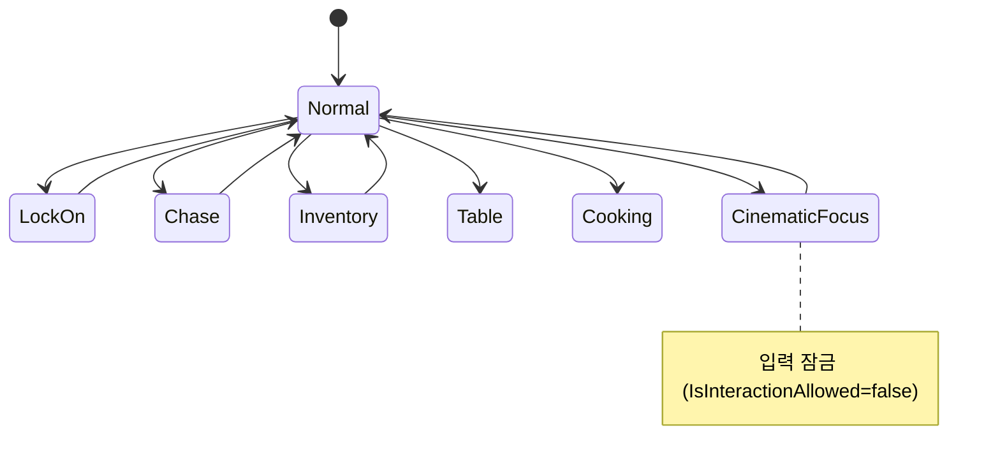

# 씬-매니저

별도의 씬 매니저 싱글톤은 없다. 씬 전환은 `WorldSaveGameManager.LoadWorldScene()` 코루틴이 담당하며, 멀티플레이 환경에서는 NGO `NetworkManager.SceneManager` 로 분기한다.

## 현황 (pB)

> **다이어그램 — 씬 전환 흐름**:

> **다이어그램 — 인게임 플레이 상태** (`WorldGameStateManager`, 씬과 별개):

### 씬 목록 (Assets/Scenes 기준, 총 8개)
| 씬 이름 | 용도 |
|---|---|
| Scene_main_menu_01 | 타이틀 / 세이브 슬롯 선택 |
| Scene_World_01 | 메인 플레이 월드 |
| Scene_pB2 | 구형 테스트 월드 |
| Scene_AI_Test | AI 전용 테스트 |
| Scene_Fog | 안개 테스트 |
| Scene_S6 / S11 / S13 | 특수 테스트 씬 |
| Scene_Simple_map_generator | 절차적 맵 생성기 테스트 |
| Wk3_NaturalEmergenceScene | pB-4 Week3 AI 통합 씬 |

### 씬 전환 흐름
1. **타이틀 → 월드**: `WorldSaveGameManager.LoadWorldScene()` 코루틴 호출
   - 호스트이면 `NetworkManager.Singleton.SceneManager.LoadScene(sceneName, Single)` — 모든 클라이언트 자동 동기화
   - 오프라인이면 `SceneManager.LoadSceneAsync(worldSceneIndex)`
2. **worldSceneIndex**: Inspector에서 고정값 1로 설정. 씬 빌드 인덱스 0 = 메인 메뉴, 1 이상 = 플레이 가능 월드 판정(`IsWorldScene(buildIndex)`)
3. **난입 클라이언트**: NGO가 씬 동기화 후 `OnSceneLoaded` 이벤트 발생 → `WorldSaveGameManager.OnSceneLoaded()` 에서 로컬 캐릭터 데이터 로드 및 주입

### DontDestroyOnLoadHelper (`Assets/Scripts/Helper/DontDestroyOnLoadHelper.cs`)
- 자식 GameObject에서 `DontDestroyOnLoad` 가 작동하지 않는 Unity 제약 우회
- 실행 순서 `-800` (Bridge 컨테이너 `-500` 보다 선행)
- 씬 매니저 오브젝트가 아닌 각 매니저 컴포넌트에 개별 부착하는 방식

### Addressables
- 미도입. 씬 로드는 전통적 Build Settings + buildIndex 방식.

## 설계·결정

- 전용 씬 매니저 클래스 없이 `WorldSaveGameManager` 에 씬 로딩 로직 통합. 설계 단순화 목적.
- 네트워크 씬 전환을 NGO SceneManager 에 위임: 클라이언트 동기화를 NGO 가 보장하므로 별도 동기화 코드 불필요.
- `worldSceneIndex` 를 int 필드로 하드코딩: 멀티플레이 프로토타입 단계에서 씬이 하나뿐이라 합리적 선택.

## ⚠ 비판·리스크

| 심각도 | 항목 | 근거 | 권고 |
|---|---|---|---|
| 높음 | **씬 인덱스 하드코딩** | `worldSceneIndex = 1` Inspector 직접 설정. 빌드 설정 순서 변경 시 잘못된 씬 로드. | 씬 이름 문자열 또는 Addressable 키 기반으로 전환 |
| 높음 | **loadOperation 반환값 미처리** | `LoadSceneAsync(worldSceneIndex)` 결과를 변수에 받지만 `yield return` 하지 않음 — 씬 로드 완료 전에 `player.LoadGameDataFromCurrentCharacterData()` 가 실행될 수 있음 | `yield return loadOperation` 추가 |
| 보통 | **로딩 화면 없음** | 씬 전환 중 검은 화면 또는 이전 씬 노출. 플레이어 경험 저하. | 진행도 바가 있는 로딩 씬 또는 Overlay Canvas |
| 보통 | **Addressables 미도입** | 씬·에셋이 증가하면 빌드 크기·초기 로딩 시간 증가. Steam 패치 크기 불리. | EA 이후 Addressables 전환 검토 |
| 낮음 | **IsWorldScene 판정 단순** | `buildIndex > 0` 이면 모두 월드 취급. 테스트 씬(AI TEST 등)이 buildIndex 1 이상이면 오판정 가능. | 명시적 월드 인덱스 목록 관리 |

## 관련 문서

- [[save-load|세이브-로드]]
- [[netcode-solution|Netcode 솔루션]]

---
← [[05-core-framework-hub|05 · 재사용 코어 프레임워크]] · [[index|인덱스]]
