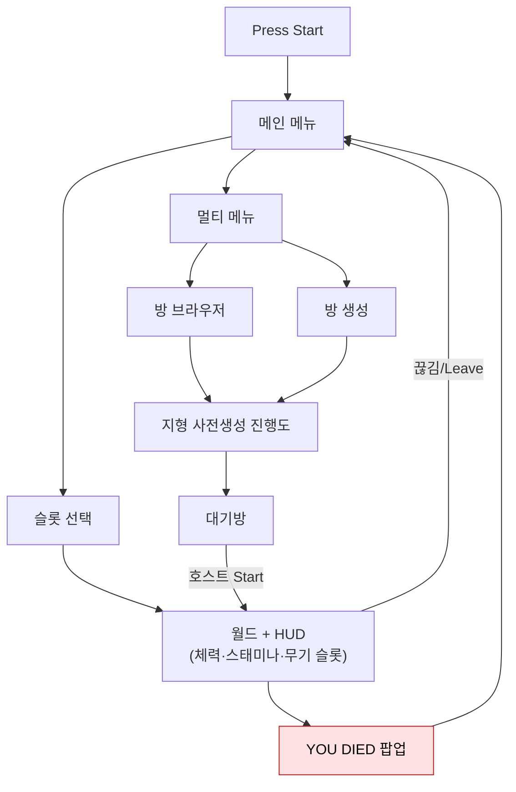

# ui-프레임워크

uGUI(Unity UI) 기반 UI 레이어. 전용 UI 프레임워크 패키지는 없으며, 역할별 매니저 클래스가 Canvas 계층을 직접 제어한다.

## 현황 (pB)

> **다이어그램 — 화면 전환 맵**:

### UI 기술 스택
- **uGUI**: `com.unity.ugui 2.0.0` (manifest.json 확인). UI Toolkit 미사용.
- **TextMeshPro**: `PlayerUIPopUpManager`, `LobbyUIManager` 모두 `TextMeshProUGUI` 참조.
- **CanvasGroup**: 팝업 알파 페이드에 사용(`PlayerUIPopUpManager`).

### 레이어 구조

| 클래스 | 위치 | 역할 |
|---|---|---|
| `PlayerUIManager` | `Assets/Scripts/Character/Player/Player UI/` | 플레이어 UI 루트 싱글톤. `DontDestroyOnLoad`. HUD·팝업 매니저 참조 허브. |
| `PlayerUIHUDManager` | 동 | HP·스태미나 바(`UI_StatBar`), 무기 퀵슬롯 아이콘 갱신 |
| `PlayerUIPopUpManager` | `Assets/Scripts/UI/` | "YOU DIED" 팝업 페이드인/아웃 코루틴 |
| `LobbyUIManager` | `Assets/Scripts/UI/` | 방 목록·대기방·지형 생성 진행도 UI. NGO `NetworkBehaviour` 상속 |
| `TitleScreenManager` | `Assets/Scripts/Menu Scene/` | 타이틀 화면, 세이브 슬롯 선택 |
| `UI_Character_Save_Slot` | `Assets/Scripts/UI/` | 슬롯 UI 항목 |
| `UI_InventoryGrid` | `Assets/Scripts/Inventory/` | 인벤토리 격자 UI |

### HUD 갱신 흐름
- 플레이어 HP 변경 → `PlayerNetworkManager.OnHealthChanged` → `PlayerUIHUDManager.SetNewHealthValue(old, new)` → `UI_StatBar.SetStat()`
- 무기 교체 → `PlayerUIHUDManager.SetRightWeaponQuickSlotIcon(weaponID)` → `WorldItemDatabase.Instance.GetWeaponByID()` 로 SO 조회 → `Image.sprite` 교체

### LobbyUIManager 특이사항
- `NetworkBehaviour` 상속으로 NGO 생명주기(`OnNetworkSpawn` / `OnNetworkDespawn`)에서 이벤트 구독·해제
- 지형 생성 진행도(`Slider`), 파티 준비 상태(`TextMeshProUGUI`) 를 `NetworkVariable<int>` 로 동기화
- 방 목록 갱신은 `SteamMatchmaking.LobbyList` 비동기 호출(`async/await`)

## 설계·결정

- uGUI 유지: 팀이 uGUI에 익숙하고 NGO 2.x와 동작 검증이 완료된 조합. UI Toolkit 전환 비용 대비 이득 불명확.
- 역할별 매니저 분리: `PlayerUIManager` 가 HUD와 팝업을 자식 컴포넌트로 보유 — GetComponentInChildren 자동 연결.
- `DontDestroyOnLoad` 플레이어 UI: 씬 전환 시 UI 재생성 비용 제거.

## ⚠ 비판·리스크

| 심각도 | 항목 | 근거 | 권고 |
|---|---|---|---|
| 높음 | **중앙화된 UI 스택 부재** | 팝업·로딩·HUD·로비가 각각 독립 Canvas로 추정. 레이어 순서 충돌·사운드 이벤트 연결 규약 없음. | UILayerManager 또는 순서 enum 기반 Canvas 스택 도입 |
| 높음 | **LobbyUIManager async/await 예외 미처리** | `RefreshRoomList()` 가 `async void` — 내부 예외 시 Unity가 캐치 불가, 조용한 실패 발생 가능. | `try-catch` 추가 또는 `UniTask` 사용 |
| 보통 | **UI Toolkit 미사용** | Unity 6 에서 UI Toolkit 이 권장 방향. uGUI는 레거시 경로로 전환 예정. | EA 이후 점진적 UI Toolkit 전환 로드맵 수립 |
| 보통 | **YOU DIED 팝업 타이밍 의존** | `StretchPopUpTextOverTime` / `FadeInPopUpOverTime` 코루틴이 `Time.deltaTime` 누산 방식 — 게임 일시정지(`Time.timeScale=0`) 시 미동작. | `Time.unscaledDeltaTime` 사용 또는 DOTween 전환 |
| 낮음 | **전역 UI 이벤트 버스 없음** | UI 갱신이 직접 함수 호출 체인으로 이루어짐. 복수 플레이어 UI 동시 관리 시 확장성 낮음. | pB-4 `EventBus` 와 연동하거나 별도 UI 이벤트 채널 추가 |

## 관련 문서

- [[event-system|이벤트 시스템]]
- [[lobby-matchmaking|로비·매치메이킹]]
- [[input-system|Input 시스템]]

---
← [[05-core-framework-hub|05 · 재사용 코어 프레임워크]] · [[index|인덱스]]
