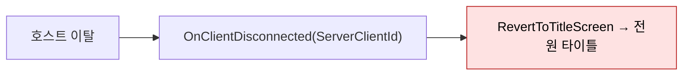
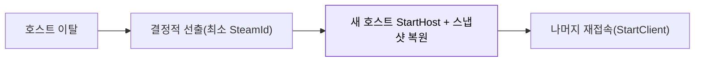

# 서버-호스팅

전용 서버 없음. Steam P2P 중계(Facepunch.Steamworks) + 호스트 권위 P2P 방식을 사용한다.

## 현황 (pB)

> **다이어그램 — 현재: 호스트 이탈 = 세션 소멸**:

**네트워크 토폴로지**

- 전용 서버 없음. 미구축(2026-06-15 실측).
- 방식: Steam P2P 중계(ISteamNetworkingMessages) + NGO(Unity Netcode for GameObjects).
- 구현: `Assets/Scripts/Networking/SteamP2PRelayTransport.cs` — `NetworkTransport` 구현체. Facepunch.Steamworks `SteamServerInit.DedicatedServer` 필드는 SDK에 있으나 게임 코드에서 사용 안 함.
- 로비 관리: `Assets/Scripts/Networking/SteamLobbyManager.cs` — Steam 로비 생성/가입 처리.
- AppID: `steam_appid.txt` = 480(Spacewar 테스트용). 실 AppID 미등록.
- NAT 통과: Steam 중계 서버가 처리. 직접 UDP는 없음.

**호스트 역할**

- 방장이 곧 서버(호스트). `NetworkManager.StartHost()` 로 호스트-클라이언트 동시 역할.
- 호스트 이탈 시 세션 종료. 재호스팅은 M8 절차로 측정 중(×3 생존 확인, 정량 10/10은 2인 미완).

**매치메이킹·오케스트레이션**

- 별도 매치메이킹 서버 없음. Steam 로비 리스트로 방 검색.
- 지역 배치, 핑 기반 매칭 없음.

## 설계·결정

- 소규모 인디 EA 전략: Steam P2P 중계로 운영 비용 0. 별도 서버 운영 비용 제거.
- 인원: 게임 특성상 소규모(2~4인) — P2P 지연이 허용 가능한 범위.
- 전용 서버 전환은 ADR 검토 대상으로 분류됨(아직 ADR 없음).

## 🎯 목표·권장 (target)

> **다이어그램 — 목표: 호스트 마이그레이션**:

**도입 전제 / 난점**:
- **상태 스냅샷**: 권위 상태(AI·드롭템·월드 오브젝트)를 직렬화해 클라들이 보유해야 새 호스트가 복원 가능. 캐릭터는 이미 로컬 세이브 기반([[save-load]])이라 상대적으로 쉽지만 **AI/팩션/월드 런타임 상태**는 별도 스냅샷 설계 필요.
- **결정적 호스트 선출**: 동시 다중 승격 방지(최소 SteamId 등 단일 규칙).
- **재접속 윈도우**: 끊김 즉시 타이틀 복귀 대신 재시도 상태 필요(Step 3 P2-6과 연동).
- 난이도 높음 → 협동 세션 지속성을 중요 기능으로 정한 뒤 착수. 대안은 **전용 서버** 도입.

## ⚠ 비판·리스크

| 심각도 | 항목 | 근거 | 권고 |
|---|---|---|---|
| 높음 | **호스트 이탈 시 세션 소멸** | NGO P2P 구조 — 호스트가 나가면 모든 클라 연결 끊김 | 호스트 마이그레이션(NGO 미지원, 별도 구현 필요) 또는 전용 서버 검토 |
| 높음 | **호스트 치팅 방어 불가** | 호스트가 곧 서버 — anti-cheat.md 참조 | 전용 서버 없이는 구조적 해결 불가 |
| 높음 | Steam AppID = 480 (테스트용) | 실 앱 ID 미등록 — Steam 릴리즈 불가 상태 | Steamworks 파트너 계정에서 신규 앱 ID 신청 |
| 중간 | NAT 홀펀칭 실패 시 중계 의존 | Steam 중계는 지연 증가 가능성 | 릴리즈 전 다양한 NAT 환경에서 접속 테스트 |
| 중간 | 지역 배치 없음 | 글로벌 출시 시 원거리 플레이어 고지연 | 초기 EA는 단일 지역 제한 or 핑 표시 UI |
| 중간 | 성능 이슈 시 호스트 머신 사양 의존 | 서버 품질이 플레이어 PC 사양에 종속 | 최소 사양 명시 + 호스트 부하 모니터링 |
| 낮음 | 매치메이킹 없음 | 방 코드 or 로비 리스트 수동 탐색 | EA 단계는 허용 가능, 성장 후 개선 |

**전용 서버 없음**은 출시 초기에 허용 가능한 결정이지만, 호스트 이탈·치팅·성능 문제가 EA 리뷰에서 반복 등장할 가능성이 높다. 이 트레이드오프를 스팀 페이지에 명시하는 것이 권장된다.

## 관련 문서

- [[anti-cheat|안티치트]]
- [[multiplayer-testing|멀티플레이-테스트]]
- [[steamworks-admin|steamworks-행정]]

---
← [[10-infra-hub|10 · 서버 호스팅 인프라]] · [[index|인덱스]]
