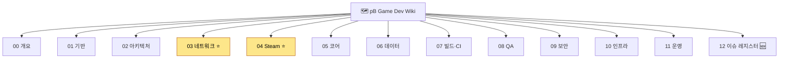

# 🗺️ 프로젝트 위키 인덱스 (MOC)

> Unity 6.3 · 가칭 **pC** · 2-5인 PvE 코옵 던전·채굴(다크/로우판타지·프로시저럴 동굴·숄더뷰·리얼리즘) · Steam P2P — **pB 실제 구현 반영 + 비판** 지식 베이스
> 작성 규약·유지보수: [[_wiki-conventions|위키 규약]] (frontmatter `source`/`verified`, 비판 섹션 의무, stale 점검)

## 🚨 출시 블로커 (위키 비판 종합 — 2026-06-15)
각 문서 `## ⚠ 비판·리스크` 의 상위 항목. EA/출시 전 해소 필요.

| 영역 | 블로커 | 문서 |
|---|---|---|
| Steam | **AppID 480(Spacewar 테스트용)** 고정 — 실 AppID 미등록 | [[steamworks-integration|Steamworks 통합]] |
| 보안 | **P2P 호스트 권위 → 호스트 치팅 원천 방어 불가** | [[anti-cheat|안티치트]] |
| 네트워크 | 예측·재조정·랙보상 **미구현** + 대역폭 **실측 0**(2인 측정 불가) | [[prediction-reconciliation|예측-재조정]] · [[bandwidth-budget|대역폭-예산]] |
| QA | PlayMode 테스트 폴더 **비어 있음** · **CI/CD 부재** · FPS 측정치 60 미달 | [[test-framework|테스트-프레임워크]] · [[ci-cd|CI-CD]] |
| 기반 | **Git LFS 미설정**(바이너리 직접 추적) · 게임코드 **asmdef 단일** | [[version-control-git-lfs|버전관리-LFS]] · [[assembly-definition|어셈블리-정의]] |
| 인프라 | **전용 서버 없음**(호스트 이탈 시 세션 소멸) | [[server-hosting|서버-호스팅]] |
| 글로벌 | **현지화 부재**(한국어 하드코딩 산재) | [[localization|현지화]] |
| 의존성 | SSGI 비공식 외부 패키지 1종 종속 · DI 부재(정적 싱글톤 28+) | [[render-pipeline|렌더-파이프라인]] · [[di-container|DI-컨테이너]] |

## ⭐ 가장 먼저 결정할 것 (분기점)
→ [[00-overview-hub|00 · 개요 & 우선순위]] 의 *최우선 의사결정* 참고. 기획 정보(장르·코어루프·타겟·동접)는 **코드로 확정 불가 → 확인 필요**([[project-overview|프로젝트-개요]]).

## 카테고리
- [[00-overview-hub|00 · 개요 & 우선순위]] — 프로젝트 개요 · 우선순위 · 체크리스트
- [[01-foundation-hub|01 · 기반 (협업/구조/컨벤션)]] — 버전관리 · 구조 · 컨벤션
- [[02-architecture-hub|02 · 아키텍처 기반 결정]] — 렌더 파이프라인 · ECS · DI · ADR
- [[03-network-hub|03 · 네트워크 아키텍처]] — 토폴로지 · 동기화 · 예측/보정
- [[04-steam-hub|04 · Steam 통합 (Steamworks)]] — Steamworks · 로비 · 클라우드
- [[05-core-framework-hub|05 · 재사용 코어 프레임워크]] — 재사용 인프라
- [[06-data-hub|06 · 데이터 파이프라인]] — ScriptableObject · 데이터 파이프라인
- [[07-build-ci-hub|07 · 빌드 & CI/CD]] — 빌드 자동화 · CI/CD
- [[08-qa-testing-hub|08 · 테스트 & 품질]] — 테스트 · 성능 예산
- [[09-security-hub|09 · 보안 / 안티치트]] — 안티치트 · 서버 권위
- [[10-infra-hub|10 · 서버 호스팅 인프라]] — 서버 호스팅
- [[11-ops-biz-hub|11 · 운영 & Steamworks 행정]] — Steamworks 행정
- [[12-issues-hub|12 · 이슈·리스크 레지스터]] — 비판·권고·이슈 종합 (각 문서 `⚠ 비판·리스크` 집계)

## 🗺️ 위키 지도

## 📐 도표 인덱스 (Mermaid)

각 문서에 박힌 Mermaid 도표 모음. **✅ 현재 구현 / 🎯 목표·권장**(목표는 `## 🎯 목표·권장` 헤더에 별도 정리).

| 영역 | 문서 | 도표 | 유형 |
|---|---|---|---|
| 기반 | [[project-structure\|프로젝트-구조]] | 코어 모듈 맵 | ✅ |
| 기반 | [[assembly-definition\|assembly-definition]] | 현재 단일 어셈블리 / 권장 분리 | ✅🎯 |
| 아키텍처 | [[ai-bridge-architecture\|ai-bridge-아키텍처]] | AI 도메인·Bridge 결합 | ✅ |
| 네트워크 | [[authority-model\|권한-모델]] | 권한별 write 주체 | ✅ |
| 네트워크 | [[state-sync\|상태-동기화]] | 데미지 RPC 왕복 | ✅ |
| 네트워크 | [[prediction-reconciliation\|예측-재조정-보간]] | 현재 보간 / 목표 예측+재조정 | ✅🎯 |
| 네트워크 | [[lag-compensation\|랙-보상]] | rewind 기법 | 🎯 |
| 네트워크 | [[network-topology\|네트워크-토폴로지]] | 연결/세션 상태 | ✅ |
| Steam | [[lobby-matchmaking\|로비-매치메이킹]] | 접속 전체 흐름 | ✅ |
| Steam | [[steamworks-integration\|steamworks-통합]] | 현재 인증 / 목표 티켓 검증 | ✅🎯 |
| Steam | [[steam-build-pipeline\|steam-빌드-파이프라인]] | 권장 SteamPipe 흐름 | 🎯 |
| 코어 | [[object-pooling\|오브젝트-풀링]] | 현재 생성·파괴 / 목표 풀 | ✅🎯 |
| 코어 | [[save-load\|세이브-로드]] | 세이브 분기 / 목표 클라우드 | ✅🎯 |
| 코어 | [[scene-manager\|씬-매니저]] | 씬 흐름 + GameState | ✅ |
| 코어 | [[ui-framework\|ui-프레임워크]] | 화면 전환 맵 | ✅ |
| 데이터 | [[data-pipeline\|데이터-파이프라인]] | 데이터 흐름(ID) | ✅ |
| 인프라 | [[server-hosting\|서버-호스팅]] | 현재 세션소멸 / 목표 마이그레이션 | ✅🎯 |

## 태그 빠른 찾기
`#network` `#steam` `#architecture` `#tooling` `#security` `#decision` `#adr`
